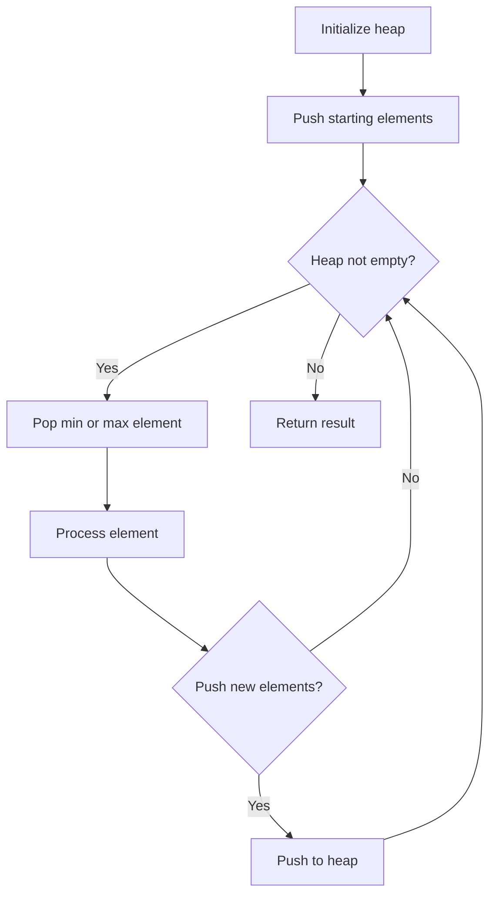
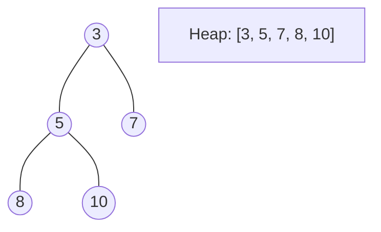
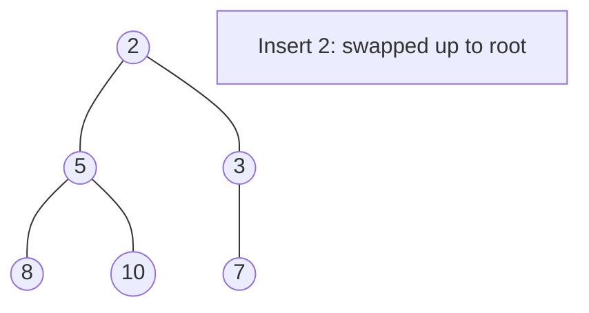
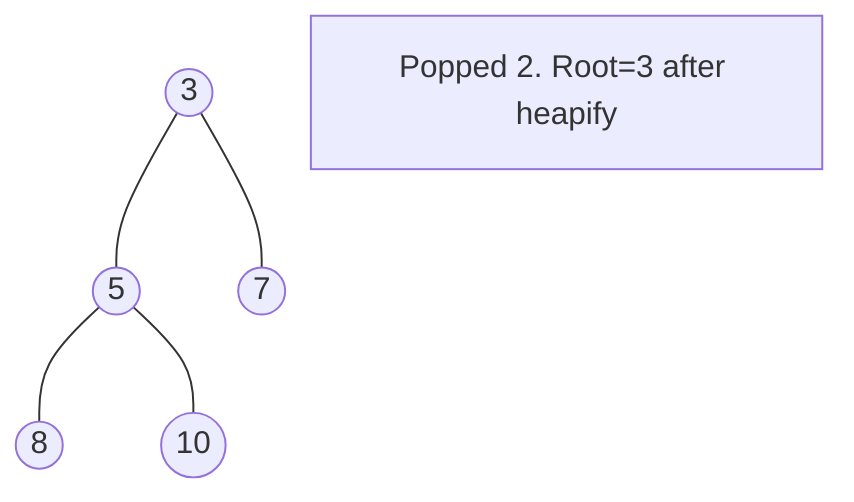

# Problem 1094: Car Pooling

**Difficulty:** Medium  
**Tags:** Array, Sorting, Heap (Priority Queue), Simulation, Prefix Sum  
**Pattern:** Heap / Priority Queue  
**Link:** [leetcode.com/problems/car-pooling](https://leetcode.com/problems/car-pooling/)

## Description

There is a car with `capacity` empty seats. The vehicle only drives east (i.e., it cannot turn around and drive west).

You are given the integer `capacity` and an array `trips` where `trips[i] = [numPassengersi, fromi, toi]` indicates that the `i^th` trip has `numPassengersi` passengers and the locations to pick them up and drop them off are `fromi` and `toi` respectively. The locations are given as the number of kilometers due east from the car's initial location.

Return `true`* if it is possible to pick up and drop off all passengers for all the given trips, or *`false`* otherwise*.

 

Example 1:

```

**Input:** trips = [[2,1,5],[3,3,7]], capacity = 4
**Output:** false

```

Example 2:

```

**Input:** trips = [[2,1,5],[3,3,7]], capacity = 5
**Output:** true

```

 

**Constraints:**

	- `1 <= trips.length <= 1000`
	- `trips[i].length == 3`
	- `1 <= numPassengersi <= 100`
	- `0 <= fromi < toi <= 1000`
	- `1 <= capacity <= 10^5`

## Approach: Heap / Priority Queue

Use a min-heap or max-heap to efficiently access the smallest/largest element. Push elements and pop the top to process in priority order.

## Pseudocode

```
1. Initialize heap (min or max)
2. Push initial elements onto heap
3. While heap not empty and condition:
   a. Pop top element (min or max)
   b. Process element
   c. Push new elements if needed
4. Return result
```

## Algorithm Flow



## Visual State Transitions

**Heap Operations (Min-Heap):**

**Frame 1: Initial heap**


**Frame 2: Insert 2 - bubble up**


**Frame 3: Pop minimum (2) - heapify down**



## Complexity Analysis

- **Time:** O(n log n)
- **Space:** O(n)

## Solution (Python3)

```python
class Solution:
    def carPooling(self, trips: List[List[int]], capacity: int) -> bool:
        # Heap/Priority Queue - O(n log k) time
        import heapq
        if not trips:
            return False
        # Min heap (negate for max heap)
        heap = []
        for val in trips:
            heapq.heappush(heap, val)
            if len(heap) > (capacity if isinstance(capacity, int) else len(trips)):
                heapq.heappop(heap)
        return heap[0] if heap else False
```

## Solution (C++)

```cpp
#include <queue>
#include <string>
#include <vector>
using namespace std;

class Solution {
public:
    bool carPooling(vector<vector<int>>& trips, int capacity) {
        // Heap/Priority Queue - O(n log k) time
        priority_queue<int, vector<int>, greater<int>> pq;
        for (int val : trips) {
            pq.push(val);
            if ((int)pq.size() > capacity)
                pq.pop();
        }
        return pq.empty() ? false : pq.top();
    }
};
```
