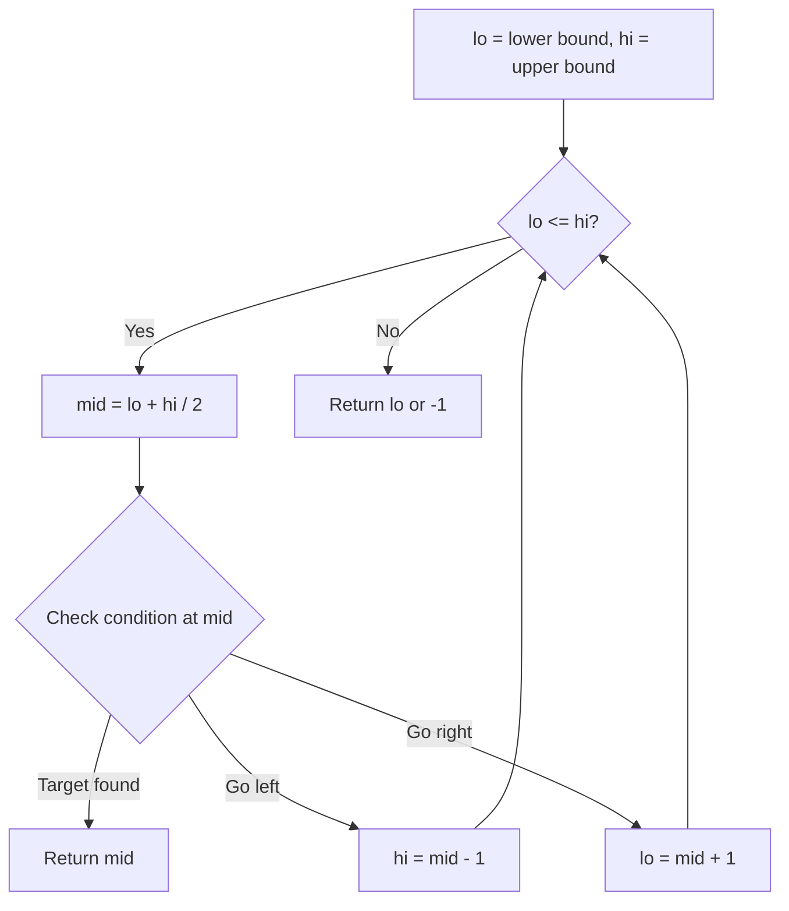
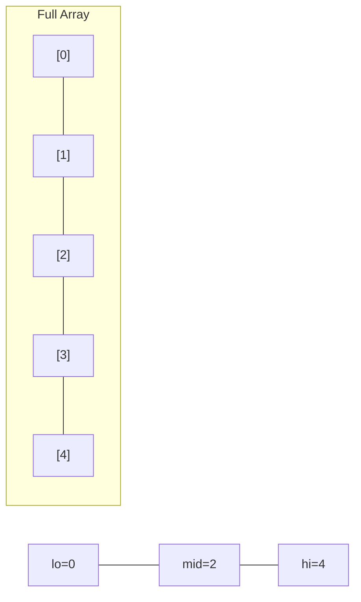
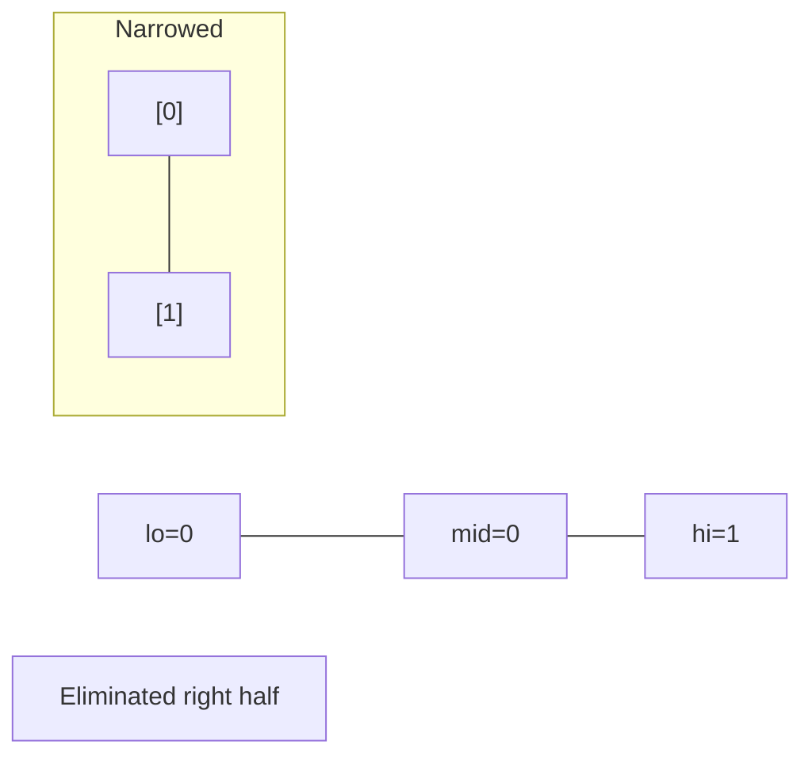
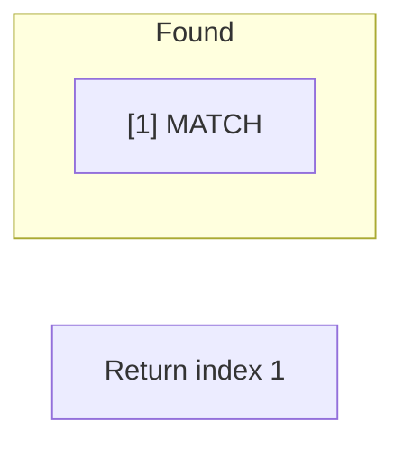

# Problem 1095: Find in Mountain Array

**Difficulty:** Hard  
**Tags:** Array, Binary Search, Interactive  
**Pattern:** Binary Search  
**Link:** [leetcode.com/problems/find-in-mountain-array](https://leetcode.com/problems/find-in-mountain-array/)

## Description

*(This problem is an **interactive problem**.)*

You may recall that an array `arr` is a **mountain array** if and only if:

	- `arr.length >= 3`
	- There exists some `i` with `0 < i < arr.length - 1` such that:
	
		`arr[0] < arr[1] < ... < arr[i - 1] < arr[i]`
		- `arr[i] > arr[i + 1] > ... > arr[arr.length - 1]`
	
	

Given a mountain array `mountainArr`, return the **minimum** `index` such that `mountainArr.get(index) == target`. If such an `index` does not exist, return `-1`.

**You cannot access the mountain array directly.** You may only access the array using a `MountainArray` interface:

	- `MountainArray.get(k)` returns the element of the array at index `k` (0-indexed).
	- `MountainArray.length()` returns the length of the array.

Submissions making more than `100` calls to `MountainArray.get` will be judged *Wrong Answer*. Also, any solutions that attempt to circumvent the judge will result in disqualification.

 

Example 1:

```

**Input:** mountainArr = [1,2,3,4,5,3,1], target = 3
**Output:** 2
**Explanation:** 3 exists in the array, at index=2 and index=5. Return the minimum index, which is 2.
```

Example 2:

```

**Input:** mountainArr = [0,1,2,4,2,1], target = 3
**Output:** -1
**Explanation:** 3 does not exist in `the array,` so we return -1.

```

 

**Constraints:**

	- `3 <= mountainArr.length() <= 10^4`
	- `0 <= target <= 10^9`
	- `0 <= mountainArr.get(index) <= 10^9`

## Approach: Binary Search

Use binary search to halve the search space each iteration. Define the search range [lo, hi], compute mid, and decide which half to keep based on the problem's monotonic condition.

## Pseudocode

```
1. lo = lower_bound, hi = upper_bound
2. While lo <= hi (or lo < hi):
   a. mid = (lo + hi) // 2
   b. If condition(mid) is satisfied: record answer, search left half
   c. Else: search right half
3. Return answer
```

## Algorithm Flow



## Visual State Transitions

**Binary Search Step-by-Step:**

**Frame 1: Initial search space**


**Frame 2: Compare mid, narrow search**


**Frame 3: Found target**



## Complexity Analysis

- **Time:** O(log n)
- **Space:** O(1)

## Solution (Python3)

```python
class Solution:
    def findInMountainArray(self, target: int, mountainArr: 'MountainArray') -> int:
        # Binary search - O(log n) time, O(1) space
        lo, hi = 0, len(target) - 1
        while lo <= hi:
            mid = lo + (hi - lo) // 2
            if target[mid] == mountainArr:
                return mid
            elif target[mid] < mountainArr:
                lo = mid + 1
            else:
                hi = mid - 1
        return 0
```

## Solution (C++)

```cpp
#include <string>
#include <vector>
using namespace std;

class Solution {
public:
    int findInMountainArray(int target, 'MountainArray' mountainArr) {
        // Binary search - O(log n) time, O(1) space
        int lo = 0, hi = target.size() - 1;
        while (lo <= hi) {
            int mid = lo + (hi - lo) / 2;
            if (target[mid] == mountainArr) {
                return mid;
            } else if (target[mid] < mountainArr) {
                lo = mid + 1;
            } else {
                hi = mid - 1;
            }
        }
        return 0;
    }
};
```
