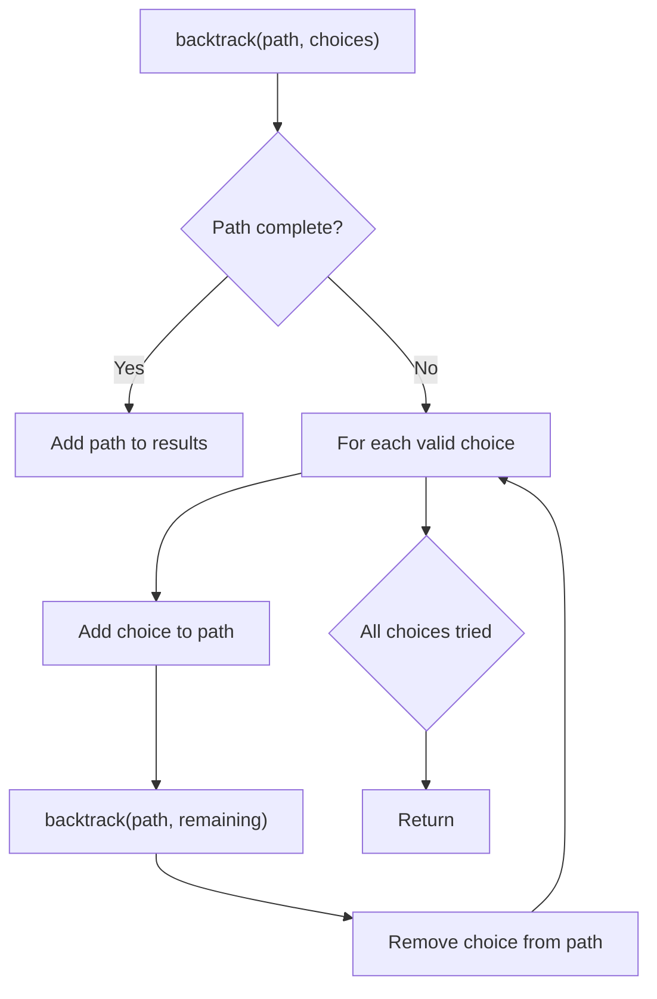
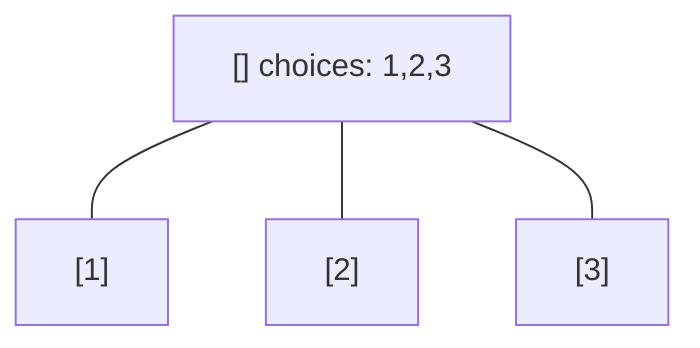
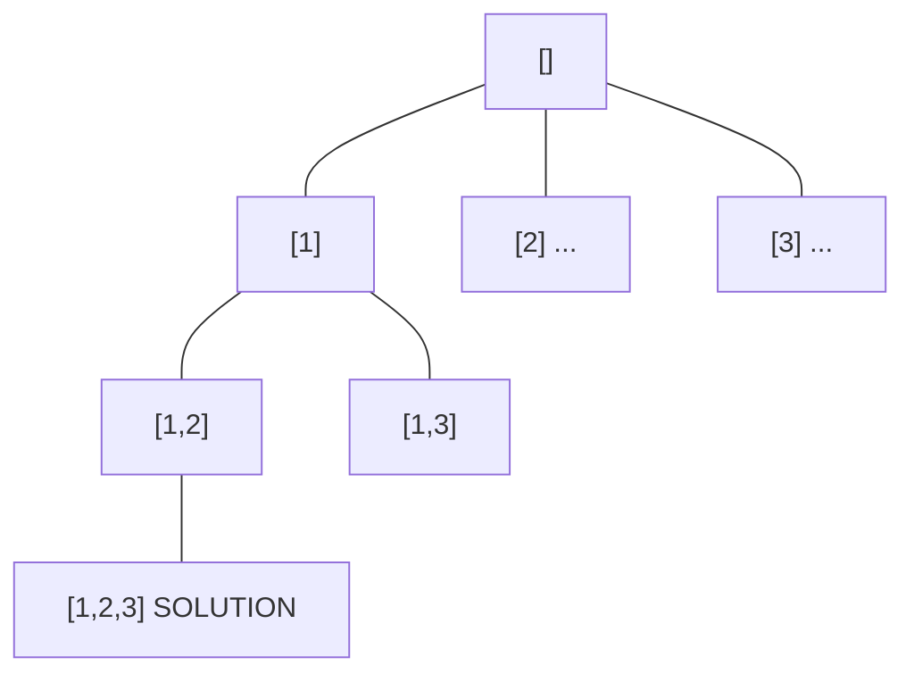
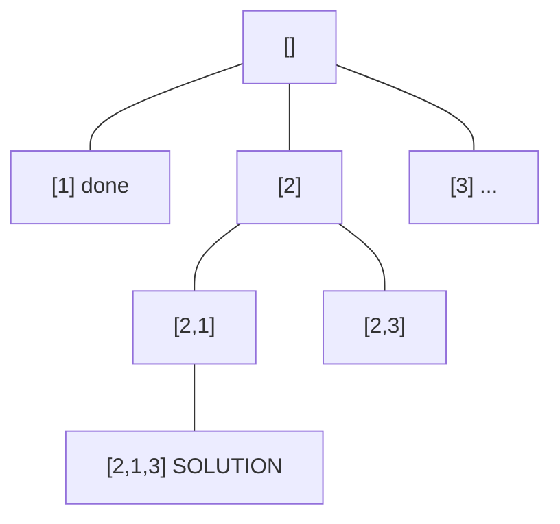
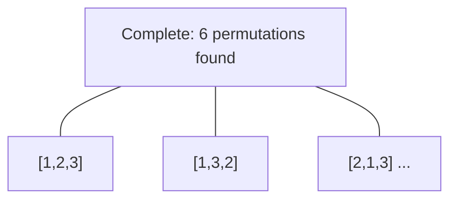

# Problem 1096: Brace Expansion II

**Difficulty:** Hard  
**Tags:** Hash Table, String, Backtracking, Stack, Breadth-First Search, Sorting  
**Pattern:** Backtracking  
**Link:** [leetcode.com/problems/brace-expansion-ii](https://leetcode.com/problems/brace-expansion-ii/)

## Description

Under the grammar given below, strings can represent a set of lowercase words. Let `R(expr)` denote the set of words the expression represents.

The grammar can best be understood through simple examples:

	- Single letters represent a singleton set containing that word.
	
		`R("a") = {"a"}`
		- `R("w") = {"w"}`
	
	
	- When we take a comma-delimited list of two or more expressions, we take the union of possibilities.
	
		`R("{a,b,c}") = {"a","b","c"}`
		- `R("{{a,b},{b,c}}") = {"a","b","c"}` (notice the final set only contains each word at most once)
	
	
	- When we concatenate two expressions, we take the set of possible concatenations between two words where the first word comes from the first expression and the second word comes from the second expression.
	
		`R("{a,b}{c,d}") = {"ac","ad","bc","bd"}`
		- `R("a{b,c}{d,e}f{g,h}") = {"abdfg", "abdfh", "abefg", "abefh", "acdfg", "acdfh", "acefg", "acefh"}`
	
	

Formally, the three rules for our grammar:

	- For every lowercase letter `x`, we have `R(x) = {x}`.
	- For expressions `e1, e2, ... , ek` with `k >= 2`, we have `R({e1, e2, ...}) = R(e1) ∪ R(e2) ∪ ...`
	- For expressions `e1` and `e2`, we have `R(e1 + e2) = {a + b for (a, b) in R(e1) × R(e2)}`, where `+` denotes concatenation, and `×` denotes the cartesian product.

Given an expression representing a set of words under the given grammar, return *the sorted list of words that the expression represents*.

 

Example 1:

```

**Input:** expression = "{a,b}{c,{d,e}}"
**Output:** ["ac","ad","ae","bc","bd","be"]

```

Example 2:

```

**Input:** expression = "{{a,z},a{b,c},{ab,z}}"
**Output:** ["a","ab","ac","z"]
**Explanation:** Each distinct word is written only once in the final answer.

```

 

**Constraints:**

	- `1 <= expression.length <= 60`
	- `expression[i]` consists of `'{'`, `'}'`, `','`or lowercase English letters.
	- The given `expression` represents a set of words based on the grammar given in the description.

## Approach: Backtracking

Explore all possible solutions by building candidates incrementally. At each step, make a choice and recurse. If the choice leads to a dead end, undo the choice (backtrack) and try the next option.

## Pseudocode

```
1. Define backtrack(path, choices):
   a. If path is a complete solution: add to results
   b. For each choice in choices:
      - If choice is valid:
        * Add choice to path
        * backtrack(path, remaining_choices)
        * Remove choice from path (backtrack)
2. Call backtrack([], all_choices)
```

## Algorithm Flow



## Visual State Transitions

**Backtracking Decision Tree:**

**Frame 1: Root - start with empty path**


**Frame 2: Explore branch [1]**


**Frame 3: Backtrack, explore [2]**


**Frame 4: All solutions found**



## Complexity Analysis

- **Time:** O(k^n) or O(n!)
- **Space:** O(n)

## Solution (Python3)

```python
class Solution:
    def braceExpansionII(self, expression: str) -> List[str]:
        # Backtracking - O(2^n) or O(n!) time
        result = []
        
        def backtrack(path, start):
            result.append(path[:])
            for i in range(start, len(expression)):
                path.append(expression[i])
                backtrack(path, i + 1)
                path.pop()
        
        backtrack([], 0)
        return result
```

## Solution (C++)

```cpp
#include <functional>
#include <string>
#include <vector>
using namespace std;

class Solution {
public:
    vector<string> braceExpansionII(string& expression) {
        // Backtracking - O(2^n) or O(n!) time
        vector<vector<int>> result;
        vector<int> path;
        function<void(int)> backtrack = [&](int start) {
            result.push_back(path);
            for (int i = start; i < (int)expression.size(); i++) {
                path.push_back(expression[i]);
                backtrack(i + 1);
                path.pop_back();
            }
        };
        backtrack(0);
        return result;
    }
};
```
