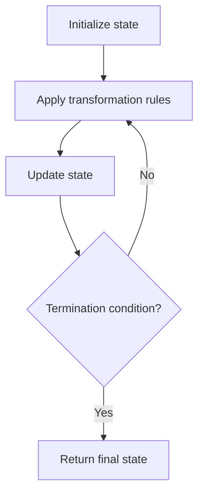

# Problem 1103: Distribute Candies to People

**Difficulty:** Easy  
**Tags:** Math, Simulation  
**Pattern:** Simulation  
**Link:** [leetcode.com/problems/distribute-candies-to-people](https://leetcode.com/problems/distribute-candies-to-people/)

## Description

We distribute some number of `candies`, to a row of **`n = num_people`** people in the following way:

We then give 1 candy to the first person, 2 candies to the second person, and so on until we give `n` candies to the last person.

Then, we go back to the start of the row, giving `n + 1` candies to the first person, `n + 2` candies to the second person, and so on until we give `2 * n` candies to the last person.

This process repeats (with us giving one more candy each time, and moving to the start of the row after we reach the end) until we run out of candies.  The last person will receive all of our remaining candies (not necessarily one more than the previous gift).

Return an array (of length `num_people` and sum `candies`) that represents the final distribution of candies.

 

Example 1:

```

**Input:** candies = 7, num_people = 4
**Output:** [1,2,3,1]
**Explanation:**
On the first turn, ans[0] += 1, and the array is [1,0,0,0].
On the second turn, ans[1] += 2, and the array is [1,2,0,0].
On the third turn, ans[2] += 3, and the array is [1,2,3,0].
On the fourth turn, ans[3] += 1 (because there is only one candy left), and the final array is [1,2,3,1].

```

Example 2:

```

**Input:** candies = 10, num_people = 3
**Output:** [5,2,3]
**Explanation: **
On the first turn, ans[0] += 1, and the array is [1,0,0].
On the second turn, ans[1] += 2, and the array is [1,2,0].
On the third turn, ans[2] += 3, and the array is [1,2,3].
On the fourth turn, ans[0] += 4, and the final array is [5,2,3].

```

 

**Constraints:**

	- 1 <= candies <= 10^9
	- 1 <= num_people <= 1000

## Approach: Simulation

Simulate the process described in the problem step by step. Follow the rules exactly, tracking state at each step.

## Pseudocode

```
1. Initialize state (grid, pointers, counters)
2. For each step / iteration:
   a. Apply the transformation rules
   b. Update state
   c. Check termination condition
3. Return final state or result
```

## Algorithm Flow



## Complexity Analysis

- **Time:** O(n) or O(n * k)
- **Space:** O(n)

## Solution (Python3)

```python
class Solution:
    def distributeCandies(self, candies: int, num_people: int) -> List[int]:
        # Simulation approach - follow the rules step by step
        result = []
        for i in range(len(candies) if isinstance(candies, list) else candies):
            # Simulate each step
            pass
        return result
```

## Solution (C++)

```cpp
#include <string>
#include <vector>
using namespace std;

class Solution {
public:
    vector<int> distributeCandies(int candies, int num_people) {
        // Simulation approach
        int n = candies.size();
        for (int i = 0; i < n; i++) {
            // Simulate each step
        }
        return {};
    }
};
```
