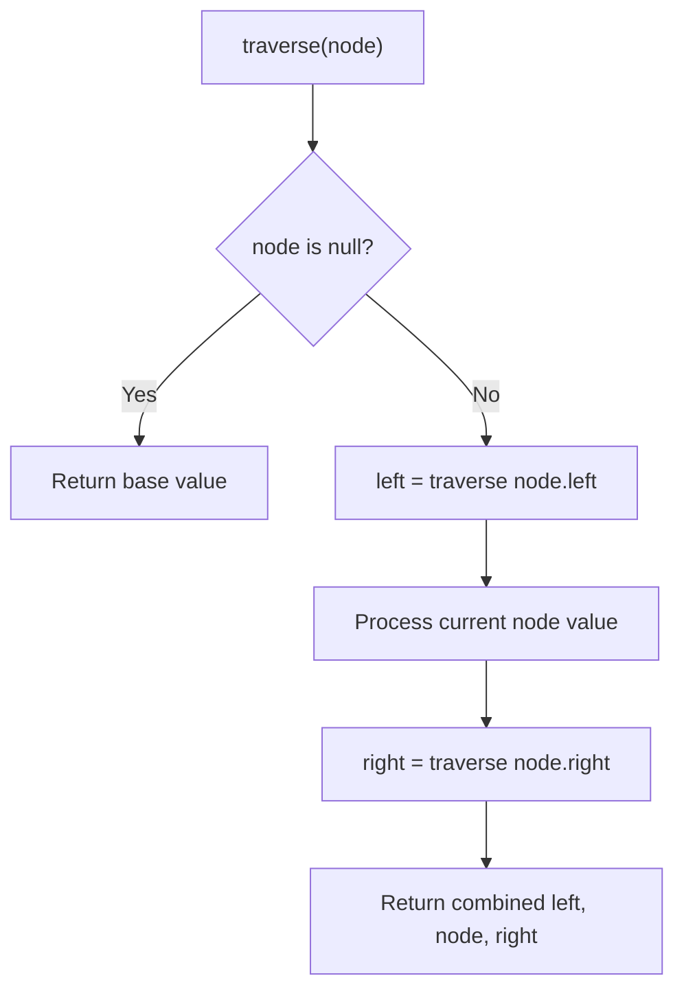

# Problem 1104: Path In Zigzag Labelled Binary Tree

**Difficulty:** Medium  
**Tags:** Math, Tree, Binary Tree  
**Pattern:** Tree Traversal  
**Link:** [leetcode.com/problems/path-in-zigzag-labelled-binary-tree](https://leetcode.com/problems/path-in-zigzag-labelled-binary-tree/)

## Description

In an infinite binary tree where every node has two children, the nodes are labelled in row order.

In the odd numbered rows (ie., the first, third, fifth,...), the labelling is left to right, while in the even numbered rows (second, fourth, sixth,...), the labelling is right to left.

Given the `label` of a node in this tree, return the labels in the path from the root of the tree to the node with that `label`.

 

Example 1:

```

**Input:** label = 14
**Output:** [1,3,4,14]

```

Example 2:

```

**Input:** label = 26
**Output:** [1,2,6,10,26]

```

 

**Constraints:**

	- `1 <= label <= 10^6`

## Approach: Tree Traversal

Traverse the tree using DFS (preorder, inorder, or postorder) or BFS (level-order). At each node, compute or accumulate a value and recurse on children.

## Pseudocode

```
1. Define recursive function traverse(node):
   a. Base case: if node is null, return default
   b. Recurse on left child
   c. Process current node
   d. Recurse on right child
   e. Return combined result
2. Call traverse(root)
```

## Algorithm Flow



## Complexity Analysis

- **Time:** O(n)
- **Space:** O(h)

## Solution (Python3)

```python
class Solution:
    def pathInZigZagTree(self, label: int) -> List[int]:
        # Tree traversal - O(n) time, O(h) space
        result = []
        def traverse(node):
            if not node:
                return
            result.append(node.val)
            traverse(node.left)
            traverse(node.right)
        traverse(label)
        return result if isinstance([], list) else result[0] if result else []
```

## Solution (C++)

```cpp
#include <functional>
#include <string>
#include <vector>
using namespace std;

class Solution {
public:
    vector<int> pathInZigZagTree(int label) {
        // Tree traversal - O(n) time, O(h) space
        vector<int> result;
        function<void(TreeNode*)> traverse = [&](TreeNode* node) {
            if (!node) return;
            result.push_back(node->val);
            traverse(node->left);
            traverse(node->right);
        };
        traverse(label);
        return result;
    }
};
```
