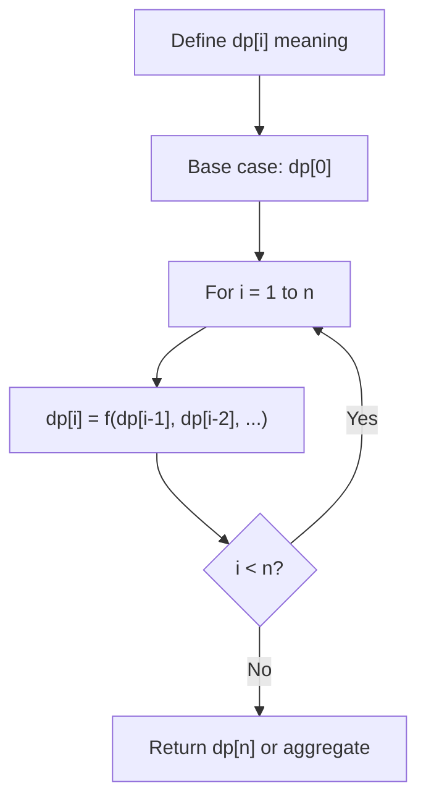
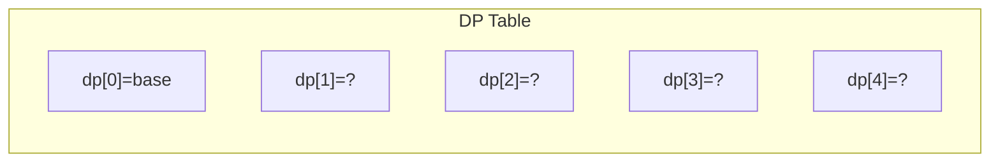
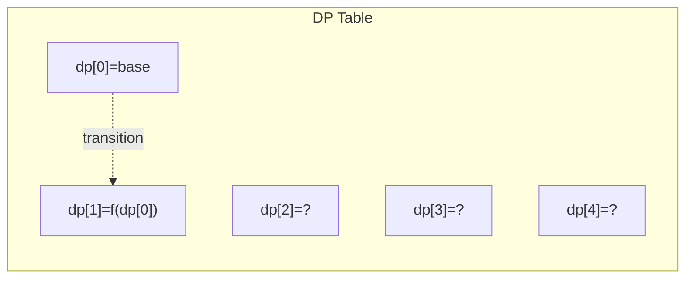
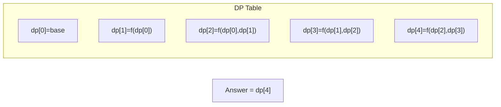

# Problem 1105: Filling Bookcase Shelves

**Difficulty:** Medium  
**Tags:** Array, Dynamic Programming  
**Pattern:** Dynamic Programming (1D)  
**Link:** [leetcode.com/problems/filling-bookcase-shelves](https://leetcode.com/problems/filling-bookcase-shelves/)

## Description

You are given an array `books` where `books[i] = [thicknessi, heighti]` indicates the thickness and height of the `i^th` book. You are also given an integer `shelfWidth`.

We want to place these books in order onto bookcase shelves that have a total width `shelfWidth`.

We choose some of the books to place on this shelf such that the sum of their thickness is less than or equal to `shelfWidth`, then build another level of the shelf of the bookcase so that the total height of the bookcase has increased by the maximum height of the books we just put down. We repeat this process until there are no more books to place.

Note that at each step of the above process, the order of the books we place is the same order as the given sequence of books.

	- For example, if we have an ordered list of `5` books, we might place the first and second book onto the first shelf, the third book on the second shelf, and the fourth and fifth book on the last shelf.

Return *the minimum possible height that the total bookshelf can be after placing shelves in this manner*.

 

Example 1:

```

**Input:** books = [[1,1],[2,3],[2,3],[1,1],[1,1],[1,1],[1,2]], shelfWidth = 4
**Output:** 6
**Explanation:**
The sum of the heights of the 3 shelves is 1 + 3 + 2 = 6.
Notice that book number 2 does not have to be on the first shelf.

```

Example 2:

```

**Input:** books = [[1,3],[2,4],[3,2]], shelfWidth = 6
**Output:** 4

```

 

**Constraints:**

	- `1 <= books.length <= 1000`
	- `1 <= thicknessi <= shelfWidth <= 1000`
	- `1 <= heighti <= 1000`

## Approach: Dynamic Programming (1D)

Break the problem into overlapping subproblems. Define dp[i] as the optimal value for the subproblem ending at or considering index i. Build the solution bottom-up, using previously computed dp values.

## Pseudocode

```
1. Define dp[i] = optimal value for subproblem i
2. Base case: dp[0] = initial value
3. For i from 1 to n:
   a. dp[i] = recurrence(dp[i-1], dp[i-2], ...)
4. Return dp[n] or max/min of dp
```

## Algorithm Flow



## Visual State Transitions

**1D Dynamic Programming Table Build:**

**Frame 1: Initialize base cases**


**Frame 2: Fill dp[1] from dp[0]**


**Frame 3: Fill remaining cells**



## Complexity Analysis

- **Time:** O(n)
- **Space:** O(n)

## Solution (Python3)

```python
class Solution:
    def minHeightShelves(self, books: List[List[int]], shelfWidth: int) -> int:
        # Dynamic programming (1D) - O(n) time, O(n) space
        if not books:
            return 0
        n = len(books) if isinstance(books, list) else books
        dp = [0] * (n + 1)
        dp[0] = 1  # base case
        for i in range(1, n + 1):
            dp[i] = dp[i-1]  # transition (customize per problem)
            if i >= 2:
                dp[i] += dp[i-2]
        return dp[n]
```

## Solution (C++)

```cpp
#include <string>
#include <vector>
using namespace std;

class Solution {
public:
    int minHeightShelves(vector<vector<int>>& books, int shelfWidth) {
        // Dynamic programming (1D) - O(n) time, O(n) space
        int n = books;
        if (n <= 0) return 0;
        vector<int> dp(n + 1, 0);
        dp[0] = 1;
        for (int i = 1; i <= n; i++) {
            dp[i] = dp[i-1];
            if (i >= 2) dp[i] += dp[i-2];
        }
        return dp[n];
    }
};
```
