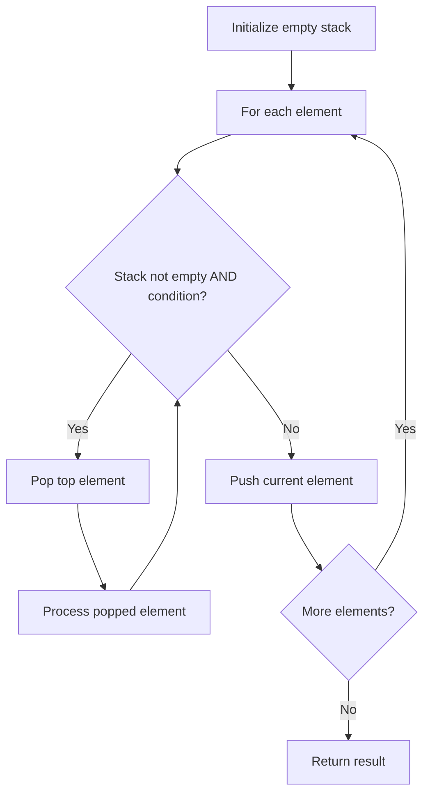

# Problem 1106: Parsing A Boolean Expression

**Difficulty:** Hard  
**Tags:** String, Stack, Recursion  
**Pattern:** Stack  
**Link:** [leetcode.com/problems/parsing-a-boolean-expression](https://leetcode.com/problems/parsing-a-boolean-expression/)

## Description

A **boolean expression** is an expression that evaluates to either `true` or `false`. It can be in one of the following shapes:

	- `'t'` that evaluates to `true`.
	- `'f'` that evaluates to `false`.
	- `'!(subExpr)'` that evaluates to **the logical NOT** of the inner expression `subExpr`.
	- `'&(subExpr1, subExpr2, ..., subExprn)'` that evaluates to **the logical AND** of the inner expressions `subExpr1, subExpr2, ..., subExprn` where `n >= 1`.
	- `'|(subExpr1, subExpr2, ..., subExprn)'` that evaluates to **the logical OR** of the inner expressions `subExpr1, subExpr2, ..., subExprn` where `n >= 1`.

Given a string `expression` that represents a **boolean expression**, return *the evaluation of that expression*.

It is **guaranteed** that the given expression is valid and follows the given rules.

 

Example 1:

```

**Input:** expression = "&(|(f))"
**Output:** false
**Explanation:** 
First, evaluate |(f) --> f. The expression is now "&(f)".
Then, evaluate &(f) --> f. The expression is now "f".
Finally, return false.

```

Example 2:

```

**Input:** expression = "|(f,f,f,t)"
**Output:** true
**Explanation:** The evaluation of (false OR false OR false OR true) is true.

```

Example 3:

```

**Input:** expression = "!(&(f,t))"
**Output:** true
**Explanation:** 
First, evaluate &(f,t) --> (false AND true) --> false --> f. The expression is now "!(f)".
Then, evaluate !(f) --> NOT false --> true. We return true.

```

 

**Constraints:**

	- `1 <= expression.length <= 2 * 10^4`
	- expression[i] is one following characters: `'('`, `')'`, `'&'`, `'|'`, `'!'`, `'t'`, `'f'`, and `','`.

## Approach: Stack

Use a stack (LIFO) to process elements. Push elements when they might be needed later; pop when a matching or resolving condition is found. Common uses: parentheses matching, expression evaluation, next greater element.

## Pseudocode

```
1. Initialize empty stack
2. For each element:
   a. While stack is not empty and condition met:
      - Pop and process top element
   b. Push current element onto stack
3. Process remaining elements in stack if needed
4. Return result
```

## Algorithm Flow



## Complexity Analysis

- **Time:** O(n)
- **Space:** O(n)

## Solution (Python3)

```python
class Solution:
    def parseBoolExpr(self, expression: str) -> bool:
        # Stack-based approach - O(n) time
        stack = []
        for ch in expression:
            if stack and self._matches(stack[-1], ch):
                stack.pop()
            else:
                stack.append(ch)
        return len(stack) == 0 if isinstance(False, bool) else stack

    def _matches(self, a, b):
        pairs = {'(': ')', '[': ']', '{': '}'}
        return pairs.get(a) == b
```

## Solution (C++)

```cpp
#include <stack>
#include <string>
#include <unordered_map>
#include <vector>
using namespace std;

class Solution {
public:
    bool parseBoolExpr(string& expression) {
        // Stack-based approach - O(n) time
        stack<char> st;
        unordered_map<char, char> pairs = {{'(', ')'}, {'[', ']'}, {'{', '}'}};
        for (char ch : expression) {
            if (!st.empty() && pairs.count(st.top()) && pairs[st.top()] == ch) {
                st.pop();
            } else {
                st.push(ch);
            }
        }
        return st.empty();
    }
};
```
