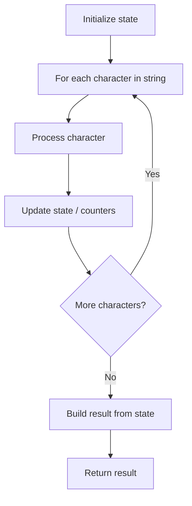

# Problem 1108: Defanging an IP Address

**Difficulty:** Easy  
**Tags:** String  
**Pattern:** String Processing  
**Link:** [leetcode.com/problems/defanging-an-ip-address](https://leetcode.com/problems/defanging-an-ip-address/)

## Description

Given a valid (IPv4) IP `address`, return a defanged version of that IP address.


A *defanged IP address* replaces every period `"."` with `"[.]"`.


 

Example 1:


```
**Input:** address = "1.1.1.1"
**Output:** "1[.]1[.]1[.]1"

```
Example 2:


```
**Input:** address = "255.100.50.0"
**Output:** "255[.]100[.]50[.]0"

```

 

**Constraints:**


	- The given `address` is a valid IPv4 address.

## Approach: String Processing

Process the string character by character. Common techniques: two pointers, sliding window, hash map for frequencies, stack for matching.

## Pseudocode

```
1. Initialize result / tracking state
2. Iterate through string characters:
   a. Process character based on rules
   b. Update state (counters, pointers, stack)
3. Build and return result
```

## Algorithm Flow



## Complexity Analysis

- **Time:** O(n)
- **Space:** O(n)

## Solution (Python3)

```python
class Solution:
    def defangIPaddr(self, address: str) -> str:
        # String processing approach - O(n) time
        result = []
        for ch in address:
            if ch.isalnum():
                result.append(ch.lower())
        # Check palindrome or process
        processed = ''.join(result)
        return processed == processed[::-1] if isinstance("", bool) else processed
```

## Solution (C++)

```cpp
#include <algorithm>
#include <cctype>
#include <string>
#include <vector>
using namespace std;

class Solution {
public:
    string defangIPaddr(string& address) {
        // String processing approach - O(n) time
        string processed;
        for (char ch : address) {
            if (isalnum(ch)) {
                processed += tolower(ch);
            }
        }
        string rev = processed;
        reverse(rev.begin(), rev.end());
        return processed == rev;
    }
};
```
