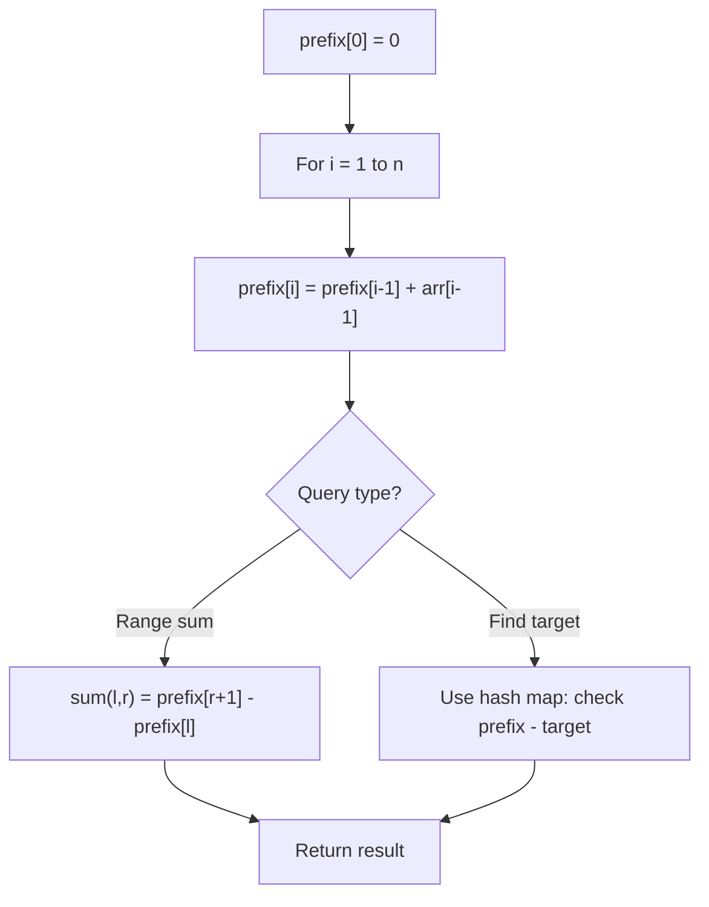

# Problem 1109: Corporate Flight Bookings

**Difficulty:** Medium  
**Tags:** Array, Prefix Sum  
**Pattern:** Prefix Sum  
**Link:** [leetcode.com/problems/corporate-flight-bookings](https://leetcode.com/problems/corporate-flight-bookings/)

## Description

There are `n` flights that are labeled from `1` to `n`.

You are given an array of flight bookings `bookings`, where `bookings[i] = [firsti, lasti, seatsi]` represents a booking for flights `firsti` through `lasti` (**inclusive**) with `seatsi` seats reserved for **each flight** in the range.

Return *an array *`answer`* of length *`n`*, where *`answer[i]`* is the total number of seats reserved for flight *`i`.

 

Example 1:

```

**Input:** bookings = [[1,2,10],[2,3,20],[2,5,25]], n = 5
**Output:** [10,55,45,25,25]
**Explanation:**
Flight labels:        1   2   3   4   5
Booking 1 reserved:  10  10
Booking 2 reserved:      20  20
Booking 3 reserved:      25  25  25  25
Total seats:         10  55  45  25  25
Hence, answer = [10,55,45,25,25]

```

Example 2:

```

**Input:** bookings = [[1,2,10],[2,2,15]], n = 2
**Output:** [10,25]
**Explanation:**
Flight labels:        1   2
Booking 1 reserved:  10  10
Booking 2 reserved:      15
Total seats:         10  25
Hence, answer = [10,25]

```

 

**Constraints:**

	- `1 <= n <= 2 * 10^4`
	- `1 <= bookings.length <= 2 * 10^4`
	- `bookings[i].length == 3`
	- `1 <= firsti <= lasti <= n`
	- `1 <= seatsi <= 10^4`

## Approach: Prefix Sum

Build a prefix sum array where prefix[i] = sum of elements 0..i-1. Any subarray sum [l..r] = prefix[r+1] - prefix[l]. Combine with hash map for O(n) subarray sum queries.

## Pseudocode

```
1. Build prefix sum array: prefix[0]=0, prefix[i]=prefix[i-1]+arr[i-1]
2. Use prefix sums to answer queries:
   - Subarray sum [l..r] = prefix[r+1] - prefix[l]
   - Or use hash map to find prefix[j]-prefix[i] == target
3. Return result
```

## Algorithm Flow



## Complexity Analysis

- **Time:** O(n)
- **Space:** O(n)

## Solution (Python3)

```python
class Solution:
    def corpFlightBookings(self, bookings: List[List[int]], n: int) -> List[int]:
        # Prefix sum approach - O(n) time, O(n) space
        prefix = {0: -1}
        curr_sum = 0
        result = 0
        target = n if isinstance(n, int) else 0
        for i, val in enumerate(bookings):
            curr_sum += val
            if curr_sum - target in prefix:
                result = max(result, i - prefix[curr_sum - target])
            if curr_sum not in prefix:
                prefix[curr_sum] = i
        return result
```

## Solution (C++)

```cpp
#include <algorithm>
#include <string>
#include <unordered_map>
#include <vector>
using namespace std;

class Solution {
public:
    vector<int> corpFlightBookings(vector<vector<int>>& bookings, int n) {
        // Prefix sum approach - O(n) time, O(n) space
        unordered_map<int, int> prefix;
        prefix[0] = -1;
        int curr_sum = 0, result = 0;
        int target = n;
        for (int i = 0; i < (int)bookings.size(); i++) {
            curr_sum += bookings[i];
            if (prefix.count(curr_sum - target)) {
                result = max(result, i - prefix[curr_sum - target]);
            }
            if (!prefix.count(curr_sum)) {
                prefix[curr_sum] = i;
            }
        }
        return result;
    }
};
```
