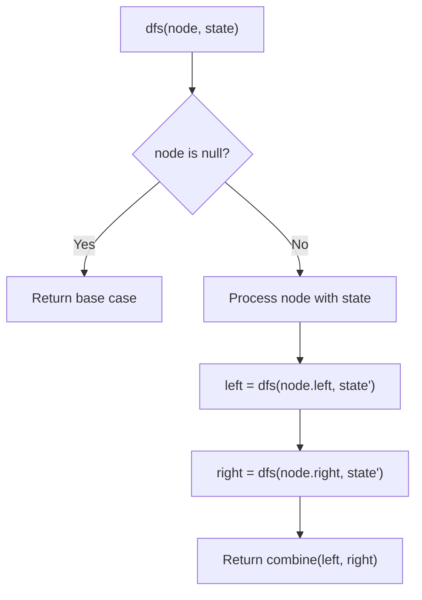
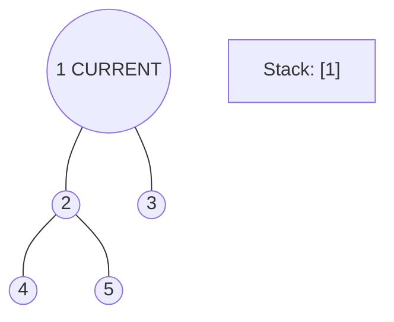
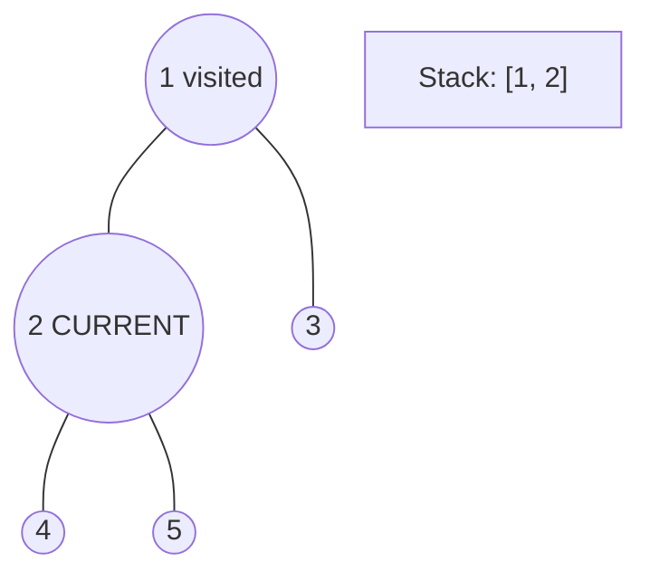
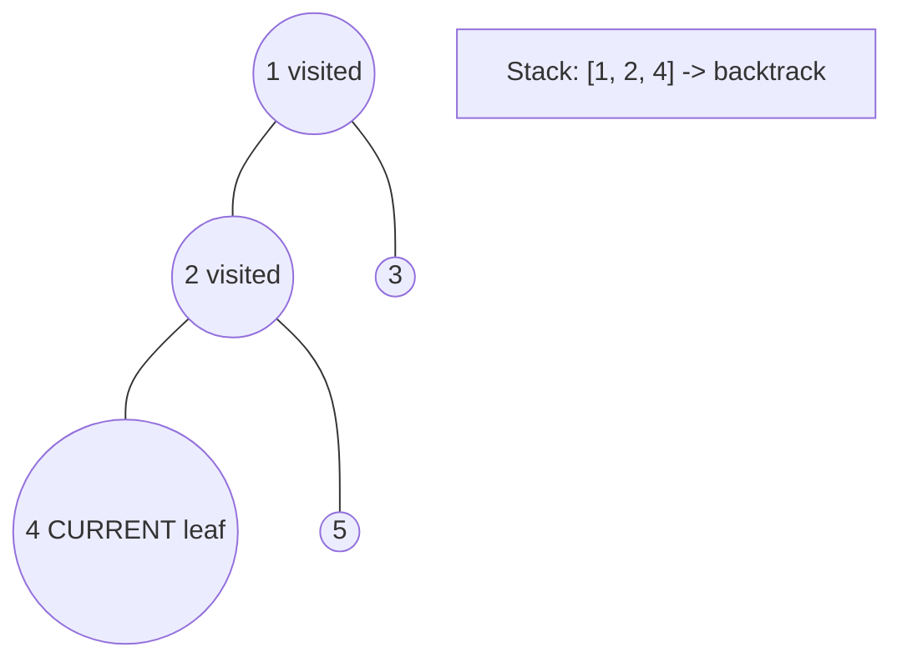
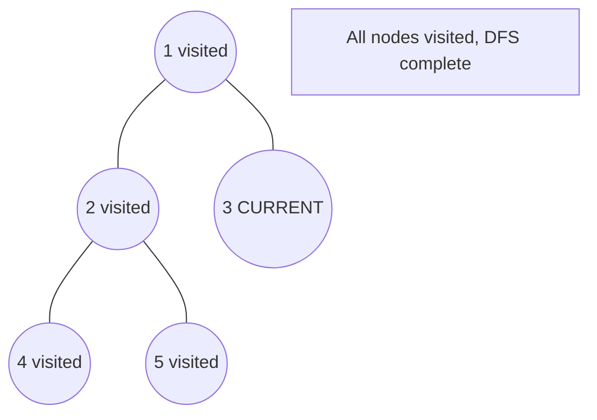

# Problem 1110: Delete Nodes And Return Forest

**Difficulty:** Medium  
**Tags:** Array, Hash Table, Tree, Depth-First Search, Binary Tree  
**Pattern:** DFS Tree Traversal  
**Link:** [leetcode.com/problems/delete-nodes-and-return-forest](https://leetcode.com/problems/delete-nodes-and-return-forest/)

## Description

Given the `root` of a binary tree, each node in the tree has a distinct value.

After deleting all nodes with a value in `to_delete`, we are left with a forest (a disjoint union of trees).

Return the roots of the trees in the remaining forest. You may return the result in any order.

 

Example 1:

```

**Input:** root = [1,2,3,4,5,6,7], to_delete = [3,5]
**Output:** [[1,2,null,4],[6],[7]]

```

Example 2:

```

**Input:** root = [1,2,4,null,3], to_delete = [3]
**Output:** [[1,2,4]]

```

 

**Constraints:**

	- The number of nodes in the given tree is at most `1000`.
	- Each node has a distinct value between `1` and `1000`.
	- `to_delete.length <= 1000`
	- `to_delete` contains distinct values between `1` and `1000`.

## Approach: DFS Tree Traversal

Perform depth-first search on the tree. Recurse on left and right subtrees, combining results bottom-up. Track state (path, depth, sum) during traversal.

## Pseudocode

```
1. Define dfs(node, state):
   a. Base case: if null, return default
   b. Process node with current state
   c. left_result = dfs(node.left, updated_state)
   d. right_result = dfs(node.right, updated_state)
   e. Return combine(left_result, right_result)
2. Return dfs(root, initial_state)
```

## Algorithm Flow



## Visual State Transitions

**DFS Tree Traversal Step-by-Step:**

**Frame 1: Start at root**


**Frame 2: Go left - visit node 2**


**Frame 3: Go left - visit node 4 (leaf)**


**Frame 4: Backtrack, visit node 5, then node 3**



## Complexity Analysis

- **Time:** O(n)
- **Space:** O(h)

## Solution (Python3)

```python
class Solution:
    def delNodes(self, root: Optional[TreeNode], to_delete: List[int]) -> List[TreeNode]:
        # DFS on binary tree - O(n) time, O(h) space
        def dfs(node):
            if not node:
                return 0
            left = dfs(node.left)
            right = dfs(node.right)
            return 1 + max(left, right)
        
        result = dfs(root)
        return result
```

## Solution (C++)

```cpp
#include <algorithm>
#include <functional>
#include <string>
#include <vector>
using namespace std;

class Solution {
public:
    vector<TreeNode*> delNodes(TreeNode* root, vector<int>& to_delete) {
        // DFS on binary tree - O(n) time, O(h) space
        function<int(TreeNode*)> dfs = [&](TreeNode* node) -> int {
            if (!node) return 0;
            int left = dfs(node->left);
            int right = dfs(node->right);
            return 1 + max(left, right);
        };
        return dfs(root);
    }
};
```
