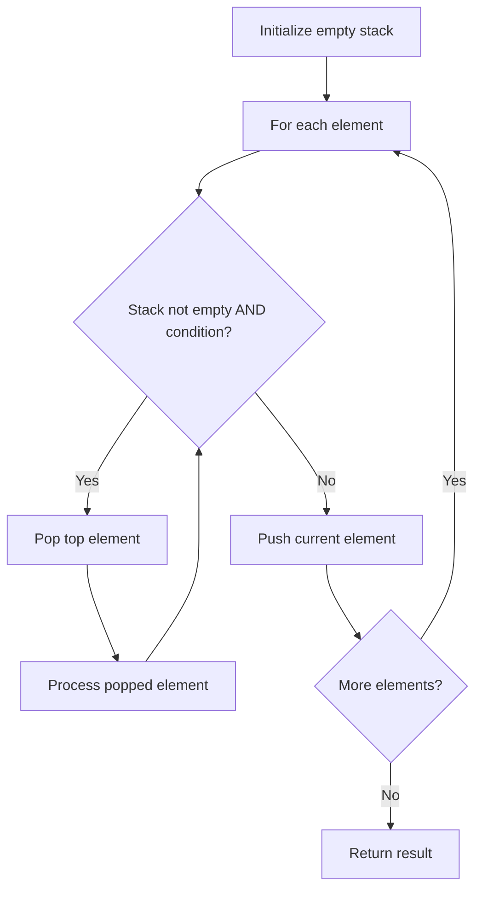

# Problem 1111: Maximum Nesting Depth of Two Valid Parentheses Strings

**Difficulty:** Medium  
**Tags:** String, Stack  
**Pattern:** Stack  
**Link:** [leetcode.com/problems/maximum-nesting-depth-of-two-valid-parentheses-strings](https://leetcode.com/problems/maximum-nesting-depth-of-two-valid-parentheses-strings/)

## Description

A string is a *valid parentheses string* (denoted VPS) if and only if it consists of `"("` and `")"` characters only, and:


	- It is the empty string, or
	- It can be written as `AB` (`A` concatenated with `B`), where `A` and `B` are VPS's, or
	- It can be written as `(A)`, where `A` is a VPS.


We can similarly define the *nesting depth* `depth(S)` of any VPS `S` as follows:


	- `depth("") = 0`
	- `depth(A + B) = max(depth(A), depth(B))`, where `A` and `B` are VPS's
	- `depth("(" + A + ")") = 1 + depth(A)`, where `A` is a VPS.


For example,  `""`, `"()()"`, and `"()(()())"` are VPS's (with nesting depths 0, 1, and 2), and `")("` and `"(()"` are not VPS's.


 


Given a VPS seq, split it into two disjoint subsequences `A` and `B`, such that `A` and `B` are VPS's (and `A.length + B.length = seq.length`).


Now choose **any** such `A` and `B` such that `max(depth(A), depth(B))` is the minimum possible value.


Return an `answer` array (of length `seq.length`) that encodes such a choice of `A` and `B`:  `answer[i] = 0` if `seq[i]` is part of `A`, else `answer[i] = 1`.  Note that even though multiple answers may exist, you may return any of them.


 

Example 1:

```

**Input:** seq = "(()())"
**Output:** [0,1,1,1,1,0]

```

Example 2:

```

**Input:** seq = "()(())()"
**Output:** [0,0,0,1,1,0,1,1]

```

 

**Constraints:**

	- `1 <= seq.size <= 10000`

## Approach: Stack

Use a stack (LIFO) to process elements. Push elements when they might be needed later; pop when a matching or resolving condition is found. Common uses: parentheses matching, expression evaluation, next greater element.

## Pseudocode

```
1. Initialize empty stack
2. For each element:
   a. While stack is not empty and condition met:
      - Pop and process top element
   b. Push current element onto stack
3. Process remaining elements in stack if needed
4. Return result
```

## Algorithm Flow



## Complexity Analysis

- **Time:** O(n)
- **Space:** O(n)

## Solution (Python3)

```python
class Solution:
    def maxDepthAfterSplit(self, seq: str) -> List[int]:
        # Stack-based approach - O(n) time
        stack = []
        for ch in seq:
            if stack and self._matches(stack[-1], ch):
                stack.pop()
            else:
                stack.append(ch)
        return len(stack) == 0 if isinstance([], bool) else stack

    def _matches(self, a, b):
        pairs = {'(': ')', '[': ']', '{': '}'}
        return pairs.get(a) == b
```

## Solution (C++)

```cpp
#include <stack>
#include <string>
#include <unordered_map>
#include <vector>
using namespace std;

class Solution {
public:
    vector<int> maxDepthAfterSplit(string& seq) {
        // Stack-based approach - O(n) time
        stack<char> st;
        unordered_map<char, char> pairs = {{'(', ')'}, {'[', ']'}, {'{', '}'}};
        for (char ch : seq) {
            if (!st.empty() && pairs.count(st.top()) && pairs[st.top()] == ch) {
                st.pop();
            } else {
                st.push(ch);
            }
        }
        return st.empty();
    }
};
```
