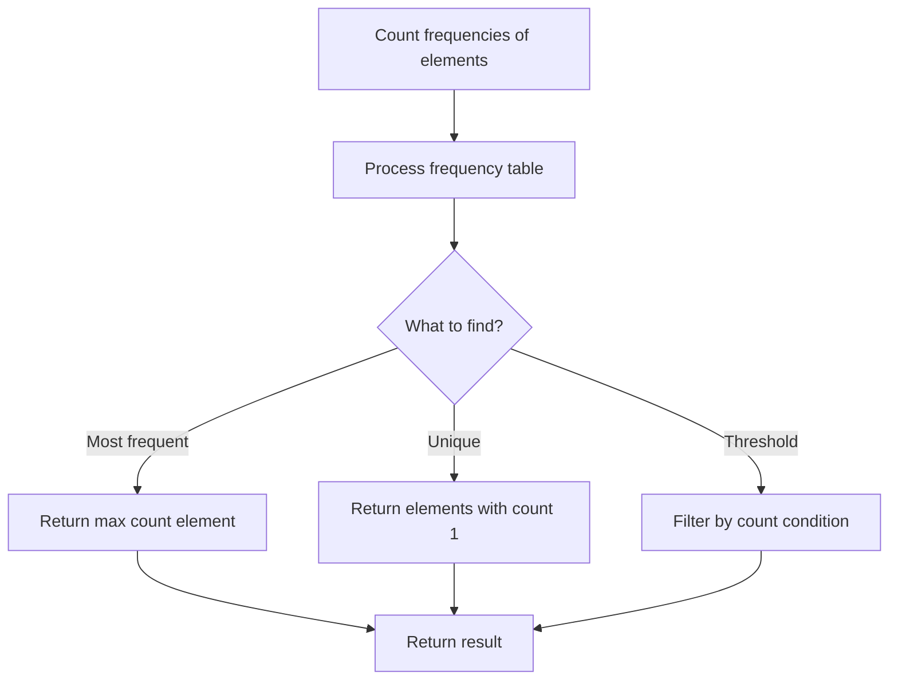

# Problem 1121: Divide Array Into Increasing Sequences

**Difficulty:** Hard  
**Tags:** Array, Counting  
**Pattern:** Counting  
**Link:** [leetcode.com/problems/divide-array-into-increasing-sequences](https://leetcode.com/problems/divide-array-into-increasing-sequences/)

## Description

*(Premium problem -- description requires LeetCode subscription)*

## Approach: Counting

Count occurrences of elements using a hash map, array, or counter. Process counts to determine the answer.

## Pseudocode

```
1. Count frequency of each element
2. Process frequency table:
   - Find elements with specific counts
   - Sort by frequency
   - Apply conditions on counts
3. Return result
```

## Algorithm Flow



## Complexity Analysis

- **Time:** O(n)
- **Space:** O(n)

## Solution (Python3)

```python
class Solution:
    pass
```

## Solution (C++)

```cpp
class Solution {
public:
    // Design problem stub
};
```
