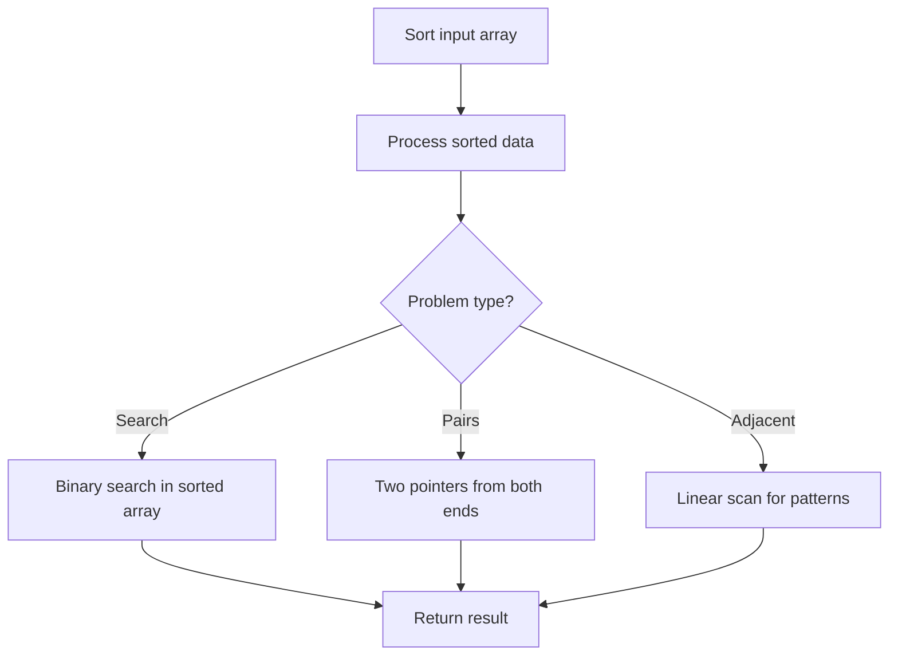

# Problem 1122: Relative Sort Array

**Difficulty:** Easy  
**Tags:** Array, Hash Table, Sorting, Counting Sort  
**Pattern:** Sorting  
**Link:** [leetcode.com/problems/relative-sort-array](https://leetcode.com/problems/relative-sort-array/)

## Description

Given two arrays `arr1` and `arr2`, the elements of `arr2` are distinct, and all elements in `arr2` are also in `arr1`.

Sort the elements of `arr1` such that the relative ordering of items in `arr1` are the same as in `arr2`. Elements that do not appear in `arr2` should be placed at the end of `arr1` in **ascending** order.

 

Example 1:

```

**Input:** arr1 = [2,3,1,3,2,4,6,7,9,2,19], arr2 = [2,1,4,3,9,6]
**Output:** [2,2,2,1,4,3,3,9,6,7,19]

```

Example 2:

```

**Input:** arr1 = [28,6,22,8,44,17], arr2 = [22,28,8,6]
**Output:** [22,28,8,6,17,44]

```

 

**Constraints:**

	- `1 <= arr1.length, arr2.length <= 1000`
	- `0 <= arr1[i], arr2[i] <= 1000`
	- All the elements of `arr2` are **distinct**.
	- Each `arr2[i]` is in `arr1`.

## Approach: Sorting

Sort the data to enable efficient processing. After sorting, use techniques like binary search, two pointers, or linear scan to solve the problem.

## Pseudocode

```
1. Sort the input array
2. Process sorted data:
   - Use binary search for lookups
   - Use two pointers for pair finding
   - Scan for adjacent patterns
3. Return result
```

## Algorithm Flow



## Complexity Analysis

- **Time:** O(n log n)
- **Space:** O(n)

## Solution (Python3)

```python
class Solution:
    def relativeSortArray(self, arr1: List[int], arr2: List[int]) -> List[int]:
        # Sort-based approach - O(n log n) time
        arr1.sort(key=lambda x: x[0] if isinstance(x, (list, tuple)) else x)
        result = [arr1[0]]
        for i in range(1, len(arr1)):
            curr = arr1[i]
            if isinstance(curr, (list, tuple)) and isinstance(result[-1], (list, tuple)):
                if curr[0] <= result[-1][1]:
                    result[-1] = [result[-1][0], max(result[-1][1], curr[1])]
                else:
                    result.append(curr)
            else:
                result.append(curr)
        return result
```

## Solution (C++)

```cpp
#include <algorithm>
#include <string>
#include <vector>
using namespace std;

class Solution {
public:
    vector<int> relativeSortArray(vector<int>& arr1, vector<int>& arr2) {
        // Sort-based approach - O(n log n) time
        sort(arr1.begin(), arr1.end());
        vector<vector<int>> result;
        result.push_back(arr1[0]);
        for (int i = 1; i < (int)arr1.size(); i++) {
            if (arr1[i][0] <= result.back()[1]) {
                result.back()[1] = max(result.back()[1], arr1[i][1]);
            } else {
                result.push_back(arr1[i]);
            }
        }
        return result;
    }
};
```
