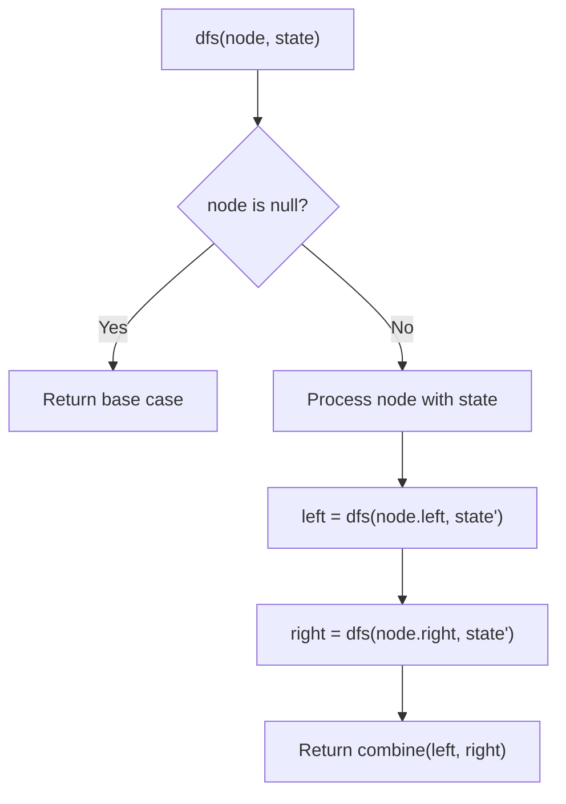
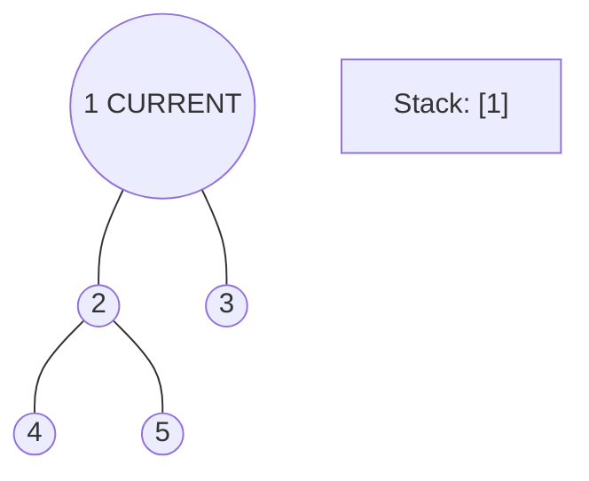
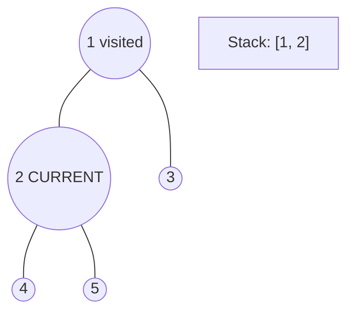
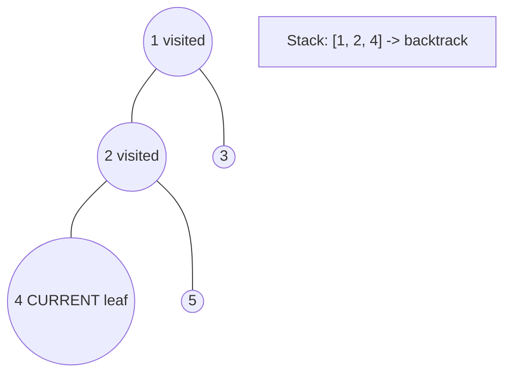
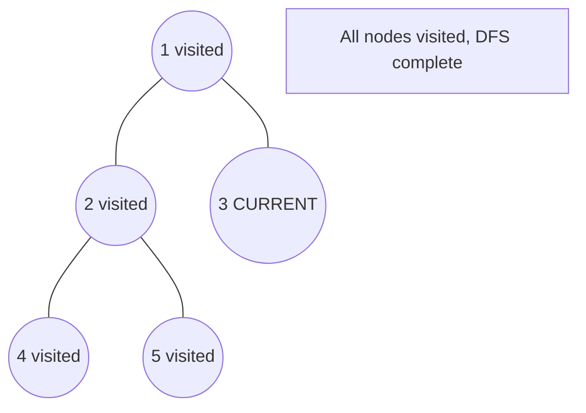

# Problem 1123: Lowest Common Ancestor of Deepest Leaves

**Difficulty:** Medium  
**Tags:** Hash Table, Tree, Depth-First Search, Breadth-First Search, Binary Tree  
**Pattern:** DFS Tree Traversal  
**Link:** [leetcode.com/problems/lowest-common-ancestor-of-deepest-leaves](https://leetcode.com/problems/lowest-common-ancestor-of-deepest-leaves/)

## Description

Given the `root` of a binary tree, return *the lowest common ancestor of its deepest leaves*.

Recall that:

	- The node of a binary tree is a leaf if and only if it has no children
	- The depth of the root of the tree is `0`. if the depth of a node is `d`, the depth of each of its children is `d + 1`.
	- The lowest common ancestor of a set `S` of nodes, is the node `A` with the largest depth such that every node in `S` is in the subtree with root `A`.

 

Example 1:

```

**Input:** root = [3,5,1,6,2,0,8,null,null,7,4]
**Output:** [2,7,4]
**Explanation:** We return the node with value 2, colored in yellow in the diagram.
The nodes coloured in blue are the deepest leaf-nodes of the tree.
Note that nodes 6, 0, and 8 are also leaf nodes, but the depth of them is 2, but the depth of nodes 7 and 4 is 3.
```

Example 2:

```

**Input:** root = [1]
**Output:** [1]
**Explanation:** The root is the deepest node in the tree, and it's the lca of itself.

```

Example 3:

```

**Input:** root = [0,1,3,null,2]
**Output:** [2]
**Explanation:** The deepest leaf node in the tree is 2, the lca of one node is itself.

```

 

**Constraints:**

	- The number of nodes in the tree will be in the range `[1, 1000]`.
	- `0 <= Node.val <= 1000`
	- The values of the nodes in the tree are **unique**.

 

**Note:** This question is the same as 865: https://leetcode.com/problems/smallest-subtree-with-all-the-deepest-nodes/

## Approach: DFS Tree Traversal

Perform depth-first search on the tree. Recurse on left and right subtrees, combining results bottom-up. Track state (path, depth, sum) during traversal.

## Pseudocode

```
1. Define dfs(node, state):
   a. Base case: if null, return default
   b. Process node with current state
   c. left_result = dfs(node.left, updated_state)
   d. right_result = dfs(node.right, updated_state)
   e. Return combine(left_result, right_result)
2. Return dfs(root, initial_state)
```

## Algorithm Flow



## Visual State Transitions

**DFS Tree Traversal Step-by-Step:**

**Frame 1: Start at root**


**Frame 2: Go left - visit node 2**


**Frame 3: Go left - visit node 4 (leaf)**


**Frame 4: Backtrack, visit node 5, then node 3**



## Complexity Analysis

- **Time:** O(n)
- **Space:** O(h)

## Solution (Python3)

```python
class Solution:
    def lcaDeepestLeaves(self, root: Optional[TreeNode]) -> Optional[TreeNode]:
        # DFS on binary tree - O(n) time, O(h) space
        def dfs(node):
            if not node:
                return 0
            left = dfs(node.left)
            right = dfs(node.right)
            return 1 + max(left, right)
        
        result = dfs(root)
        return result
```

## Solution (C++)

```cpp
#include <algorithm>
#include <functional>
#include <string>
#include <vector>
using namespace std;

class Solution {
public:
    TreeNode* lcaDeepestLeaves(TreeNode* root) {
        // DFS on binary tree - O(n) time, O(h) space
        function<int(TreeNode*)> dfs = [&](TreeNode* node) -> int {
            if (!node) return 0;
            int left = dfs(node->left);
            int right = dfs(node->right);
            return 1 + max(left, right);
        };
        return dfs(root);
    }
};
```
