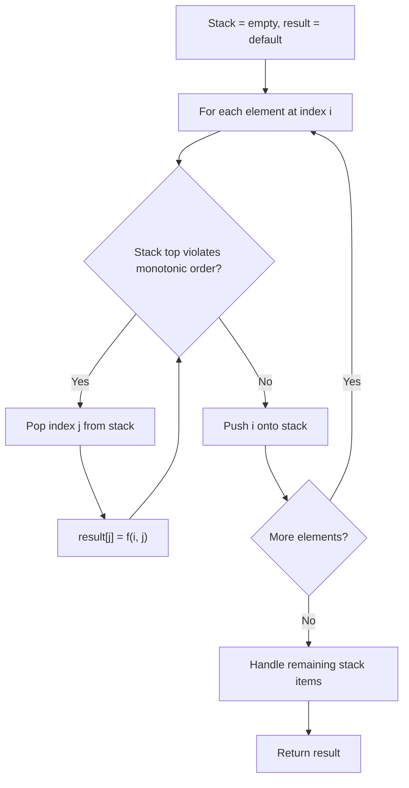
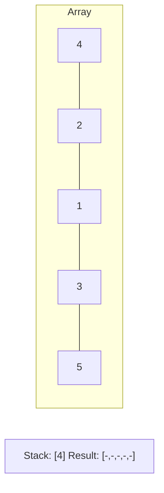
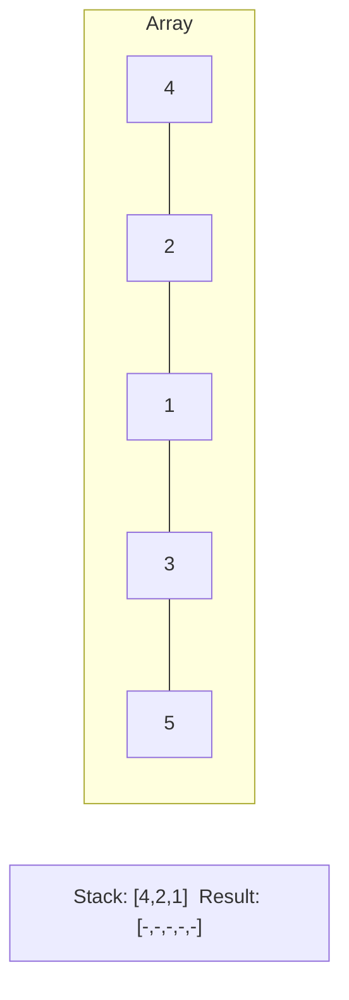
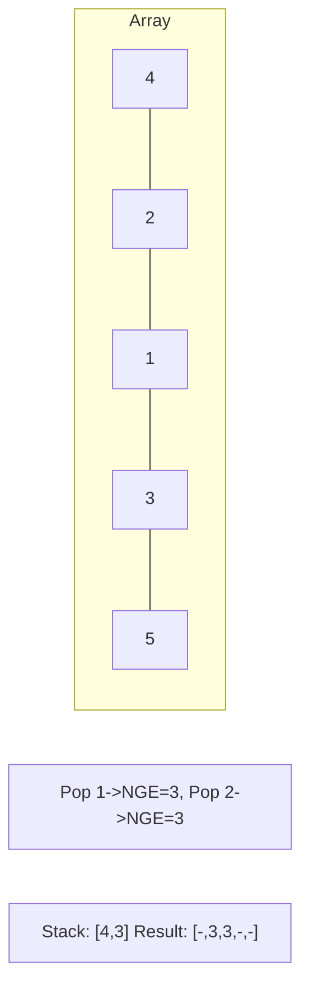
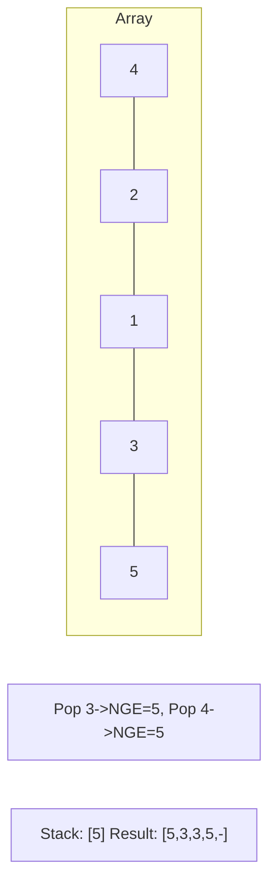

# Problem 1124: Longest Well-Performing Interval

**Difficulty:** Medium  
**Tags:** Array, Hash Table, Stack, Monotonic Stack, Prefix Sum  
**Pattern:** Monotonic Stack  
**Link:** [leetcode.com/problems/longest-well-performing-interval](https://leetcode.com/problems/longest-well-performing-interval/)

## Description

We are given `hours`, a list of the number of hours worked per day for a given employee.

A day is considered to be a *tiring day* if and only if the number of hours worked is (strictly) greater than `8`.

A *well-performing interval* is an interval of days for which the number of tiring days is strictly larger than the number of non-tiring days.

Return the length of the longest well-performing interval.

 

Example 1:

```

**Input:** hours = [9,9,6,0,6,6,9]
**Output:** 3
**Explanation: **The longest well-performing interval is [9,9,6].

```

Example 2:

```

**Input:** hours = [6,6,6]
**Output:** 0

```

 

**Constraints:**

	- `1 <= hours.length <= 10^4`
	- `0 <= hours[i] <= 16`

## Approach: Monotonic Stack

Maintain a stack where elements are always in monotonic order (increasing or decreasing). When a new element violates the monotonic property, pop elements and compute results (e.g., next greater/smaller element, spans, areas).

## Pseudocode

```
1. Initialize empty stack, result array
2. For each element (index i):
   a. While stack not empty and arr[i] breaks monotonic order:
      - Pop index j from stack
      - result[j] = compute(i, j)
   b. Push i onto stack
3. Handle remaining elements in stack
4. Return result
```

## Algorithm Flow



## Visual State Transitions

**Monotonic Stack (Next Greater Element):**

**Frame 1: Process first elements**


**Frame 2: Push smaller elements**


**Frame 3: Element 3 pops 1 and 2**


**Frame 4: Element 5 pops all**



## Complexity Analysis

- **Time:** O(n)
- **Space:** O(n)

## Solution (Python3)

```python
class Solution:
    def longestWPI(self, hours: List[int]) -> int:
        # Monotonic stack - O(n) time, O(n) space
        n = len(hours)
        result = [0] * n
        stack = []  # indices
        for i in range(n):
            while stack and hours[i] > hours[stack[-1]]:
                idx = stack.pop()
                result[idx] = i - idx
            stack.append(i)
        return result
```

## Solution (C++)

```cpp
#include <stack>
#include <string>
#include <vector>
using namespace std;

class Solution {
public:
    int longestWPI(vector<int>& hours) {
        // Monotonic stack - O(n) time, O(n) space
        int n = hours.size();
        vector<int> result(n, 0);
        stack<int> st;
        for (int i = 0; i < n; i++) {
            while (!st.empty() && hours[i] > hours[st.top()]) {
                int idx = st.top(); st.pop();
                result[idx] = i - idx;
            }
            st.push(i);
        }
        return result;
    }
};
```
