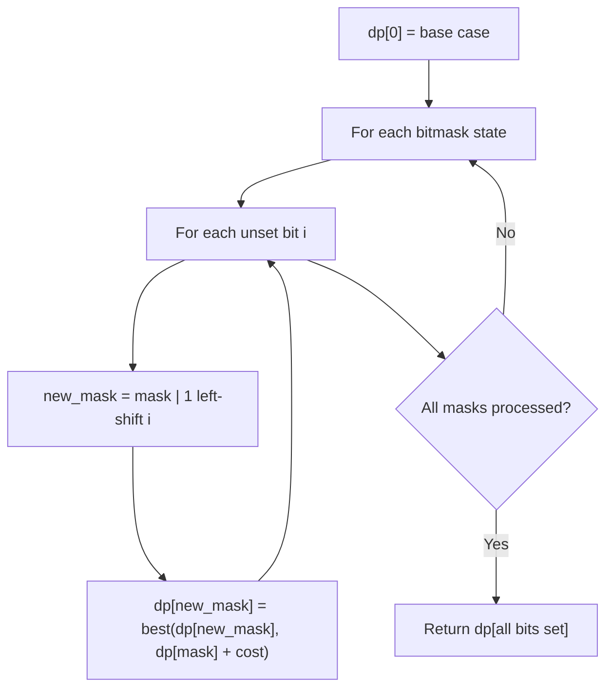

# Problem 1125: Smallest Sufficient Team

**Difficulty:** Hard  
**Tags:** Array, Dynamic Programming, Bit Manipulation, Bitmask  
**Pattern:** Dynamic Programming (Bitmask)  
**Link:** [leetcode.com/problems/smallest-sufficient-team](https://leetcode.com/problems/smallest-sufficient-team/)

## Description

In a project, you have a list of required skills `req_skills`, and a list of people. The `i^th` person `people[i]` contains a list of skills that the person has.

Consider a sufficient team: a set of people such that for every required skill in `req_skills`, there is at least one person in the team who has that skill. We can represent these teams by the index of each person.

	- For example, `team = [0, 1, 3]` represents the people with skills `people[0]`, `people[1]`, and `people[3]`.

Return *any sufficient team of the smallest possible size, represented by the index of each person*. You may return the answer in **any order**.

It is **guaranteed** an answer exists.

 

Example 1:

```
**Input:** req_skills = ["java","nodejs","reactjs"], people = [["java"],["nodejs"],["nodejs","reactjs"]]
**Output:** [0,2]

```
Example 2:

```
**Input:** req_skills = ["algorithms","math","java","reactjs","csharp","aws"], people = [["algorithms","math","java"],["algorithms","math","reactjs"],["java","csharp","aws"],["reactjs","csharp"],["csharp","math"],["aws","java"]]
**Output:** [1,2]

```

 

**Constraints:**

	- `1 <= req_skills.length <= 16`
	- `1 <= req_skills[i].length <= 16`
	- `req_skills[i]` consists of lowercase English letters.
	- All the strings of `req_skills` are **unique**.
	- `1 <= people.length <= 60`
	- `0 <= people[i].length <= 16`
	- `1 <= people[i][j].length <= 16`
	- `people[i][j]` consists of lowercase English letters.
	- All the strings of `people[i]` are **unique**.
	- Every skill in `people[i]` is a skill in `req_skills`.
	- It is guaranteed a sufficient team exists.

## Approach: Dynamic Programming (Bitmask)

Use bitmask to represent subsets of n elements. dp[mask] = optimal value when the selected subset is represented by mask. Iterate over all masks and transitions.

## Pseudocode

```
1. dp[0] = base case
2. For mask from 0 to 2^n - 1:
   a. For each bit i not set in mask:
      - new_mask = mask | (1 << i)
      - dp[new_mask] = best of dp[new_mask], dp[mask] + cost(i)
3. Return dp[(1 << n) - 1]
```

## Algorithm Flow



## Complexity Analysis

- **Time:** O(2^n * n)
- **Space:** O(2^n)

## Solution (Python3)

```python
class Solution:
    def smallestSufficientTeam(self, req_skills: List[str], people: List[List[str]]) -> List[int]:
        # Bitmask DP - O(2^n * n) time
        n = len(req_skills)
        dp = [float('inf')] * (1 << n)
        dp[0] = 0
        for mask in range(1 << n):
            bits = bin(mask).count('1')
            for i in range(n):
                if mask & (1 << i):
                    continue
                new_mask = mask | (1 << i)
                dp[new_mask] = min(dp[new_mask], dp[mask] + 1)
        return dp[(1 << n) - 1]
```

## Solution (C++)

```cpp
#include <algorithm>
#include <climits>
#include <string>
#include <vector>
using namespace std;

class Solution {
public:
    vector<int> smallestSufficientTeam(vector<string>& req_skills, vector<vector<string>>& people) {
        // Bitmask DP - O(2^n * n) time
        int n = req_skills.size();
        vector<int> dp(1 << n, INT_MAX);
        dp[0] = 0;
        for (int mask = 0; mask < (1 << n); mask++) {
            for (int i = 0; i < n; i++) {
                if (mask & (1 << i)) continue;
                int new_mask = mask | (1 << i);
                dp[new_mask] = min(dp[new_mask], dp[mask] + 1);
            }
        }
        return dp[(1 << n) - 1];
    }
};
```
