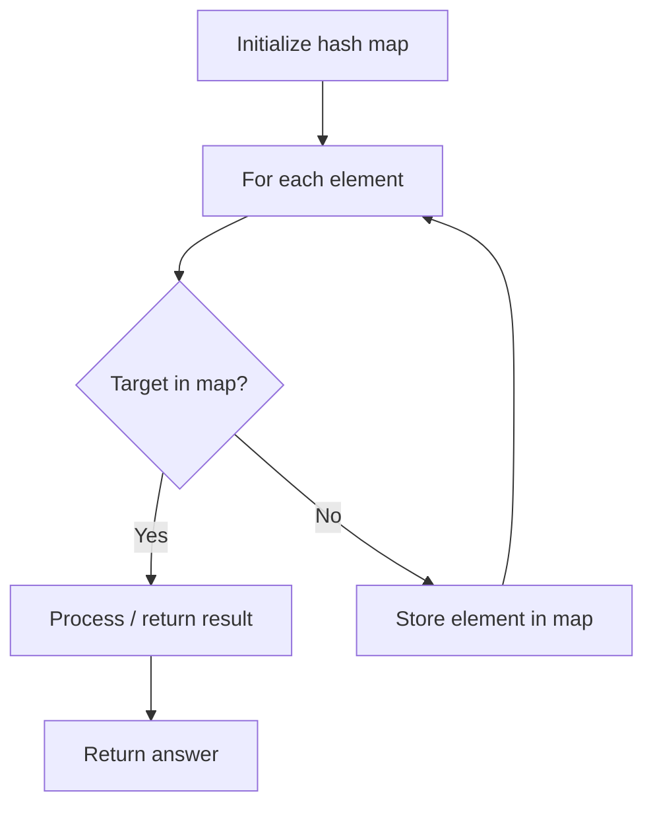

# Problem 1128: Number of Equivalent Domino Pairs

**Difficulty:** Easy  
**Tags:** Array, Hash Table, Counting  
**Pattern:** Hash Map Lookup  
**Link:** [leetcode.com/problems/number-of-equivalent-domino-pairs](https://leetcode.com/problems/number-of-equivalent-domino-pairs/)

## Description

Given a list of `dominoes`, `dominoes[i] = [a, b]` is **equivalent to** `dominoes[j] = [c, d]` if and only if either (`a == c` and `b == d`), or (`a == d` and `b == c`) - that is, one domino can be rotated to be equal to another domino.

Return *the number of pairs *`(i, j)`* for which *`0 <= i < j < dominoes.length`*, and *`dominoes[i]`* is **equivalent to** *`dominoes[j]`.

 

Example 1:

```

**Input:** dominoes = [[1,2],[2,1],[3,4],[5,6]]
**Output:** 1

```

Example 2:

```

**Input:** dominoes = [[1,2],[1,2],[1,1],[1,2],[2,2]]
**Output:** 3

```

 

**Constraints:**

	- `1 <= dominoes.length <= 4 * 10^4`
	- `dominoes[i].length == 2`
	- `1 <= dominoes[i][j] <= 9`

## Approach: Hash Map Lookup

Use a hash map (dictionary) to store elements for O(1) lookup. Iterate through the input, checking membership or counting frequencies in the map.

## Pseudocode

```
1. Initialize hash map
2. Iterate through elements:
   a. Check if target/complement exists in map
   b. If found: process result
   c. Otherwise: store element in map
3. Return result
```

## Algorithm Flow



## Complexity Analysis

- **Time:** O(n)
- **Space:** O(n)

## Solution (Python3)

```python
class Solution:
    def numEquivDominoPairs(self, dominoes: List[List[int]]) -> int:
        # Hash map approach - O(n) time, O(n) space
        seen = {}
        for i, val in enumerate(dominoes):
            complement = dominoes - val
            if complement in seen:
                return [seen[complement], i]
            seen[val] = i
        return 0
```

## Solution (C++)

```cpp
#include <string>
#include <unordered_map>
#include <vector>
using namespace std;

class Solution {
public:
    int numEquivDominoPairs(vector<vector<int>>& dominoes) {
        // Hash map approach - O(n) time, O(n) space
        unordered_map<int, int> seen;
        for (int i = 0; i < dominoes.size(); i++) {
            int complement = dominoes - dominoes[i];
            if (seen.count(complement)) {
                return {seen[complement], i};
            }
            seen[dominoes[i]] = i;
        }
        return 0;
    }
};
```
