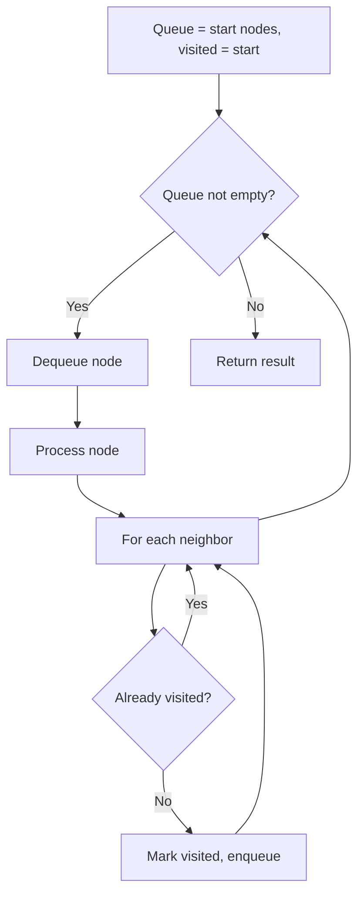
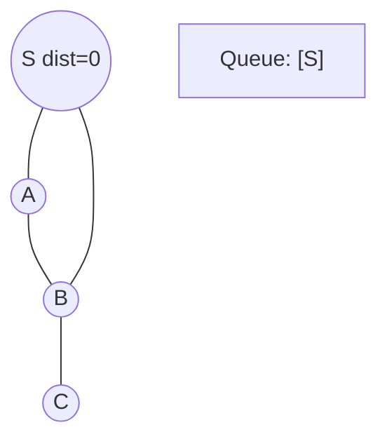
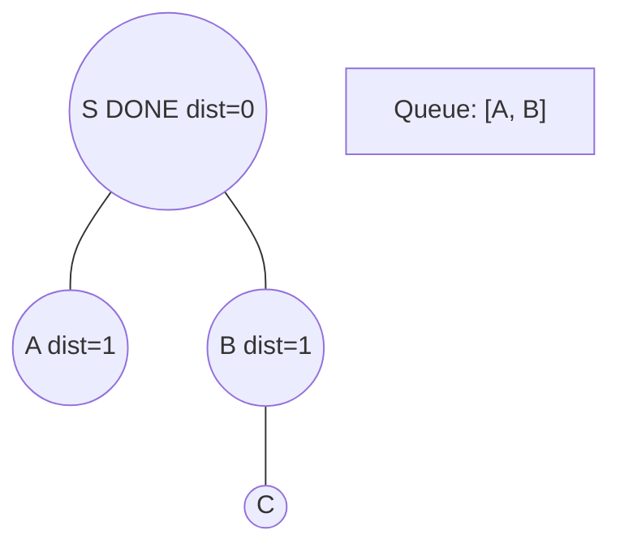
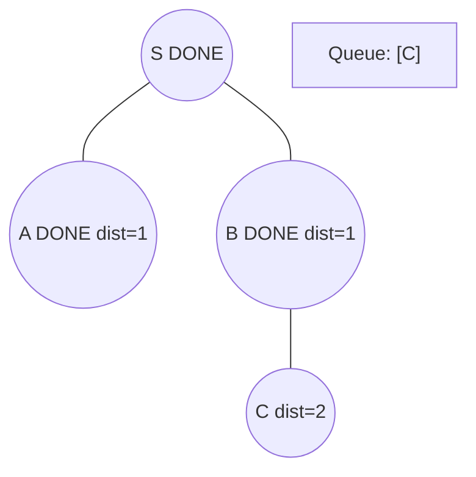
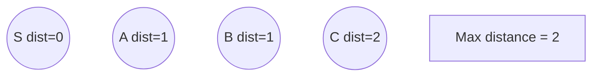

# Problem 1129: Shortest Path with Alternating Colors

**Difficulty:** Medium  
**Tags:** Breadth-First Search, Graph Theory  
**Pattern:** BFS Graph Traversal  
**Link:** [leetcode.com/problems/shortest-path-with-alternating-colors](https://leetcode.com/problems/shortest-path-with-alternating-colors/)

## Description

You are given an integer `n`, the number of nodes in a directed graph where the nodes are labeled from `0` to `n - 1`. Each edge is red or blue in this graph, and there could be self-edges and parallel edges.

You are given two arrays `redEdges` and `blueEdges` where:

	- `redEdges[i] = [ai, bi]` indicates that there is a directed red edge from node `ai` to node `bi` in the graph, and
	- `blueEdges[j] = [uj, vj]` indicates that there is a directed blue edge from node `uj` to node `vj` in the graph.

Return an array `answer` of length `n`, where each `answer[x]` is the length of the shortest path from node `0` to node `x` such that the edge colors alternate along the path, or `-1` if such a path does not exist.

 

Example 1:

```

**Input:** n = 3, redEdges = [[0,1],[1,2]], blueEdges = []
**Output:** [0,1,-1]

```

Example 2:

```

**Input:** n = 3, redEdges = [[0,1]], blueEdges = [[2,1]]
**Output:** [0,1,-1]

```

 

**Constraints:**

	- `1 <= n <= 100`
	- `0 <= redEdges.length, blueEdges.length <= 400`
	- `redEdges[i].length == blueEdges[j].length == 2`
	- `0 <= ai, bi, uj, vj < n`

## Approach: BFS Graph Traversal

Explore the graph breadth-first using a queue. Process nodes level by level; BFS finds shortest paths in unweighted graphs.

## Pseudocode

```
1. Initialize queue with start node(s), visited set
2. While queue not empty:
   a. Dequeue node
   b. Process node
   c. For each unvisited neighbor:
      - Mark visited, enqueue
3. Return result
```

## Algorithm Flow



## Visual State Transitions

**BFS Level-by-Level Traversal:**

**Frame 1: Start BFS from source**


**Frame 2: Process level 0, enqueue neighbors**


**Frame 3: Process level 1**


**Frame 4: All nodes reached**



## Complexity Analysis

- **Time:** O(V + E)
- **Space:** O(V)

## Solution (Python3)

```python
class Solution:
    def shortestAlternatingPaths(self, n: int, redEdges: List[List[int]], blueEdges: List[List[int]]) -> List[int]:
        # BFS on graph - O(V+E) time
        from collections import deque
        if not n:
            return []
        visited = set()
        queue = deque([0])
        visited.add(0)
        dist = 0
        while queue:
            for _ in range(len(queue)):
                node = queue.popleft()
                # Process node
            dist += 1
        return dist
```

## Solution (C++)

```cpp
#include <queue>
#include <string>
#include <unordered_set>
#include <vector>
using namespace std;

class Solution {
public:
    vector<int> shortestAlternatingPaths(int n, vector<vector<int>>& redEdges, vector<vector<int>>& blueEdges) {
        // BFS on graph - O(V+E) time
        if (n.empty()) return {};
        queue<int> q;
        unordered_set<int> visited;
        q.push(0);
        visited.insert(0);
        int dist = 0;
        while (!q.empty()) {
            int sz = q.size();
            for (int i = 0; i < sz; i++) {
                int node = q.front(); q.pop();
                // Process node
            }
            dist++;
        }
        return dist;
    }
};
```
