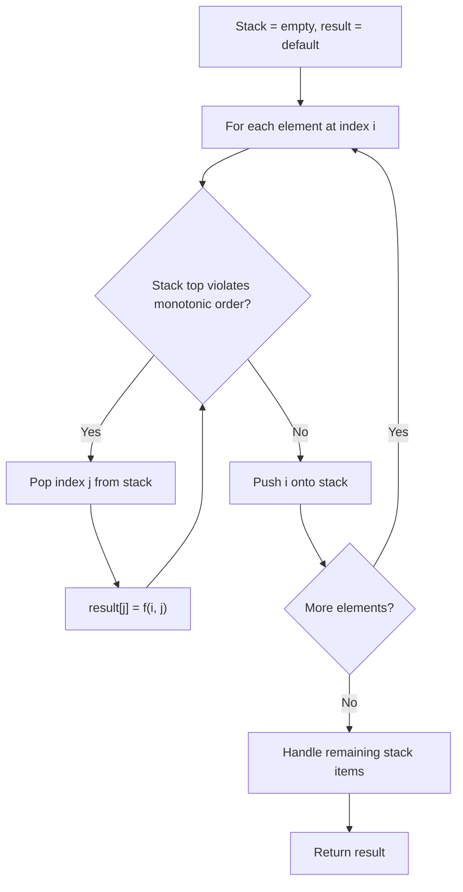
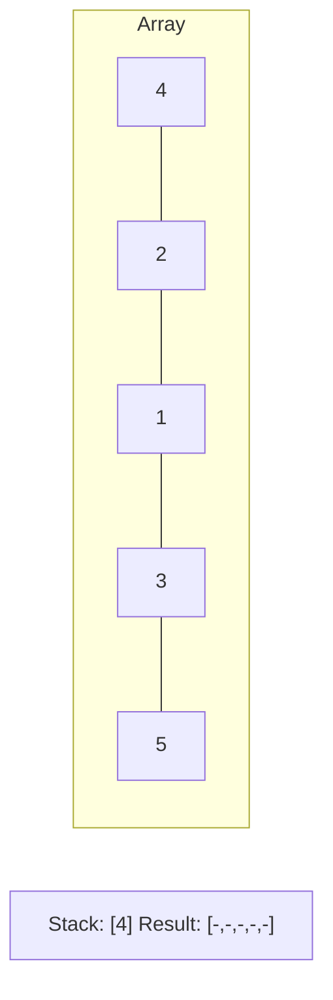
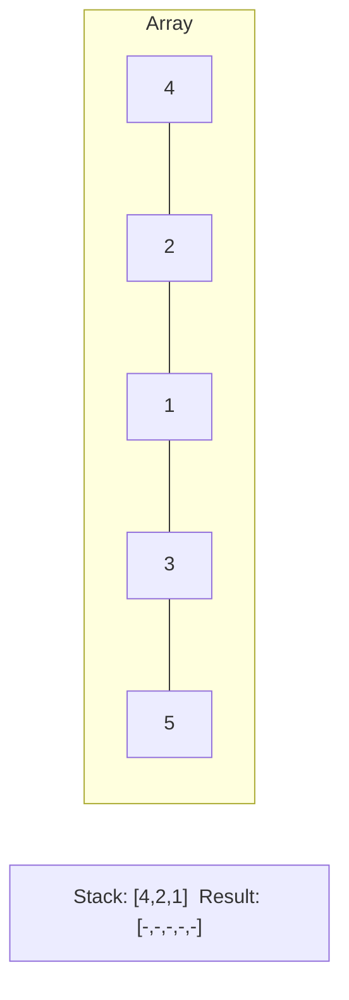
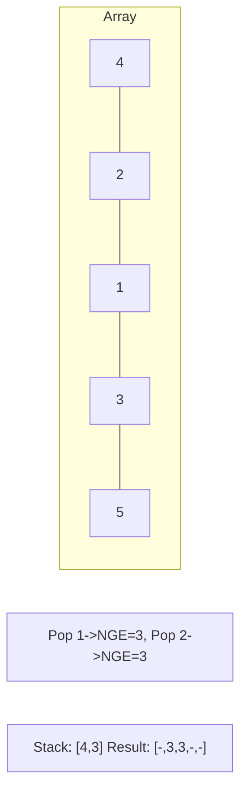
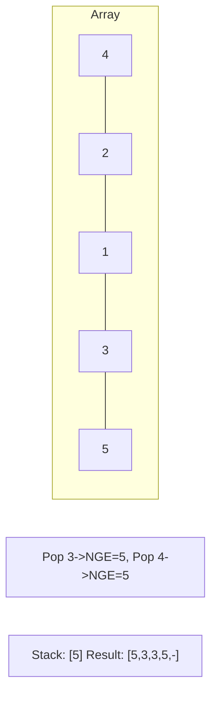

# Problem 1130: Minimum Cost Tree From Leaf Values

**Difficulty:** Medium  
**Tags:** Array, Dynamic Programming, Stack, Greedy, Monotonic Stack  
**Pattern:** Monotonic Stack  
**Link:** [leetcode.com/problems/minimum-cost-tree-from-leaf-values](https://leetcode.com/problems/minimum-cost-tree-from-leaf-values/)

## Description

Given an array `arr` of positive integers, consider all binary trees such that:

	- Each node has either `0` or `2` children;
	- The values of `arr` correspond to the values of each **leaf** in an in-order traversal of the tree.
	- The value of each non-leaf node is equal to the product of the largest leaf value in its left and right subtree, respectively.

Among all possible binary trees considered, return *the smallest possible sum of the values of each non-leaf node*. It is guaranteed this sum fits into a **32-bit** integer.

A node is a **leaf** if and only if it has zero children.

 

Example 1:

```

**Input:** arr = [6,2,4]
**Output:** 32
**Explanation:** There are two possible trees shown.
The first has a non-leaf node sum 36, and the second has non-leaf node sum 32.

```

Example 2:

```

**Input:** arr = [4,11]
**Output:** 44

```

 

**Constraints:**

	- `2 <= arr.length <= 40`
	- `1 <= arr[i] <= 15`
	- It is guaranteed that the answer fits into a **32-bit** signed integer (i.e., it is less than 2^31).

## Approach: Monotonic Stack

Maintain a stack where elements are always in monotonic order (increasing or decreasing). When a new element violates the monotonic property, pop elements and compute results (e.g., next greater/smaller element, spans, areas).

## Pseudocode

```
1. Initialize empty stack, result array
2. For each element (index i):
   a. While stack not empty and arr[i] breaks monotonic order:
      - Pop index j from stack
      - result[j] = compute(i, j)
   b. Push i onto stack
3. Handle remaining elements in stack
4. Return result
```

## Algorithm Flow



## Visual State Transitions

**Monotonic Stack (Next Greater Element):**

**Frame 1: Process first elements**


**Frame 2: Push smaller elements**


**Frame 3: Element 3 pops 1 and 2**


**Frame 4: Element 5 pops all**



## Complexity Analysis

- **Time:** O(n)
- **Space:** O(n)

## Solution (Python3)

```python
class Solution:
    def mctFromLeafValues(self, arr: List[int]) -> int:
        # Monotonic stack - O(n) time, O(n) space
        n = len(arr)
        result = [0] * n
        stack = []  # indices
        for i in range(n):
            while stack and arr[i] > arr[stack[-1]]:
                idx = stack.pop()
                result[idx] = i - idx
            stack.append(i)
        return result
```

## Solution (C++)

```cpp
#include <stack>
#include <string>
#include <vector>
using namespace std;

class Solution {
public:
    int mctFromLeafValues(vector<int>& arr) {
        // Monotonic stack - O(n) time, O(n) space
        int n = arr.size();
        vector<int> result(n, 0);
        stack<int> st;
        for (int i = 0; i < n; i++) {
            while (!st.empty() && arr[i] > arr[st.top()]) {
                int idx = st.top(); st.pop();
                result[idx] = i - idx;
            }
            st.push(i);
        }
        return result;
    }
};
```
