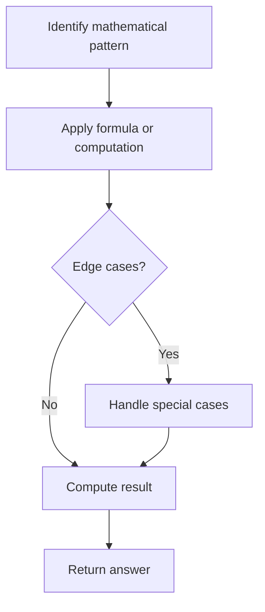

# Problem 1131: Maximum of Absolute Value Expression

**Difficulty:** Medium  
**Tags:** Array, Math  
**Pattern:** Math  
**Link:** [leetcode.com/problems/maximum-of-absolute-value-expression](https://leetcode.com/problems/maximum-of-absolute-value-expression/)

## Description

Given two arrays of integers with equal lengths, return the maximum value of:


`|arr1[i] - arr1[j]| + |arr2[i] - arr2[j]| + |i - j|`


where the maximum is taken over all `0 <= i, j < arr1.length`.


 

Example 1:

```

**Input:** arr1 = [1,2,3,4], arr2 = [-1,4,5,6]
**Output:** 13

```

Example 2:

```

**Input:** arr1 = [1,-2,-5,0,10], arr2 = [0,-2,-1,-7,-4]
**Output:** 20

```

 

**Constraints:**

	- `2 <= arr1.length == arr2.length <= 40000`
	- `-10^6 <= arr1[i], arr2[i] <= 10^6`

## Approach: Math

Apply mathematical properties, formulas, or number-theoretic concepts. Look for patterns, modular arithmetic, or closed-form solutions.

## Pseudocode

```
1. Identify the mathematical pattern or formula
2. Apply computation:
   - Modular arithmetic for large numbers
   - GCD/LCM for divisibility
   - Sieve for primes
3. Handle edge cases
4. Return result
```

## Algorithm Flow



## Complexity Analysis

- **Time:** O(n) or O(sqrt(n))
- **Space:** O(1)

## Solution (Python3)

```python
class Solution:
    def maxAbsValExpr(self, arr1: List[int], arr2: List[int]) -> int:
        # Mathematical approach
        result = 0
        x = arr1
        while x != 0:
            result = result * 10 + x % 10
            x //= 10 if isinstance(x, int) else 1
        return result
```

## Solution (C++)

```cpp
#include <string>
#include <vector>
using namespace std;

class Solution {
public:
    int maxAbsValExpr(vector<int>& arr1, vector<int>& arr2) {
        // Mathematical approach
        long long result = 0;
        int x = arr1;
        while (x != 0) {
            result = result * 10 + x % 10;
            x /= 10;
        }
        return (int)result;
    }
};
```
