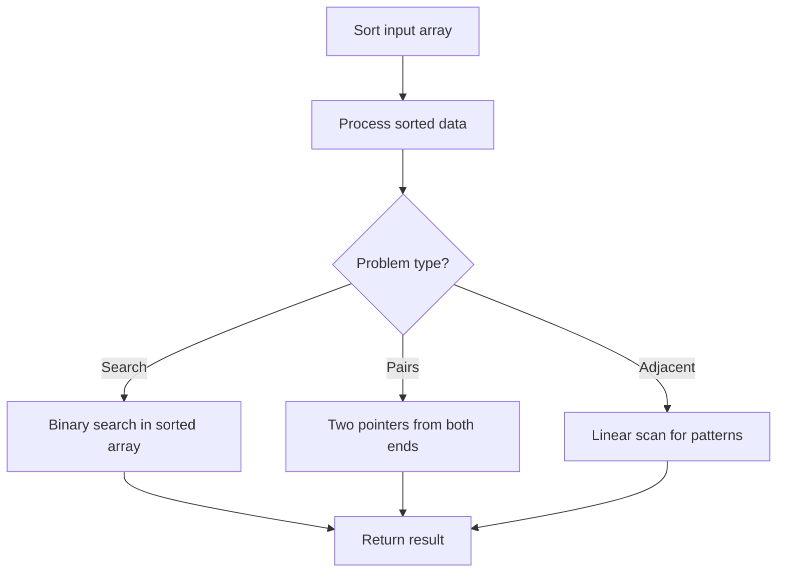

# Problem 1133: Largest Unique Number

**Difficulty:** Easy  
**Tags:** Array, Hash Table, Sorting  
**Pattern:** Sorting  
**Link:** [leetcode.com/problems/largest-unique-number](https://leetcode.com/problems/largest-unique-number/)

## Description

*(Premium problem -- description requires LeetCode subscription)*

## Approach: Sorting

Sort the data to enable efficient processing. After sorting, use techniques like binary search, two pointers, or linear scan to solve the problem.

## Pseudocode

```
1. Sort the input array
2. Process sorted data:
   - Use binary search for lookups
   - Use two pointers for pair finding
   - Scan for adjacent patterns
3. Return result
```

## Algorithm Flow



## Complexity Analysis

- **Time:** O(n log n)
- **Space:** O(n)

## Solution (Python3)

```python
class Solution:
    pass
```

## Solution (C++)

```cpp
class Solution {
public:
    // Design problem stub
};
```
