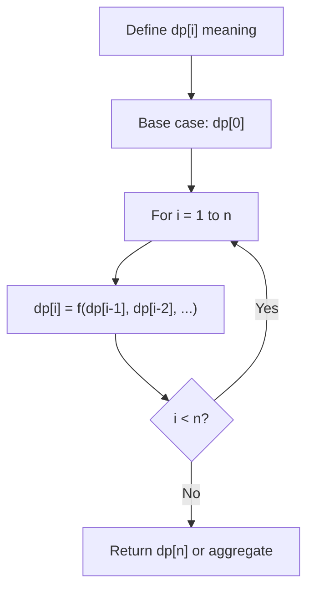
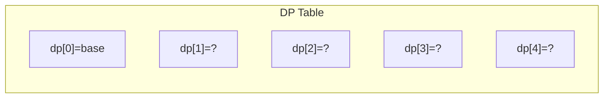
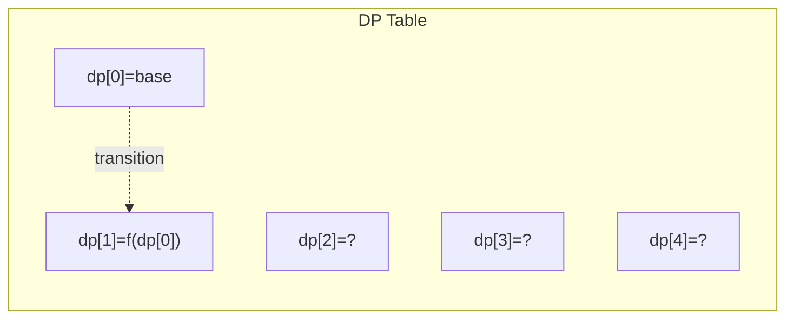
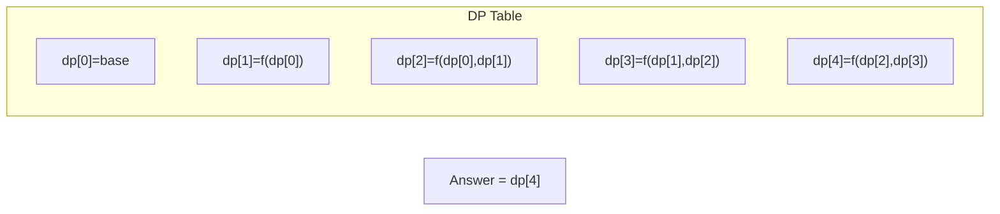

# Problem 1137: N-th Tribonacci Number

**Difficulty:** Easy  
**Tags:** Math, Dynamic Programming, Memoization  
**Pattern:** Dynamic Programming  
**Link:** [leetcode.com/problems/n-th-tribonacci-number](https://leetcode.com/problems/n-th-tribonacci-number/)

## Description

The Tribonacci sequence Tn is defined as follows: 

T0 = 0, T1 = 1, T2 = 1, and Tn+3 = Tn + Tn+1 + Tn+2 for n >= 0.

Given `n`, return the value of Tn.

 

Example 1:

```

**Input:** n = 4
**Output:** 4
**Explanation:**
T_3 = 0 + 1 + 1 = 2
T_4 = 1 + 1 + 2 = 4

```

Example 2:

```

**Input:** n = 25
**Output:** 1389537

```

 

**Constraints:**

	- `0 <= n <= 37`
	- The answer is guaranteed to fit within a 32-bit integer, ie. `answer <= 2^31 - 1`.

## Approach: Dynamic Programming

Iterative tribonacci with three variables.

## Pseudocode

```
1. Define dp[i] = optimal value for subproblem i
2. Base case: dp[0] = initial value
3. For i from 1 to n:
   a. dp[i] = recurrence(dp[i-1], dp[i-2], ...)
4. Return dp[n] or max/min of dp
```

## Algorithm Flow



## Visual State Transitions

**1D Dynamic Programming Table Build:**

**Frame 1: Initialize base cases**


**Frame 2: Fill dp[1] from dp[0]**


**Frame 3: Fill remaining cells**



## Complexity Analysis

- **Time:** O(n)
- **Space:** O(1)

## Solution (Python3)

```python
class Solution:
    def tribonacci(self, n: int) -> int:
        if n == 0: return 0
        if n <= 2: return 1
        a, b, c = 0, 1, 1
        for _ in range(3, n + 1):
            a, b, c = b, c, a + b + c
        return c
```

## Solution (C++)

```cpp
#include <string>
#include <vector>
using namespace std;

class Solution {
public:
    int tribonacci(int n) {
        // Dynamic programming (1D) - O(n) time, O(n) space
        int n = n;
        if (n <= 0) return 0;
        vector<int> dp(n + 1, 0);
        dp[0] = 1;
        for (int i = 1; i <= n; i++) {
            dp[i] = dp[i-1];
            if (i >= 2) dp[i] += dp[i-2];
        }
        return dp[n];
    }
};
```
