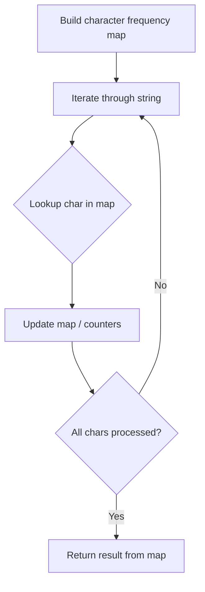

# Problem 1138: Alphabet Board Path

**Difficulty:** Medium  
**Tags:** Hash Table, String  
**Pattern:** Hash Map String Processing  
**Link:** [leetcode.com/problems/alphabet-board-path](https://leetcode.com/problems/alphabet-board-path/)

## Description

On an alphabet board, we start at position `(0, 0)`, corresponding to character `board[0][0]`.


Here, `board = ["abcde", "fghij", "klmno", "pqrst", "uvwxy", "z"]`, as shown in the diagram below.


We may make the following moves:


	- `'U'` moves our position up one row, if the position exists on the board;
	- `'D'` moves our position down one row, if the position exists on the board;
	- `'L'` moves our position left one column, if the position exists on the board;
	- `'R'` moves our position right one column, if the position exists on the board;
	- `'!'` adds the character `board[r][c]` at our current position `(r, c)` to the answer.


(Here, the only positions that exist on the board are positions with letters on them.)


Return a sequence of moves that makes our answer equal to `target` in the minimum number of moves.  You may return any path that does so.


 

Example 1:


```
**Input:** target = "leet"
**Output:** "DDR!UURRR!!DDD!"

```
Example 2:


```
**Input:** target = "code"
**Output:** "RR!DDRR!UUL!R!"

```

 

**Constraints:**


	- `1 <= target.length <= 100`
	- `target` consists only of English lowercase letters.

## Approach: Hash Map String Processing

Use a hash map to count character frequencies or map characters/strings for O(1) lookups. Process the string in one or two passes.

## Pseudocode

```
1. Build frequency map / char-to-index map
2. Iterate through string:
   a. Look up character in map
   b. Update counts or mappings
3. Return result based on map state
```

## Algorithm Flow



## Complexity Analysis

- **Time:** O(n)
- **Space:** O(n)

## Solution (Python3)

```python
class Solution:
    def alphabetBoardPath(self, target: str) -> str:
        # Hash map for string/character frequency - O(n) time
        freq = {}
        for ch in target:
            freq[ch] = freq.get(ch, 0) + 1
        # Process frequency map
        for ch, cnt in freq.items():
            if cnt == 1:
                return target.index(ch)
        return ""
```

## Solution (C++)

```cpp
#include <string>
#include <unordered_map>
#include <vector>
using namespace std;

class Solution {
public:
    string alphabetBoardPath(string& target) {
        // Hash map for string/character frequency - O(n) time
        unordered_map<char, int> freq;
        for (char ch : target) {
            freq[ch]++;
        }
        // Process frequency map
        for (int i = 0; i < target.size(); i++) {
            if (freq[target[i]] == 1) return i;
        }
        return "";
    }
};
```
