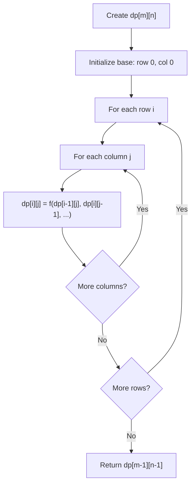
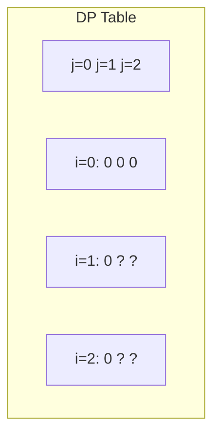
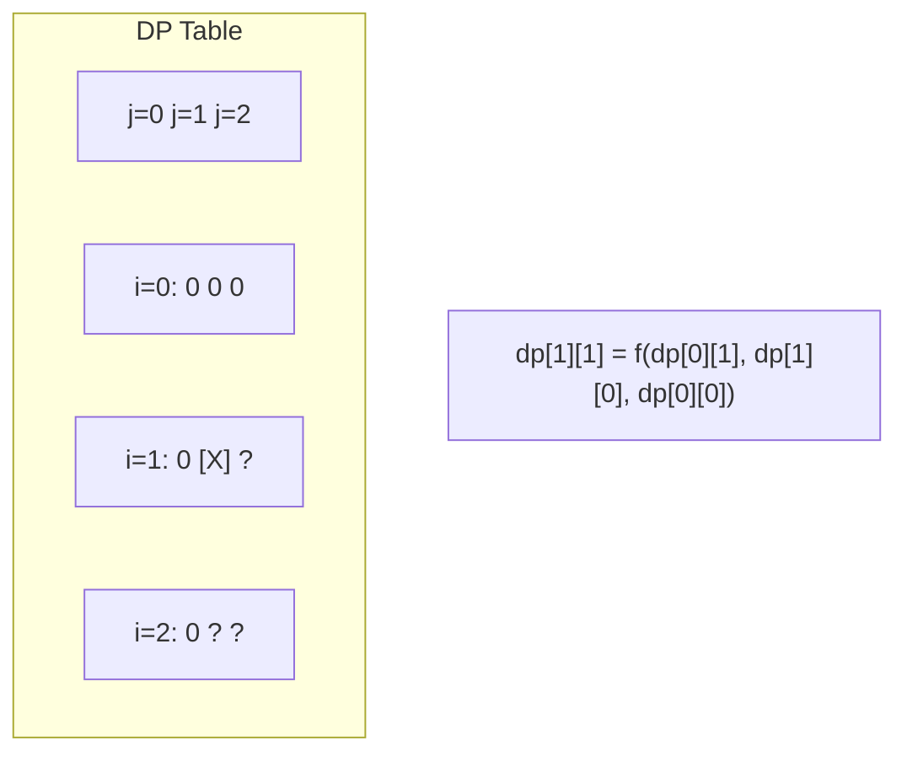
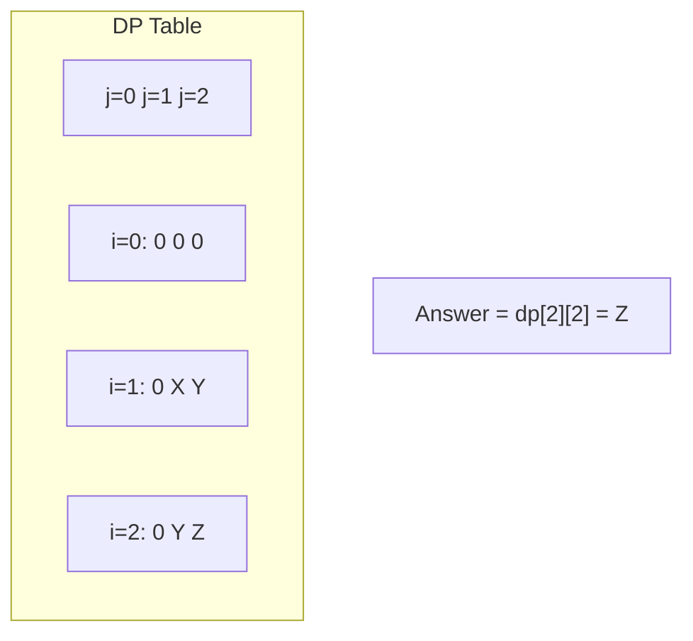

# Problem 1139: Largest 1-Bordered Square

**Difficulty:** Medium  
**Tags:** Array, Dynamic Programming, Matrix  
**Pattern:** Dynamic Programming (2D Grid/Matrix)  
**Link:** [leetcode.com/problems/largest-1-bordered-square](https://leetcode.com/problems/largest-1-bordered-square/)

## Description

Given a 2D `grid` of `0`s and `1`s, return the number of elements in the largest **square** subgrid that has all `1`s on its **border**, or `0` if such a subgrid doesn't exist in the `grid`.


 

Example 1:


```

**Input:** grid = [[1,1,1],[1,0,1],[1,1,1]]
**Output:** 9

```


Example 2:


```

**Input:** grid = [[1,1,0,0]]
**Output:** 1

```


 

**Constraints:**


	- `1 <= grid.length <= 100`
	- `1 <= grid[0].length <= 100`
	- `grid[i][j]` is `0` or `1`

## Approach: Dynamic Programming (2D Grid/Matrix)

Use a 2D DP table where dp[i][j] represents the optimal value for the subproblem defined by rows 0..i and columns 0..j. Fill row by row or column by column.

## Pseudocode

```
1. Create dp[m][n] table
2. Initialize base cases (first row, first column)
3. For i from 1 to m-1:
   For j from 1 to n-1:
     dp[i][j] = recurrence(dp[i-1][j], dp[i][j-1], dp[i-1][j-1])
4. Return dp[m-1][n-1]
```

## Algorithm Flow



## Visual State Transitions

**2D DP Table Build:**

**Frame 1: Initialize borders**


**Frame 2: Fill cell by cell**


**Frame 3: Table complete**



## Complexity Analysis

- **Time:** O(m * n)
- **Space:** O(m * n)

## Solution (Python3)

```python
class Solution:
    def largest1BorderedSquare(self, grid: List[List[int]]) -> int:
        # Dynamic programming (2D) - O(m*n) time and space
        if not grid:
            return 0
        m, n = len(grid), len(grid[0])
        dp = [[0] * (n + 1) for _ in range(m + 1)]
        for i in range(1, m + 1):
            for j in range(1, n + 1):
                dp[i][j] = max(dp[i-1][j], dp[i][j-1])
                # Add problem-specific transition
        return dp[m][n]
```

## Solution (C++)

```cpp
#include <algorithm>
#include <string>
#include <vector>
using namespace std;

class Solution {
public:
    int largest1BorderedSquare(vector<vector<int>>& grid) {
        // Dynamic programming (2D) - O(m*n) time and space
        if (grid.empty()) return 0;
        int m = grid.size(), n = grid[0].size();
        vector<vector<int>> dp(m + 1, vector<int>(n + 1, 0));
        for (int i = 1; i <= m; i++) {
            for (int j = 1; j <= n; j++) {
                dp[i][j] = max(dp[i-1][j], dp[i][j-1]);
            }
        }
        return dp[m][n];
    }
};
```
