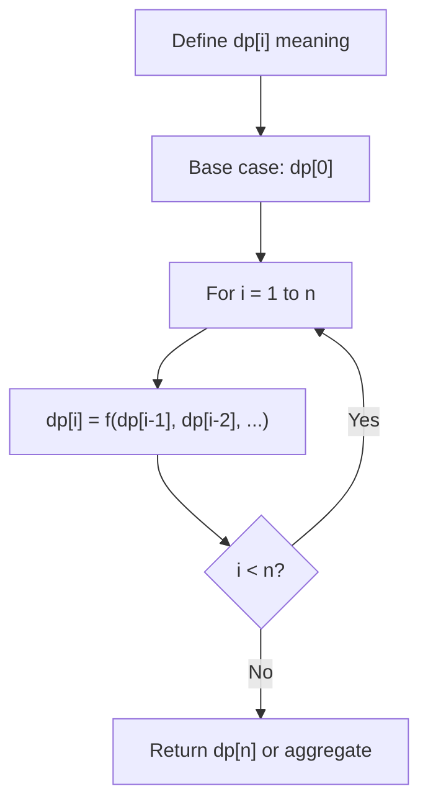
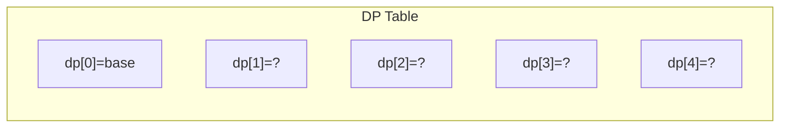
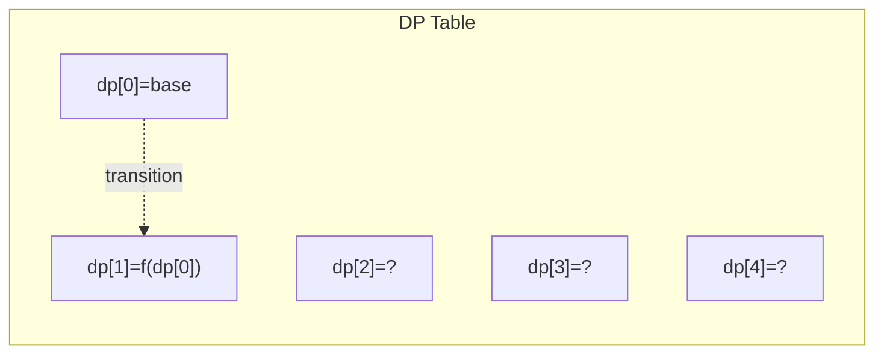
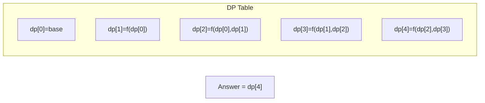

# Problem 1140: Stone Game II

**Difficulty:** Medium  
**Tags:** Array, Math, Dynamic Programming, Prefix Sum, Game Theory  
**Pattern:** Dynamic Programming (1D)  
**Link:** [leetcode.com/problems/stone-game-ii](https://leetcode.com/problems/stone-game-ii/)

## Description

Alice and Bob continue their games with piles of stones. There are a number of piles **arranged in a row**, and each pile has a positive integer number of stones `piles[i]`. The objective of the game is to end with the most stones.

Alice and Bob take turns, with Alice starting first.

On each player's turn, that player can take **all the stones** in the **first** `X` remaining piles, where `1 <= X <= 2M`. Then, we set `M = max(M, X)`. Initially, M = 1.

The game continues until all the stones have been taken.

Assuming Alice and Bob play optimally, return the maximum number of stones Alice can get.

 

Example 1:

**Input:** piles = [2,7,9,4,4]

**Output:** 10

**Explanation:**

	- If Alice takes one pile at the beginning, Bob takes two piles, then Alice takes 2 piles again. Alice can get `2 + 4 + 4 = 10` stones in total.
	- If Alice takes two piles at the beginning, then Bob can take all three piles left. In this case, Alice get `2 + 7 = 9` stones in total.

So we return 10 since it's larger.

Example 2:

**Input:** piles = [1,2,3,4,5,100]

**Output:** 104

 

**Constraints:**

	- `1 <= piles.length <= 100`
	- `1 <= piles[i] <= 10^4`

## Approach: Dynamic Programming (1D)

Break the problem into overlapping subproblems. Define dp[i] as the optimal value for the subproblem ending at or considering index i. Build the solution bottom-up, using previously computed dp values.

## Pseudocode

```
1. Define dp[i] = optimal value for subproblem i
2. Base case: dp[0] = initial value
3. For i from 1 to n:
   a. dp[i] = recurrence(dp[i-1], dp[i-2], ...)
4. Return dp[n] or max/min of dp
```

## Algorithm Flow



## Visual State Transitions

**1D Dynamic Programming Table Build:**

**Frame 1: Initialize base cases**


**Frame 2: Fill dp[1] from dp[0]**


**Frame 3: Fill remaining cells**



## Complexity Analysis

- **Time:** O(n)
- **Space:** O(n)

## Solution (Python3)

```python
class Solution:
    def stoneGameII(self, piles: List[int]) -> int:
        # Dynamic programming (1D) - O(n) time, O(n) space
        if not piles:
            return 0
        n = len(piles) if isinstance(piles, list) else piles
        dp = [0] * (n + 1)
        dp[0] = 1  # base case
        for i in range(1, n + 1):
            dp[i] = dp[i-1]  # transition (customize per problem)
            if i >= 2:
                dp[i] += dp[i-2]
        return dp[n]
```

## Solution (C++)

```cpp
#include <string>
#include <vector>
using namespace std;

class Solution {
public:
    int stoneGameII(vector<int>& piles) {
        // Dynamic programming (1D) - O(n) time, O(n) space
        int n = piles;
        if (n <= 0) return 0;
        vector<int> dp(n + 1, 0);
        dp[0] = 1;
        for (int i = 1; i <= n; i++) {
            dp[i] = dp[i-1];
            if (i >= 2) dp[i] += dp[i-2];
        }
        return dp[n];
    }
};
```
