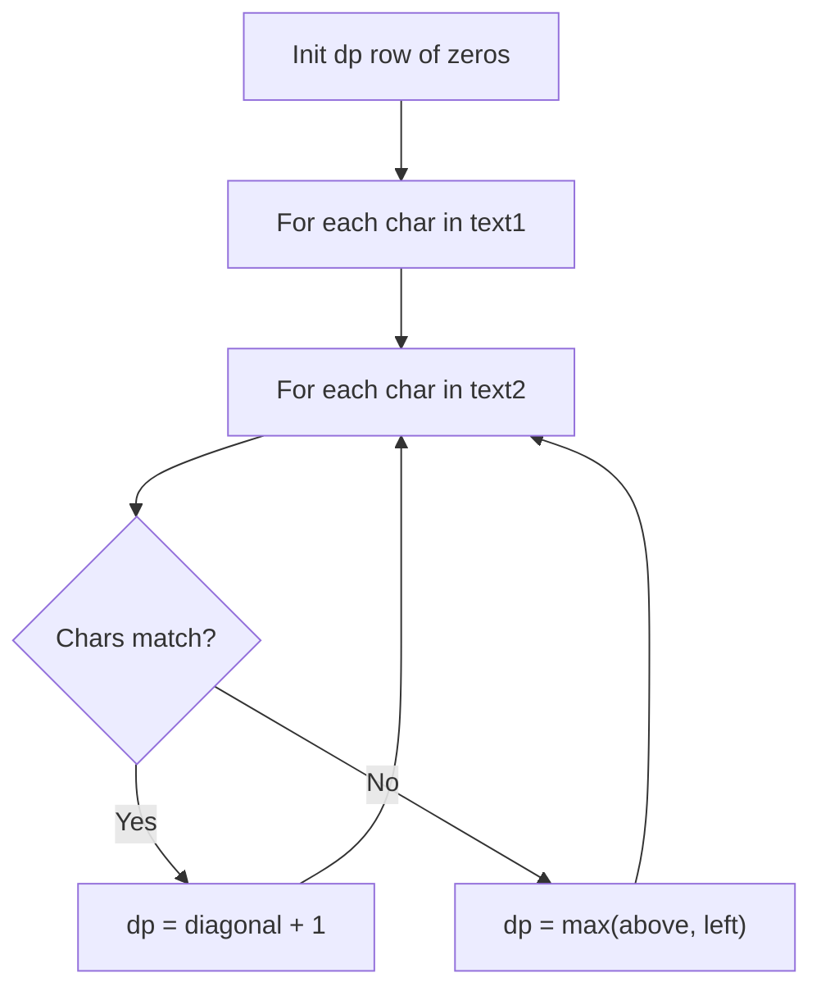
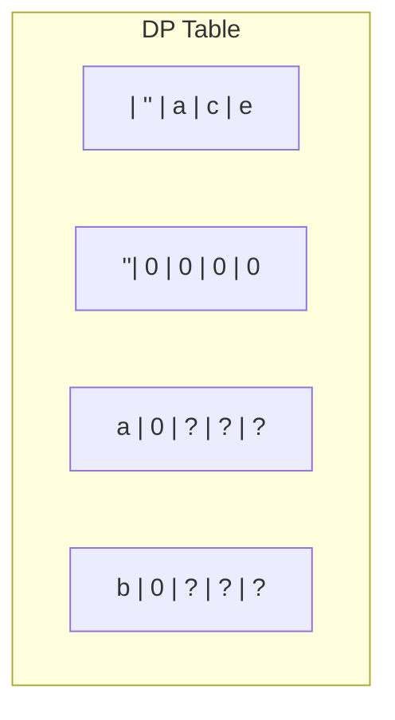
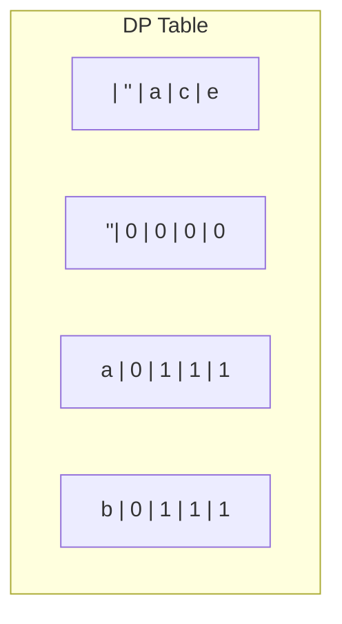
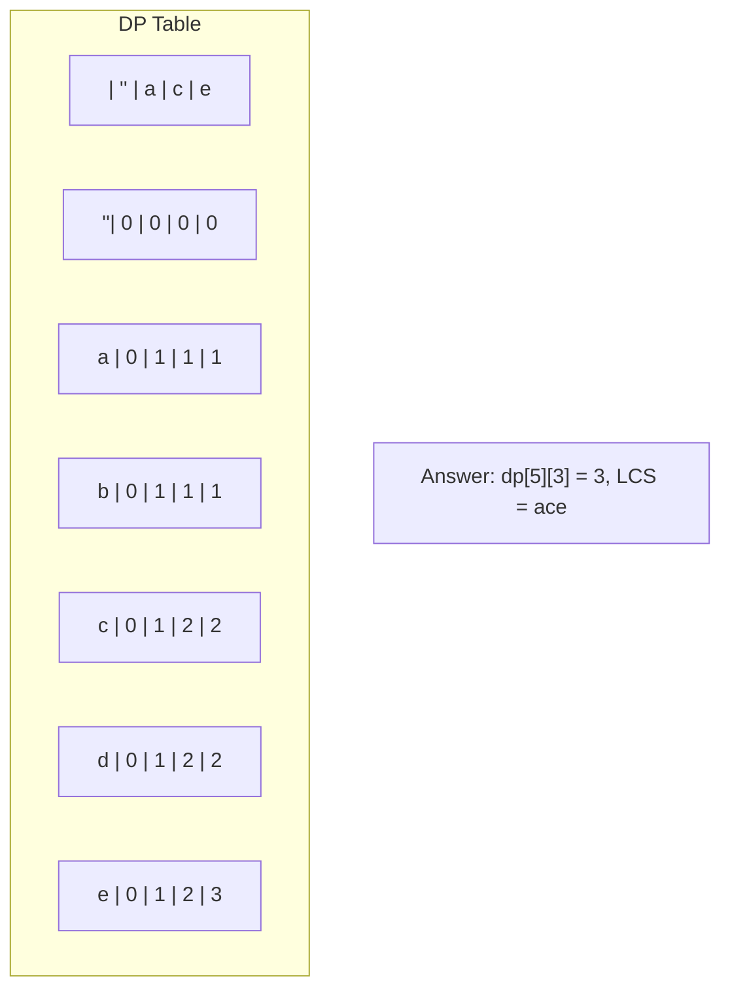

# Problem 1143: Longest Common Subsequence

**Difficulty:** Medium  
**Tags:** String, Dynamic Programming  
**Pattern:** Dynamic Programming  
**Link:** [leetcode.com/problems/longest-common-subsequence](https://leetcode.com/problems/longest-common-subsequence/)

## Description

Given two strings `text1` and `text2`, return *the length of their longest **common subsequence**. *If there is no **common subsequence**, return `0`.

A **subsequence** of a string is a new string generated from the original string with some characters (can be none) deleted without changing the relative order of the remaining characters.

	- For example, `"ace"` is a subsequence of `"abcde"`.

A **common subsequence** of two strings is a subsequence that is common to both strings.

 

Example 1:

```

**Input:** text1 = "abcde", text2 = "ace" 
**Output:** 3  
**Explanation:** The longest common subsequence is "ace" and its length is 3.

```

Example 2:

```

**Input:** text1 = "abc", text2 = "abc"
**Output:** 3
**Explanation:** The longest common subsequence is "abc" and its length is 3.

```

Example 3:

```

**Input:** text1 = "abc", text2 = "def"
**Output:** 0
**Explanation:** There is no such common subsequence, so the result is 0.

```

 

**Constraints:**

	- `1 <= text1.length, text2.length <= 1000`
	- `text1` and `text2` consist of only lowercase English characters.

## Approach: Dynamic Programming

Classic LCS DP. dp[i][j] = LCS of text1[:i] and text2[:j]. Optimized to 1D.

## Pseudocode

```
1. Create dp[m+1][n+1]
2. Initialize base cases
3. For i from 1 to m:
   For j from 1 to n:
     If s1[i-1] == s2[j-1]: dp[i][j] = dp[i-1][j-1] + 1
     Else: dp[i][j] = best of (dp[i-1][j], dp[i][j-1], dp[i-1][j-1])
4. Return dp[m][n]
```

## Algorithm Flow



## Visual State Transitions

**LCS DP Table Build:**

**Input:** text1 = "abcde", text2 = "ace"

**Frame 1: Initialize DP table**


**Frame 2: Fill row 'a' - match at (a,a)**


**Frame 3: Fill rows c, d, e**



## Complexity Analysis

- **Time:** O(m*n)
- **Space:** O(n)

## Solution (Python3)

```python
class Solution:
    def longestCommonSubsequence(self, text1: str, text2: str) -> int:
        m, n = len(text1), len(text2)
        dp = [0] * (n + 1)
        for i in range(1, m + 1):
            prev = 0
            for j in range(1, n + 1):
                temp = dp[j]
                if text1[i-1] == text2[j-1]:
                    dp[j] = prev + 1
                else:
                    dp[j] = max(dp[j], dp[j-1])
                prev = temp
        return dp[n]
```

## Solution (C++)

```cpp
#include <algorithm>
#include <string>
#include <vector>
using namespace std;

class Solution {
public:
    int longestCommonSubsequence(string& text1, string& text2) {
        // String DP - O(m*n) time and space
        int m = text1.size(), n = text2.size();
        vector<vector<int>> dp(m + 1, vector<int>(n + 1, 0));
        for (int i = 1; i <= m; i++) {
            for (int j = 1; j <= n; j++) {
                if (text1[i-1] == text2[j-1])
                    dp[i][j] = dp[i-1][j-1] + 1;
                else
                    dp[i][j] = max(dp[i-1][j], dp[i][j-1]);
            }
        }
        return dp[m][n];
    }
};
```
