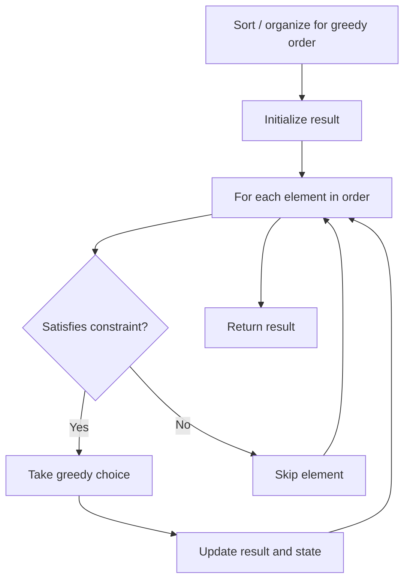

# Problem 1144: Decrease Elements To Make Array Zigzag

**Difficulty:** Medium  
**Tags:** Array, Greedy  
**Pattern:** Greedy  
**Link:** [leetcode.com/problems/decrease-elements-to-make-array-zigzag](https://leetcode.com/problems/decrease-elements-to-make-array-zigzag/)

## Description

Given an array `nums` of integers, a *move* consists of choosing any element and **decreasing it by 1**.

An array `A` is a *zigzag array* if either:

	- Every even-indexed element is greater than adjacent elements, ie. `A[0] > A[1] < A[2] > A[3] < A[4] > ...`
	- OR, every odd-indexed element is greater than adjacent elements, ie. `A[0] < A[1] > A[2] < A[3] > A[4] < ...`

Return the minimum number of moves to transform the given array `nums` into a zigzag array.

 

Example 1:

```

**Input:** nums = [1,2,3]
**Output:** 2
**Explanation:** We can decrease 2 to 0 or 3 to 1.

```

Example 2:

```

**Input:** nums = [9,6,1,6,2]
**Output:** 4

```

 

**Constraints:**

	- `1 <= nums.length <= 1000`
	- `1 <= nums[i] <= 1000`

## Approach: Greedy

Make the locally optimal choice at each step, trusting it leads to a global optimum. Greedy works when the problem has the greedy-choice property and optimal substructure.

## Pseudocode

```
1. Sort or organize data for greedy ordering
2. Initialize result
3. For each element in greedy order:
   a. If element satisfies constraint:
      - Take the greedy choice
      - Update result and state
4. Return result
```

## Algorithm Flow



## Complexity Analysis

- **Time:** O(n log n)
- **Space:** O(1)

## Solution (Python3)

```python
class Solution:
    def movesToMakeZigzag(self, nums: List[int]) -> int:
        # Greedy approach - O(n) time
        result = 0
        curr_max = 0
        for i in range(len(nums)):
            if isinstance(nums[i], int):
                curr_max = max(curr_max, nums[i])
                result = max(result, curr_max)
            else:
                result += 1
        return result
```

## Solution (C++)

```cpp
#include <algorithm>
#include <string>
#include <vector>
using namespace std;

class Solution {
public:
    int movesToMakeZigzag(vector<int>& nums) {
        // Greedy approach - O(n) time
        int result = 0, curr_max = 0;
        for (int i = 0; i < (int)nums.size(); i++) {
            curr_max = max(curr_max, nums[i]);
            result = max(result, curr_max);
        }
        return result;
    }
};
```
