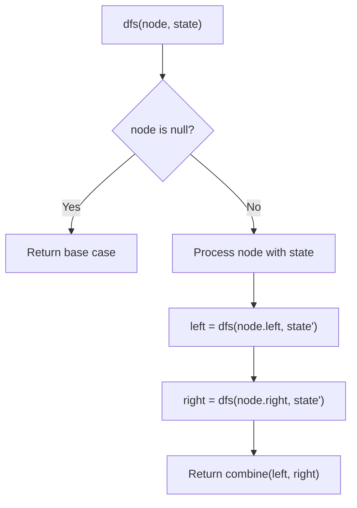
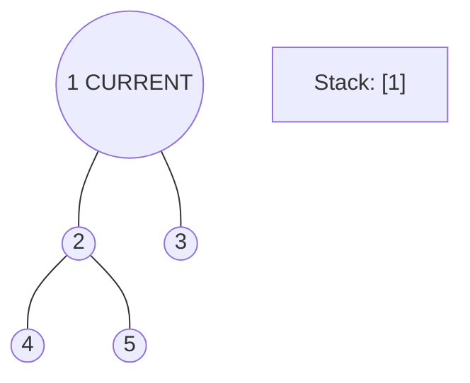
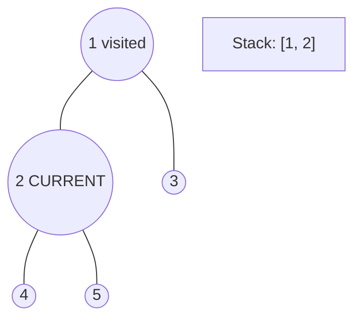
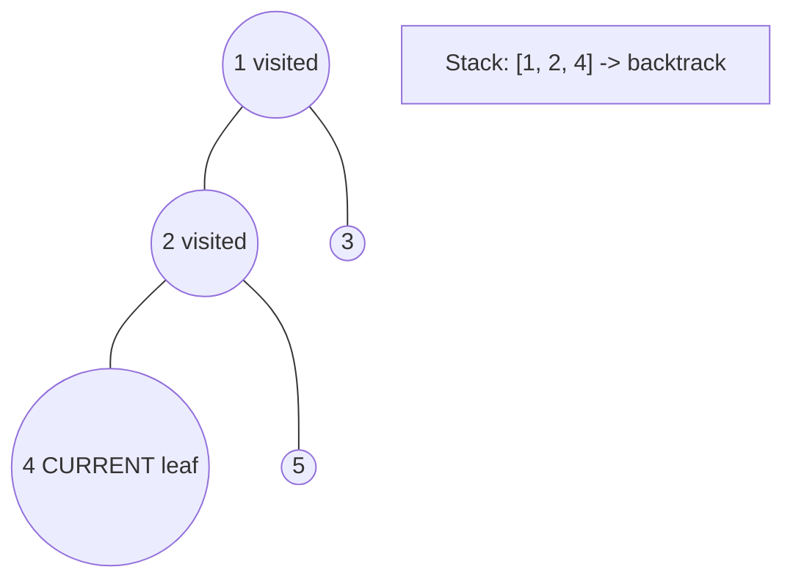
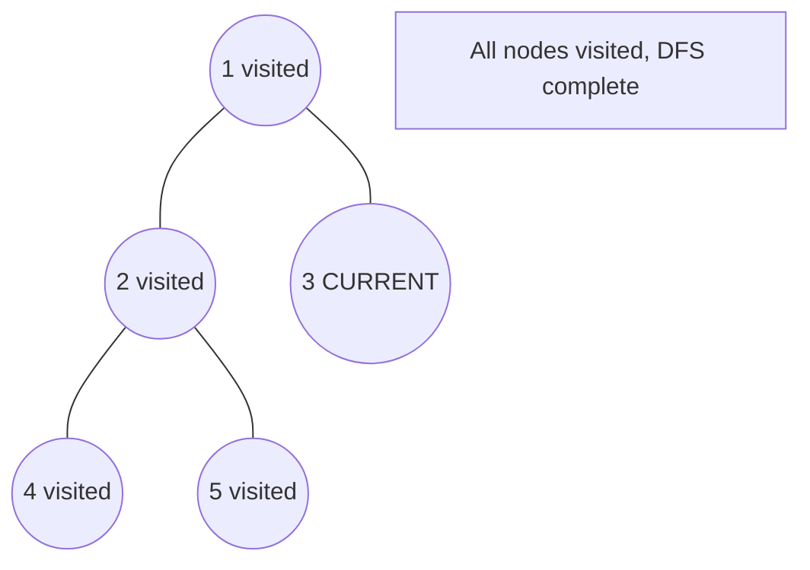

# Problem 1145: Binary Tree Coloring Game

**Difficulty:** Medium  
**Tags:** Tree, Depth-First Search, Binary Tree  
**Pattern:** DFS Tree Traversal  
**Link:** [leetcode.com/problems/binary-tree-coloring-game](https://leetcode.com/problems/binary-tree-coloring-game/)

## Description

Two players play a turn based game on a binary tree. We are given the `root` of this binary tree, and the number of nodes `n` in the tree. `n` is odd, and each node has a distinct value from `1` to `n`.

Initially, the first player names a value `x` with `1 <= x <= n`, and the second player names a value `y` with `1 <= y <= n` and `y != x`. The first player colors the node with value `x` red, and the second player colors the node with value `y` blue.

Then, the players take turns starting with the first player. In each turn, that player chooses a node of their color (red if player 1, blue if player 2) and colors an **uncolored** neighbor of the chosen node (either the left child, right child, or parent of the chosen node.)

If (and only if) a player cannot choose such a node in this way, they must pass their turn. If both players pass their turn, the game ends, and the winner is the player that colored more nodes.

You are the second player. If it is possible to choose such a `y` to ensure you win the game, return `true`. If it is not possible, return `false`.

 

Example 1:

```

**Input:** root = [1,2,3,4,5,6,7,8,9,10,11], n = 11, x = 3
**Output:** true
**Explanation: **The second player can choose the node with value 2.

```

Example 2:

```

**Input:** root = [1,2,3], n = 3, x = 1
**Output:** false

```

 

**Constraints:**

	- The number of nodes in the tree is `n`.
	- `1 <= x <= n <= 100`
	- `n` is odd.
	- 1 <= Node.val <= n
	- All the values of the tree are **unique**.

## Approach: DFS Tree Traversal

Perform depth-first search on the tree. Recurse on left and right subtrees, combining results bottom-up. Track state (path, depth, sum) during traversal.

## Pseudocode

```
1. Define dfs(node, state):
   a. Base case: if null, return default
   b. Process node with current state
   c. left_result = dfs(node.left, updated_state)
   d. right_result = dfs(node.right, updated_state)
   e. Return combine(left_result, right_result)
2. Return dfs(root, initial_state)
```

## Algorithm Flow



## Visual State Transitions

**DFS Tree Traversal Step-by-Step:**

**Frame 1: Start at root**


**Frame 2: Go left - visit node 2**


**Frame 3: Go left - visit node 4 (leaf)**


**Frame 4: Backtrack, visit node 5, then node 3**



## Complexity Analysis

- **Time:** O(n)
- **Space:** O(h)

## Solution (Python3)

```python
class Solution:
    def btreeGameWinningMove(self, root: Optional[TreeNode], n: int, x: int) -> bool:
        # DFS on binary tree - O(n) time, O(h) space
        def dfs(node):
            if not node:
                return 0
            left = dfs(node.left)
            right = dfs(node.right)
            return 1 + max(left, right)
        
        result = dfs(root)
        return result
```

## Solution (C++)

```cpp
#include <algorithm>
#include <functional>
#include <string>
#include <vector>
using namespace std;

class Solution {
public:
    bool btreeGameWinningMove(TreeNode* root, int n, int x) {
        // DFS on binary tree - O(n) time, O(h) space
        function<int(TreeNode*)> dfs = [&](TreeNode* node) -> int {
            if (!node) return 0;
            int left = dfs(node->left);
            int right = dfs(node->right);
            return 1 + max(left, right);
        };
        return dfs(root);
    }
};
```
