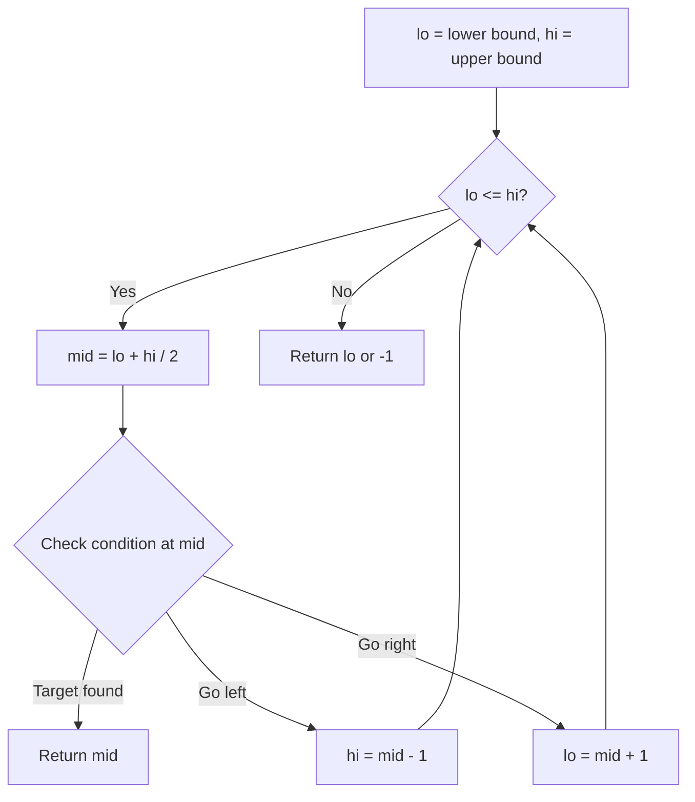
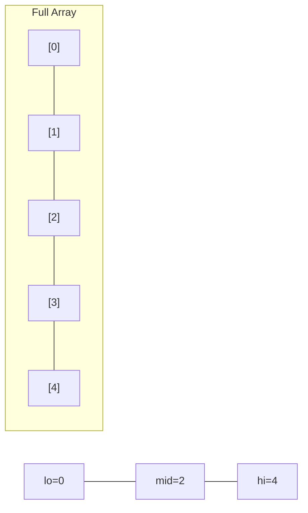
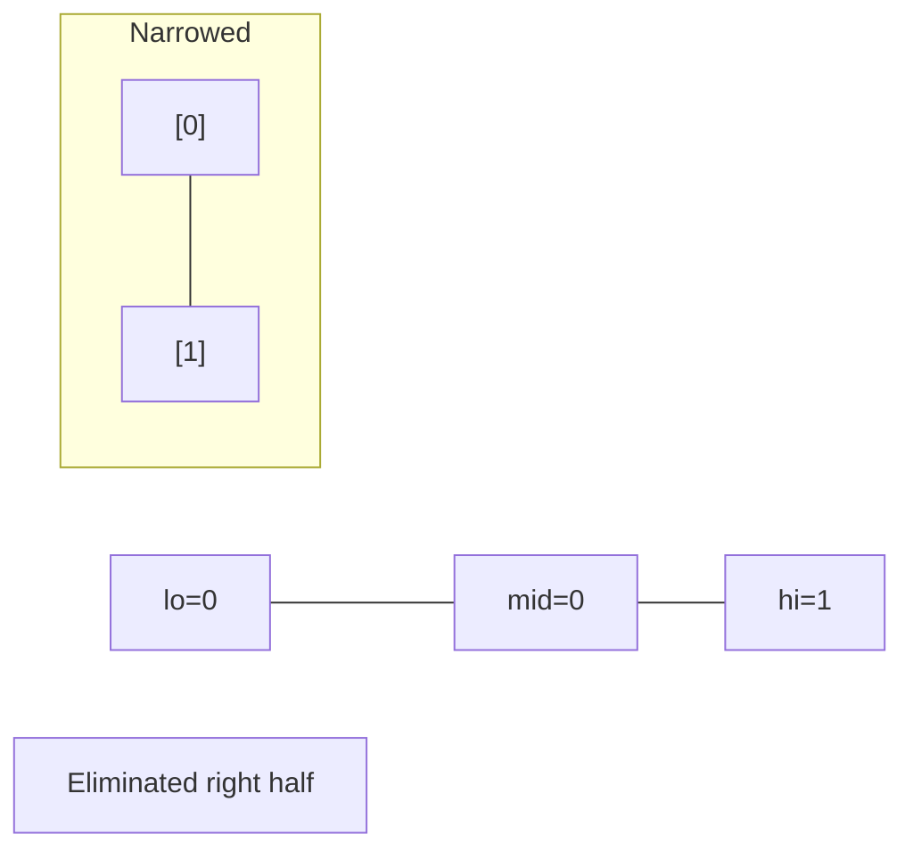
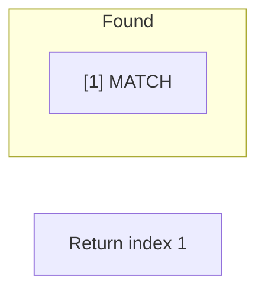

# Problem 1146: Snapshot Array

**Difficulty:** Medium  
**Tags:** Array, Hash Table, Binary Search, Design  
**Pattern:** Binary Search  
**Link:** [leetcode.com/problems/snapshot-array](https://leetcode.com/problems/snapshot-array/)

## Description

Implement a SnapshotArray that supports the following interface:

	- `SnapshotArray(int length)` initializes an array-like data structure with the given length. **Initially, each element equals 0**.
	- `void set(index, val)` sets the element at the given `index` to be equal to `val`.
	- `int snap()` takes a snapshot of the array and returns the `snap_id`: the total number of times we called `snap()` minus `1`.
	- `int get(index, snap_id)` returns the value at the given `index`, at the time we took the snapshot with the given `snap_id`

 

Example 1:

```

**Input:** ["SnapshotArray","set","snap","set","get"]
[[3],[0,5],[],[0,6],[0,0]]
**Output:** [null,null,0,null,5]
**Explanation: **
SnapshotArray snapshotArr = new SnapshotArray(3); // set the length to be 3
snapshotArr.set(0,5);  // Set array[0] = 5
snapshotArr.snap();  // Take a snapshot, return snap_id = 0
snapshotArr.set(0,6);
snapshotArr.get(0,0);  // Get the value of array[0] with snap_id = 0, return 5
```

 

**Constraints:**

	- `1 <= length <= 5 * 10^4`
	- `0 <= index < length`
	- `0 <= val <= 10^9`
	- `0 <= snap_id < `(the total number of times we call `snap()`)
	- At most `5 * 10^4` calls will be made to `set`, `snap`, and `get`.

## Approach: Binary Search

Use binary search to halve the search space each iteration. Define the search range [lo, hi], compute mid, and decide which half to keep based on the problem's monotonic condition.

## Pseudocode

```
1. lo = lower_bound, hi = upper_bound
2. While lo <= hi (or lo < hi):
   a. mid = (lo + hi) // 2
   b. If condition(mid) is satisfied: record answer, search left half
   c. Else: search right half
3. Return answer
```

## Algorithm Flow



## Visual State Transitions

**Binary Search Step-by-Step:**

**Frame 1: Initial search space**


**Frame 2: Compare mid, narrow search**


**Frame 3: Found target**



## Complexity Analysis

- **Time:** O(log n)
- **Space:** O(1)

## Solution (Python3)

```python
class SnapshotArray:
    def __init__(self, length: int):
        # Initialize data structure
        self.length = length

    def set(self, index: int, val: int) -> None:
        return None

    def snap(self) -> int:
        return 0

    def get(self, index: int, snap_id: int) -> int:
        return 0

```

## Solution (C++)

```cpp
#include <string>
#include <vector>
using namespace std;

class SnapshotArray {
public:
    SnapshotArray(int length) {
        // Initialize
    }

    void set(int index, int val) {
        return ;
    }

    int snap() {
        return 0;
    }

    int get(int index, int snap_id) {
        return 0;
    }

};
```
