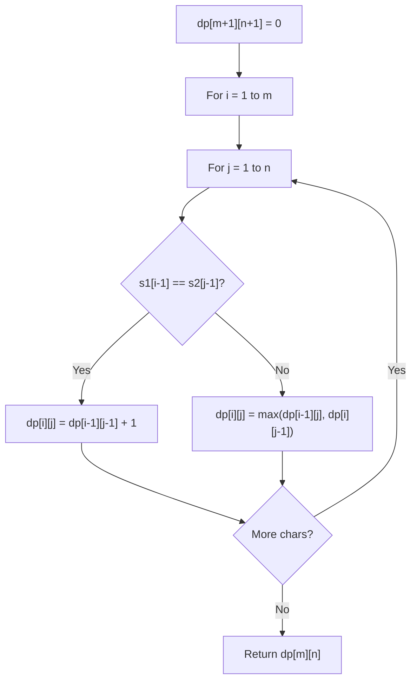

# Problem 1147: Longest Chunked Palindrome Decomposition

**Difficulty:** Hard  
**Tags:** Two Pointers, String, Dynamic Programming, Greedy, Rolling Hash, Hash Function  
**Pattern:** Dynamic Programming (String)  
**Link:** [leetcode.com/problems/longest-chunked-palindrome-decomposition](https://leetcode.com/problems/longest-chunked-palindrome-decomposition/)

## Description

You are given a string `text`. You should split it to k substrings `(subtext1, subtext2, ..., subtextk)` such that:

	- `subtexti` is a **non-empty** string.
	- The concatenation of all the substrings is equal to `text` (i.e., `subtext1 + subtext2 + ... + subtextk == text`).
	- `subtexti == subtextk - i + 1` for all valid values of `i` (i.e., `1 <= i <= k`).

Return the largest possible value of `k`.

 

Example 1:

```

**Input:** text = "ghiabcdefhelloadamhelloabcdefghi"
**Output:** 7
**Explanation:** We can split the string on "(ghi)(abcdef)(hello)(adam)(hello)(abcdef)(ghi)".

```

Example 2:

```

**Input:** text = "merchant"
**Output:** 1
**Explanation:** We can split the string on "(merchant)".

```

Example 3:

```

**Input:** text = "antaprezatepzapreanta"
**Output:** 11
**Explanation:** We can split the string on "(a)(nt)(a)(pre)(za)(tep)(za)(pre)(a)(nt)(a)".

```

 

**Constraints:**

	- `1 <= text.length <= 1000`
	- `text` consists only of lowercase English characters.

## Approach: Dynamic Programming (String)

Compare or match two strings using a 2D DP table. dp[i][j] represents the answer for substrings s1[0..i-1] and s2[0..j-1]. Common patterns: LCS, edit distance, regex matching.

## Pseudocode

```
1. Create dp[m+1][n+1]
2. Initialize base cases
3. For i from 1 to m:
   For j from 1 to n:
     If s1[i-1] == s2[j-1]: dp[i][j] = dp[i-1][j-1] + 1
     Else: dp[i][j] = best of (dp[i-1][j], dp[i][j-1], dp[i-1][j-1])
4. Return dp[m][n]
```

## Algorithm Flow



## Complexity Analysis

- **Time:** O(m * n)
- **Space:** O(m * n)

## Solution (Python3)

```python
class Solution:
    def longestDecomposition(self, text: str) -> int:
        # String DP - O(m*n) time and space
        m, n = len(text), len(text)
        dp = [[0] * (n + 1) for _ in range(m + 1)]
        for i in range(1, m + 1):
            for j in range(1, n + 1):
                if text[i-1] == text[j-1]:
                    dp[i][j] = dp[i-1][j-1] + 1
                else:
                    dp[i][j] = max(dp[i-1][j], dp[i][j-1])
        return dp[m][n]
```

## Solution (C++)

```cpp
#include <algorithm>
#include <string>
#include <vector>
using namespace std;

class Solution {
public:
    int longestDecomposition(string& text) {
        // String DP - O(m*n) time and space
        int m = text.size(), n = text.size();
        vector<vector<int>> dp(m + 1, vector<int>(n + 1, 0));
        for (int i = 1; i <= m; i++) {
            for (int j = 1; j <= n; j++) {
                if (text[i-1] == text[j-1])
                    dp[i][j] = dp[i-1][j-1] + 1;
                else
                    dp[i][j] = max(dp[i-1][j], dp[i][j-1]);
            }
        }
        return dp[m][n];
    }
};
```
