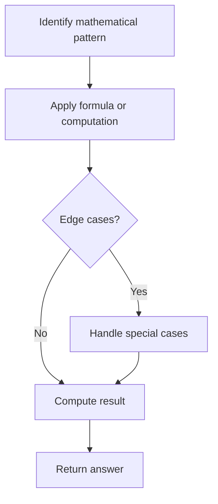

# Problem 1154: Day of the Year

**Difficulty:** Easy  
**Tags:** Math, String  
**Pattern:** Math  
**Link:** [leetcode.com/problems/day-of-the-year](https://leetcode.com/problems/day-of-the-year/)

## Description

Given a string `date` representing a Gregorian calendar date formatted as `YYYY-MM-DD`, return *the day number of the year*.

 

Example 1:

```

**Input:** date = "2019-01-09"
**Output:** 9
**Explanation:** Given date is the 9th day of the year in 2019.

```

Example 2:

```

**Input:** date = "2019-02-10"
**Output:** 41

```

 

**Constraints:**

	- `date.length == 10`
	- `date[4] == date[7] == '-'`, and all other `date[i]`'s are digits
	- `date` represents a calendar date between Jan 1^st, 1900 and Dec 31^st, 2019.

## Approach: Math

Apply mathematical properties, formulas, or number-theoretic concepts. Look for patterns, modular arithmetic, or closed-form solutions.

## Pseudocode

```
1. Identify the mathematical pattern or formula
2. Apply computation:
   - Modular arithmetic for large numbers
   - GCD/LCM for divisibility
   - Sieve for primes
3. Handle edge cases
4. Return result
```

## Algorithm Flow



## Complexity Analysis

- **Time:** O(n) or O(sqrt(n))
- **Space:** O(1)

## Solution (Python3)

```python
class Solution:
    def dayOfYear(self, date: str) -> int:
        # Mathematical approach
        result = 0
        x = date
        while x != 0:
            result = result * 10 + x % 10
            x //= 10 if isinstance(x, int) else 1
        return result
```

## Solution (C++)

```cpp
#include <string>
#include <vector>
using namespace std;

class Solution {
public:
    int dayOfYear(string& date) {
        // Mathematical approach
        long long result = 0;
        int x = date;
        while (x != 0) {
            result = result * 10 + x % 10;
            x /= 10;
        }
        return (int)result;
    }
};
```
