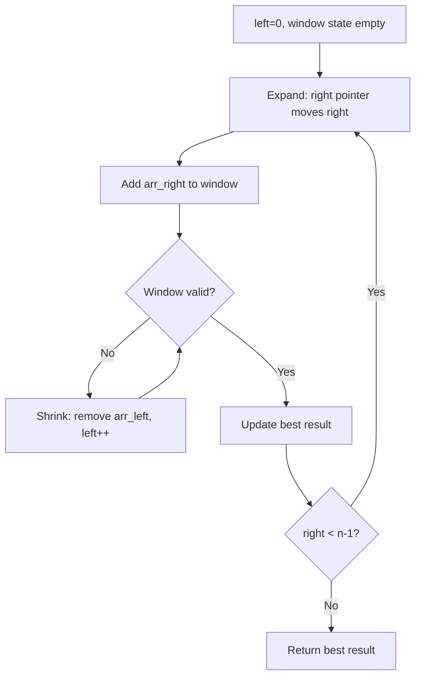
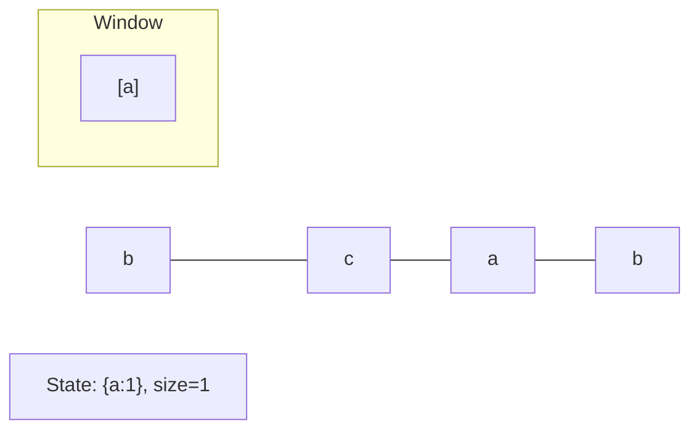
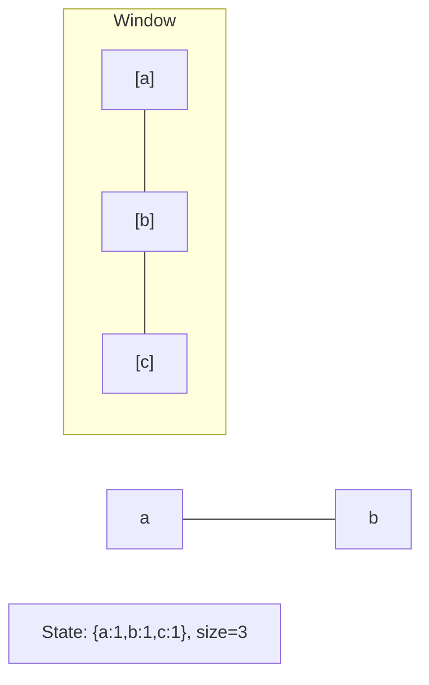
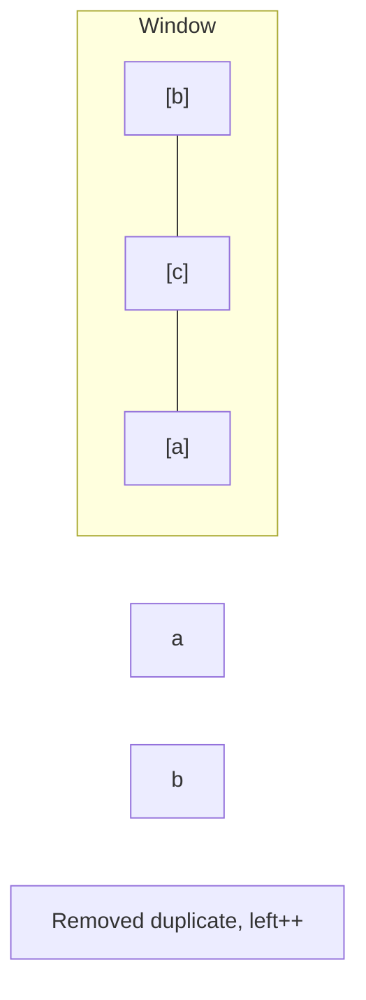
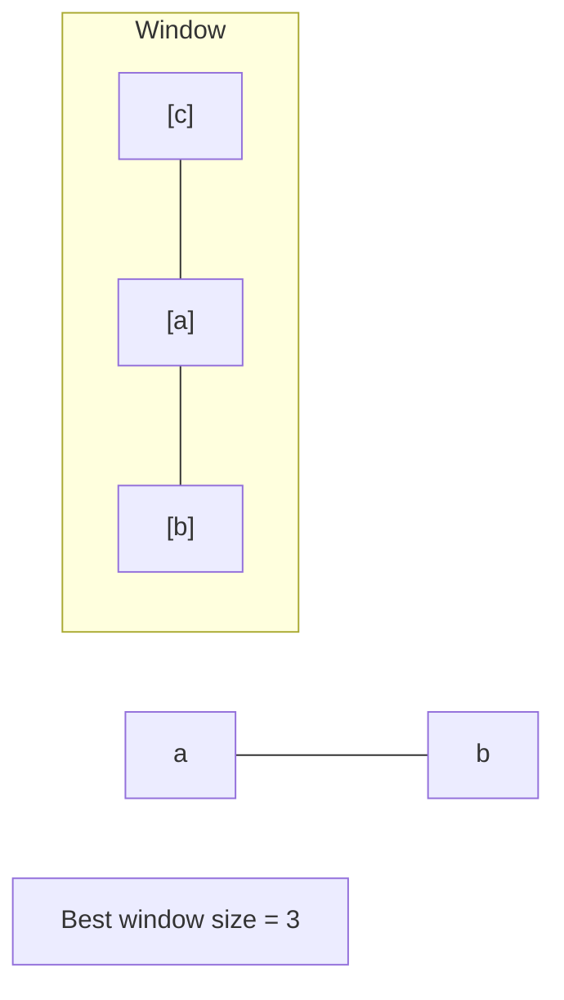

# Problem 1156: Swap For Longest Repeated Character Substring

**Difficulty:** Medium  
**Tags:** Hash Table, String, Sliding Window  
**Pattern:** Sliding Window  
**Link:** [leetcode.com/problems/swap-for-longest-repeated-character-substring](https://leetcode.com/problems/swap-for-longest-repeated-character-substring/)

## Description

You are given a string `text`. You can swap two of the characters in the `text`.

Return *the length of the longest substring with repeated characters*.

 

Example 1:

```

**Input:** text = "ababa"
**Output:** 3
**Explanation:** We can swap the first 'b' with the last 'a', or the last 'b' with the first 'a'. Then, the longest repeated character substring is "aaa" with length 3.

```

Example 2:

```

**Input:** text = "aaabaaa"
**Output:** 6
**Explanation:** Swap 'b' with the last 'a' (or the first 'a'), and we get longest repeated character substring "aaaaaa" with length 6.

```

Example 3:

```

**Input:** text = "aaaaa"
**Output:** 5
**Explanation:** No need to swap, longest repeated character substring is "aaaaa" with length is 5.

```

 

**Constraints:**

	- `1 <= text.length <= 2 * 10^4`
	- `text` consist of lowercase English characters only.

## Approach: Sliding Window

Maintain a window over the data using two pointers. Expand the right boundary to include new elements, and shrink the left boundary when the window constraint is violated. Track the optimal window.

## Pseudocode

```
1. Initialize left = 0, result = initial_value
2. For right in range(n):
   a. Add element at right to window state
   b. While window is invalid:
      - Remove element at left from window state
      - left++
   c. Update result = best of (result, window size/value)
3. Return result
```

## Algorithm Flow



## Visual State Transitions

**Sliding Window Step-by-Step:**

**Frame 1: Initial window (left=0, right=0)**


**Frame 2: Expand right (right=2)**


**Frame 3: Violation - shrink left**


**Frame 4: Continue expanding**



## Complexity Analysis

- **Time:** O(n)
- **Space:** O(k)

## Solution (Python3)

```python
class Solution:
    def maxRepOpt1(self, text: str) -> int:
        # Sliding window approach - O(n) time, O(k) space
        from collections import defaultdict
        window = defaultdict(int)
        left = 0
        result = 0
        for right in range(len(text)):
            window[text[right]] += 1
            while len(window) > (text if isinstance(text, int) else len(text)):
                window[text[left]] -= 1
                if window[text[left]] == 0:
                    del window[text[left]]
                left += 1
            result = max(result, right - left + 1)
        return result
```

## Solution (C++)

```cpp
#include <algorithm>
#include <string>
#include <unordered_map>
#include <vector>
using namespace std;

class Solution {
public:
    int maxRepOpt1(string& text) {
        // Sliding window approach - O(n) time, O(k) space
        unordered_map<char, int> window;
        int left = 0, result = 0;
        for (int right = 0; right < text.size(); right++) {
            window[text[right]]++;
            while ((int)window.size() > text) {
                window[text[left]]--;
                if (window[text[left]] == 0)
                    window.erase(text[left]);
                left++;
            }
            result = max(result, right - left + 1);
        }
        return result;
    }
};
```
