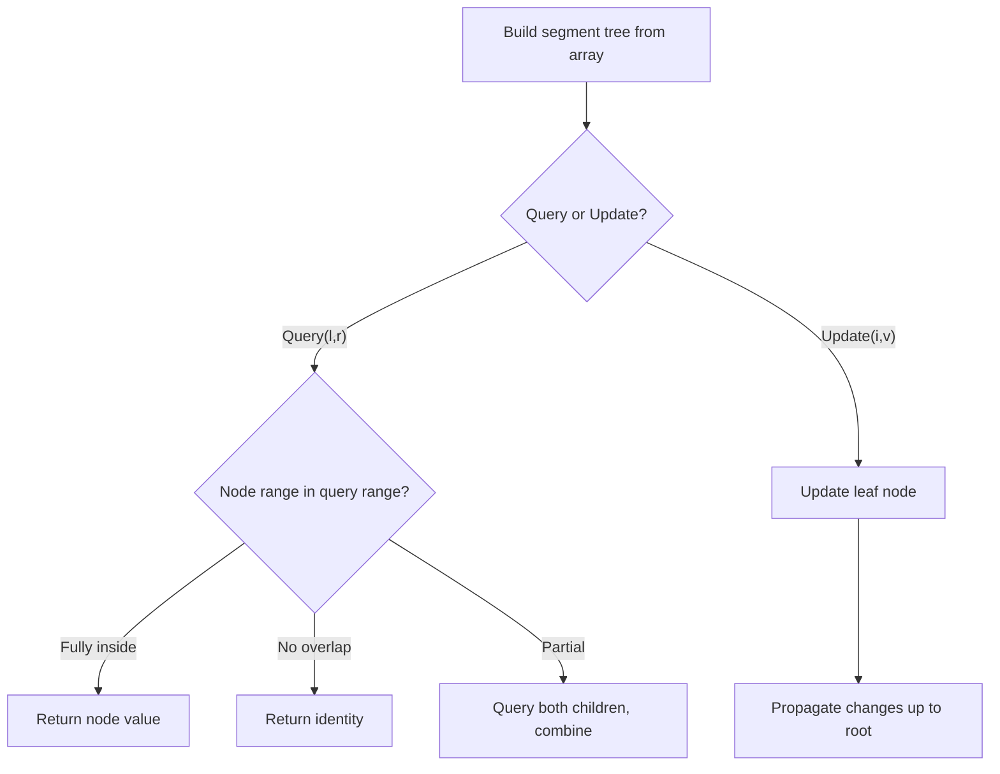

# Problem 1157: Online Majority Element In Subarray

**Difficulty:** Hard  
**Tags:** Array, Binary Search, Design, Binary Indexed Tree, Segment Tree  
**Pattern:** Segment Tree  
**Link:** [leetcode.com/problems/online-majority-element-in-subarray](https://leetcode.com/problems/online-majority-element-in-subarray/)

## Description

Design a data structure that efficiently finds the **majority element** of a given subarray.

The **majority element** of a subarray is an element that occurs `threshold` times or more in the subarray.

Implementing the `MajorityChecker` class:

	- `MajorityChecker(int[] arr)` Initializes the instance of the class with the given array `arr`.
	- `int query(int left, int right, int threshold)` returns the element in the subarray `arr[left...right]` that occurs at least `threshold` times, or `-1` if no such element exists.

 

Example 1:

```

**Input**
["MajorityChecker", "query", "query", "query"]
[[[1, 1, 2, 2, 1, 1]], [0, 5, 4], [0, 3, 3], [2, 3, 2]]
**Output**
[null, 1, -1, 2]

**Explanation**
MajorityChecker majorityChecker = new MajorityChecker([1, 1, 2, 2, 1, 1]);
majorityChecker.query(0, 5, 4); // return 1
majorityChecker.query(0, 3, 3); // return -1
majorityChecker.query(2, 3, 2); // return 2

```

 

**Constraints:**

	- `1 <= arr.length <= 2 * 10^4`
	- `1 <= arr[i] <= 2 * 10^4`
	- `0 <= left <= right < arr.length`
	- `threshold <= right - left + 1`
	- `2 * threshold > right - left + 1`
	- At most `10^4` calls will be made to `query`.

## Approach: Segment Tree

Build a segment tree for range queries (sum, min, max) with point or range updates. Each node covers a range; queries are answered by combining relevant segments.

## Pseudocode

```
1. Build segment tree from array (O(n))
2. Query(l, r):
   - If node range within [l,r]: return node value
   - If no overlap: return identity
   - Else: combine query(left_child) and query(right_child)
3. Update(i, val): update leaf and propagate up
```

## Algorithm Flow



## Complexity Analysis

- **Time:** O(n log n) build, O(log n) query/update
- **Space:** O(n)

## Solution (Python3)

```python
class MajorityChecker:
    def __init__(self, arr: List[int]):
        # Initialize data structure
        self.arr = arr

    def query(self, left: int, right: int, threshold: int) -> int:
        return 0

```

## Solution (C++)

```cpp
#include <functional>
#include <string>
#include <vector>
using namespace std;

class MajorityChecker {
public:
    MajorityChecker(vector<int>& arr) {
        // Initialize
    }

    int query(int left, int right, int threshold) {
        return 0;
    }

};
```
