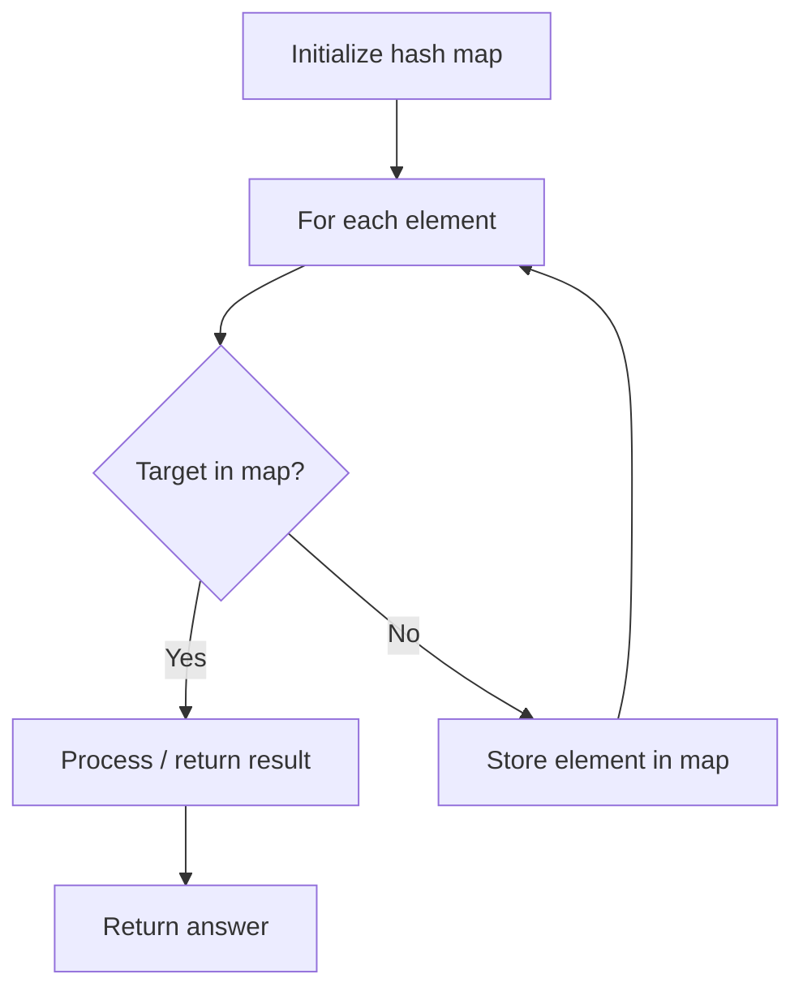

# Problem 1160: Find Words That Can Be Formed by Characters

**Difficulty:** Easy  
**Tags:** Array, Hash Table, String, Counting  
**Pattern:** Hash Map Lookup  
**Link:** [leetcode.com/problems/find-words-that-can-be-formed-by-characters](https://leetcode.com/problems/find-words-that-can-be-formed-by-characters/)

## Description

You are given an array of strings `words` and a string `chars`.

A string is **good** if it can be formed by characters from `chars` (each character can only be used once for **each** word in `words`).

Return *the sum of lengths of all good strings in words*.

 

Example 1:

```

**Input:** words = ["cat","bt","hat","tree"], chars = "atach"
**Output:** 6
**Explanation:** The strings that can be formed are "cat" and "hat" so the answer is 3 + 3 = 6.

```

Example 2:

```

**Input:** words = ["hello","world","leetcode"], chars = "welldonehoneyr"
**Output:** 10
**Explanation:** The strings that can be formed are "hello" and "world" so the answer is 5 + 5 = 10.

```

 

**Constraints:**

	- `1 <= words.length <= 1000`
	- `1 <= words[i].length, chars.length <= 100`
	- `words[i]` and `chars` consist of lowercase English letters.

## Approach: Hash Map Lookup

Use a hash map (dictionary) to store elements for O(1) lookup. Iterate through the input, checking membership or counting frequencies in the map.

## Pseudocode

```
1. Initialize hash map
2. Iterate through elements:
   a. Check if target/complement exists in map
   b. If found: process result
   c. Otherwise: store element in map
3. Return result
```

## Algorithm Flow



## Complexity Analysis

- **Time:** O(n)
- **Space:** O(n)

## Solution (Python3)

```python
class Solution:
    def countCharacters(self, words: List[str], chars: str) -> int:
        # Hash map approach - O(n) time, O(n) space
        seen = {}
        for i, val in enumerate(words):
            complement = chars - val
            if complement in seen:
                return [seen[complement], i]
            seen[val] = i
        return 0
```

## Solution (C++)

```cpp
#include <string>
#include <unordered_map>
#include <vector>
using namespace std;

class Solution {
public:
    int countCharacters(vector<string>& words, string& chars) {
        // Hash map approach - O(n) time, O(n) space
        unordered_map<int, int> seen;
        for (int i = 0; i < words.size(); i++) {
            int complement = chars - words[i];
            if (seen.count(complement)) {
                return {seen[complement], i};
            }
            seen[words[i]] = i;
        }
        return 0;
    }
};
```
