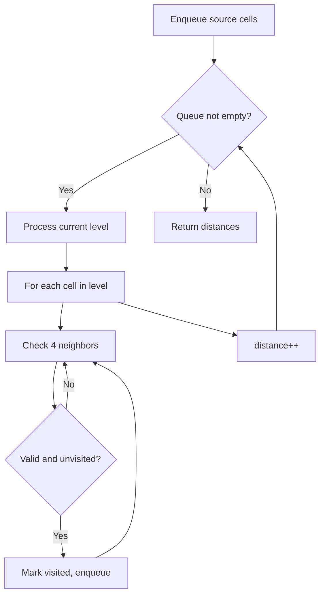
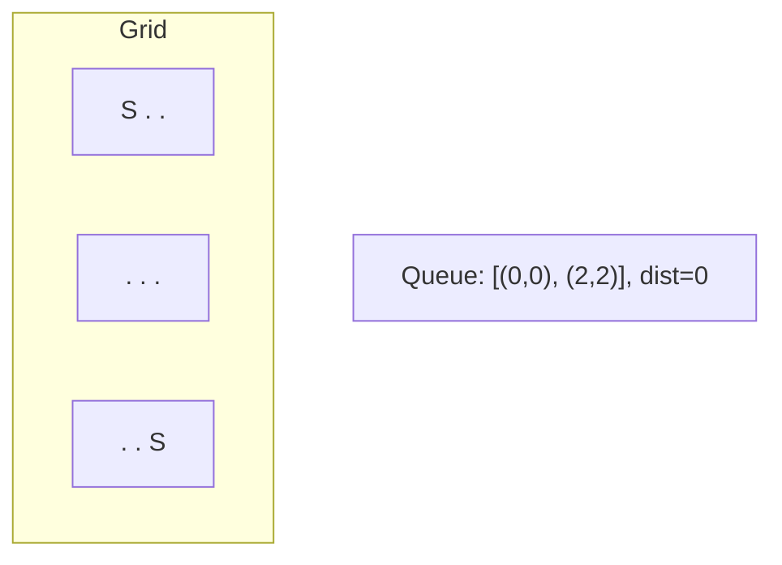
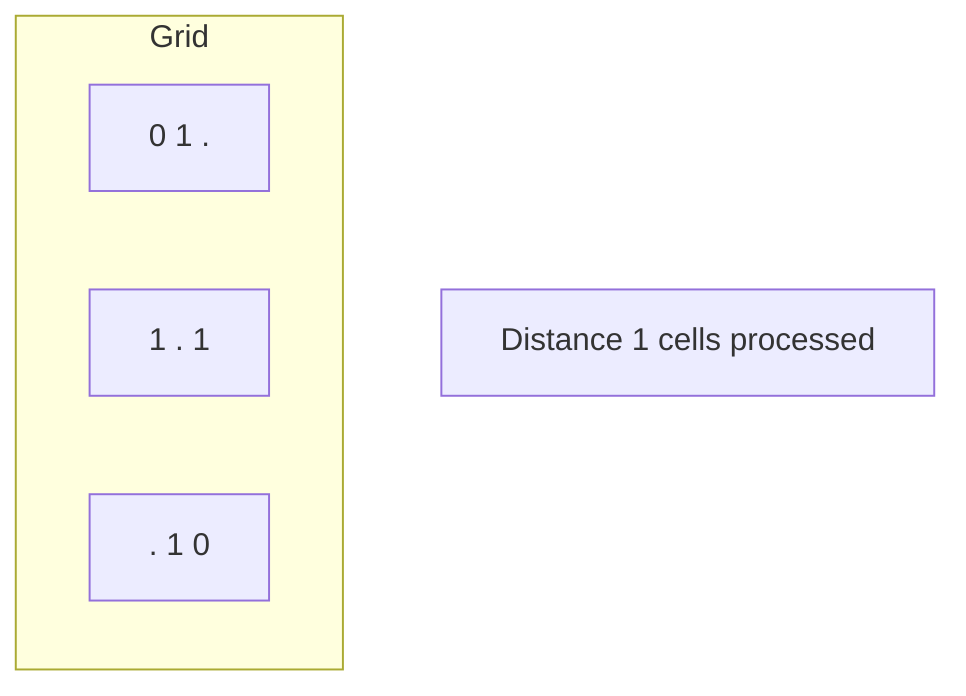
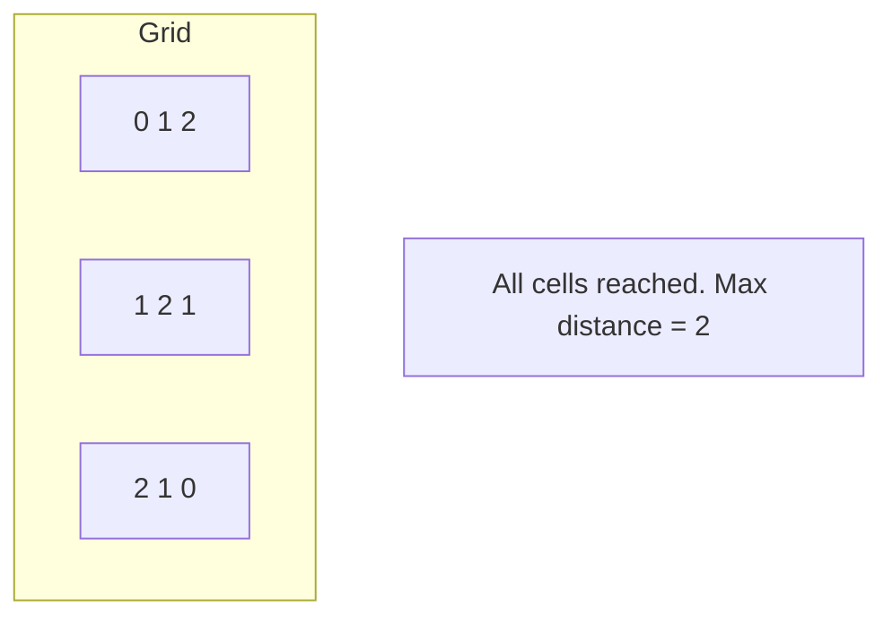

# Problem 1162: As Far from Land as Possible

**Difficulty:** Medium  
**Tags:** Array, Dynamic Programming, Breadth-First Search, Matrix  
**Pattern:** Multi-source BFS  
**Link:** [leetcode.com/problems/as-far-from-land-as-possible](https://leetcode.com/problems/as-far-from-land-as-possible/)

## Description

Given an `n x n` `grid` containing only values `0` and `1`, where `0` represents water and `1` represents land, find a water cell such that its distance to the nearest land cell is maximized, and return the distance. If no land or water exists in the grid, return `-1`.

The distance used in this problem is the Manhattan distance: the distance between two cells `(x0, y0)` and `(x1, y1)` is `|x0 - x1| + |y0 - y1|`.

 

Example 1:

```

**Input:** grid = [[1,0,1],[0,0,0],[1,0,1]]
**Output:** 2
**Explanation:** The cell (1, 1) is as far as possible from all the land with distance 2.

```

Example 2:

```

**Input:** grid = [[1,0,0],[0,0,0],[0,0,0]]
**Output:** 4
**Explanation:** The cell (2, 2) is as far as possible from all the land with distance 4.

```

 

**Constraints:**

	- `n == grid.length`
	- `n == grid[i].length`
	- `1 <= n <= 100`
	- `grid[i][j]` is `0` or `1`

## Approach: Multi-source BFS

Multi-source BFS from all land cells. Last water cell reached gives max distance.

## Pseudocode

```
1. Enqueue all source cells, mark visited
2. distance = 0
3. While queue not empty:
   a. Process all cells at current distance
   b. For each cell, enqueue unvisited neighbors
   c. distance++
4. Return result
```

## Algorithm Flow



## Visual State Transitions

**Multi-source BFS on Grid:**

**Frame 1: Enqueue all sources**


**Frame 2: Expand distance 1**


**Frame 3: Expand distance 2**



## Complexity Analysis

- **Time:** O(n^2)
- **Space:** O(n^2)

## Solution (Python3)

```python
from collections import deque

class Solution:
    def maxDistance(self, grid: list[list[int]]) -> int:
        n = len(grid)
        queue = deque()
        for r in range(n):
            for c in range(n):
                if grid[r][c] == 1:
                    queue.append((r, c))
        if len(queue) == 0 or len(queue) == n * n:
            return -1
        dist = -1
        while queue:
            dist += 1
            for _ in range(len(queue)):
                r, c = queue.popleft()
                for dr, dc in [(-1,0),(1,0),(0,-1),(0,1)]:
                    nr, nc = r+dr, c+dc
                    if 0 <= nr < n and 0 <= nc < n and grid[nr][nc] == 0:
                        grid[nr][nc] = 1
                        queue.append((nr, nc))
        return dist
```

## Solution (C++)

```cpp
#include <algorithm>
#include <queue>
#include <string>
#include <tuple>
#include <vector>
using namespace std;

class Solution {
public:
    int maxDistance(vector<vector<int>>& grid) {
        // BFS on grid - O(m*n) time
        if (grid.empty()) return 0;
        int rows = grid.size(), cols = grid[0].size();
        queue<tuple<int,int,int>> q;
        vector<vector<bool>> visited(rows, vector<bool>(cols, false));
        int dirs[4][2] = {{1,0},{-1,0},{0,1},{0,-1}};
        for (int r = 0; r < rows; r++)
            for (int c = 0; c < cols; c++)
                if (grid[r][c] == 1) {
                    q.push({r, c, 0});
                    visited[r][c] = true;
                }
        int steps = 0;
        while (!q.empty()) {
            auto [r, c, d] = q.front(); q.pop();
            steps = max(steps, d);
            for (auto& dir : dirs) {
                int nr = r+dir[0], nc = c+dir[1];
                if (nr>=0 && nr<rows && nc>=0 && nc<cols && !visited[nr][nc]) {
                    visited[nr][nc] = true;
                    q.push({nr, nc, d+1});
                }
            }
        }
        return steps;
    }
};
```
