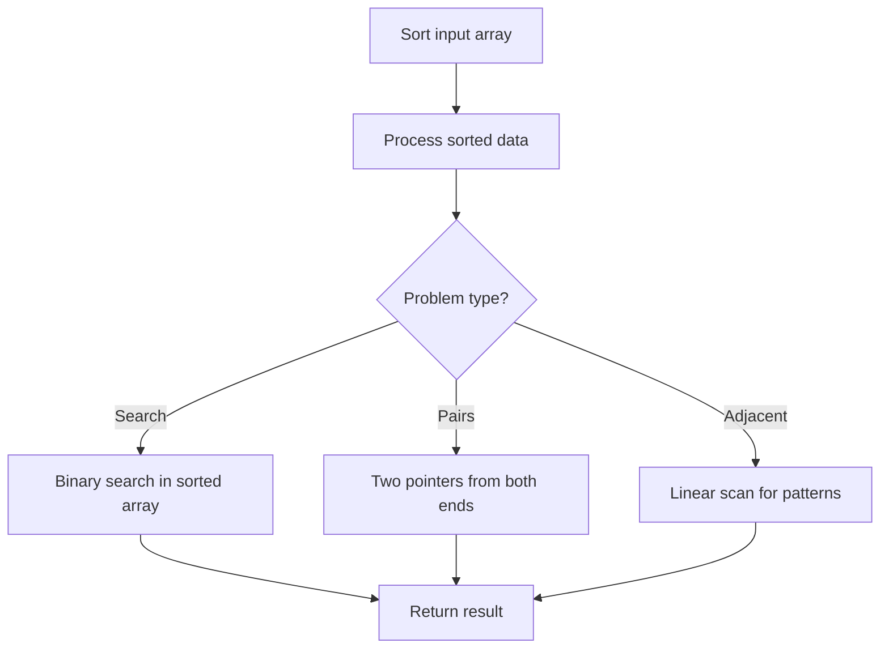

# Problem 1169: Invalid Transactions

**Difficulty:** Medium  
**Tags:** Array, Hash Table, String, Sorting  
**Pattern:** Sorting  
**Link:** [leetcode.com/problems/invalid-transactions](https://leetcode.com/problems/invalid-transactions/)

## Description

A transaction is possibly invalid if:

	- the amount exceeds `$1000`, or;
	- if it occurs within (and including) `60` minutes of another transaction with the **same name** in a **different city**.

You are given an array of strings `transaction` where `transactions[i]` consists of comma-separated values representing the name, time (in minutes), amount, and city of the transaction.

Return a list of `transactions` that are possibly invalid. You may return the answer in **any order**.

 

Example 1:

```

**Input:** transactions = ["alice,20,800,mtv","alice,50,100,beijing"]
**Output:** ["alice,20,800,mtv","alice,50,100,beijing"]
**Explanation:** The first transaction is invalid because the second transaction occurs within a difference of 60 minutes, have the same name and is in a different city. Similarly the second one is invalid too.
```

Example 2:

```

**Input:** transactions = ["alice,20,800,mtv","alice,50,1200,mtv"]
**Output:** ["alice,50,1200,mtv"]

```

Example 3:

```

**Input:** transactions = ["alice,20,800,mtv","bob,50,1200,mtv"]
**Output:** ["bob,50,1200,mtv"]

```

 

**Constraints:**

	- `transactions.length <= 1000`
	- Each `transactions[i]` takes the form `"{name},{time},{amount},{city}"`
	- Each `{name}` and `{city}` consist of lowercase English letters, and have lengths between `1` and `10`.
	- Each `{time}` consist of digits, and represent an integer between `0` and `1000`.
	- Each `{amount}` consist of digits, and represent an integer between `0` and `2000`.

## Approach: Sorting

Sort the data to enable efficient processing. After sorting, use techniques like binary search, two pointers, or linear scan to solve the problem.

## Pseudocode

```
1. Sort the input array
2. Process sorted data:
   - Use binary search for lookups
   - Use two pointers for pair finding
   - Scan for adjacent patterns
3. Return result
```

## Algorithm Flow



## Complexity Analysis

- **Time:** O(n log n)
- **Space:** O(n)

## Solution (Python3)

```python
class Solution:
    def invalidTransactions(self, transactions: List[str]) -> List[str]:
        # Sort-based approach - O(n log n) time
        transactions.sort(key=lambda x: x[0] if isinstance(x, (list, tuple)) else x)
        result = [transactions[0]]
        for i in range(1, len(transactions)):
            curr = transactions[i]
            if isinstance(curr, (list, tuple)) and isinstance(result[-1], (list, tuple)):
                if curr[0] <= result[-1][1]:
                    result[-1] = [result[-1][0], max(result[-1][1], curr[1])]
                else:
                    result.append(curr)
            else:
                result.append(curr)
        return result
```

## Solution (C++)

```cpp
#include <algorithm>
#include <string>
#include <vector>
using namespace std;

class Solution {
public:
    vector<string> invalidTransactions(vector<string>& transactions) {
        // Sort-based approach - O(n log n) time
        sort(transactions.begin(), transactions.end());
        vector<vector<int>> result;
        result.push_back(transactions[0]);
        for (int i = 1; i < (int)transactions.size(); i++) {
            if (transactions[i][0] <= result.back()[1]) {
                result.back()[1] = max(result.back()[1], transactions[i][1]);
            } else {
                result.push_back(transactions[i]);
            }
        }
        return result;
    }
};
```
