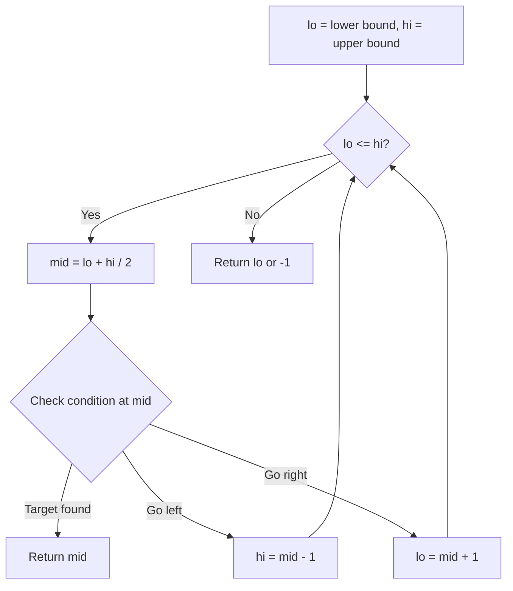
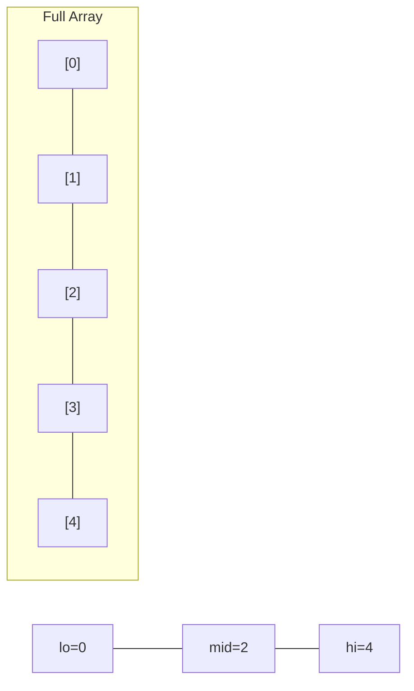
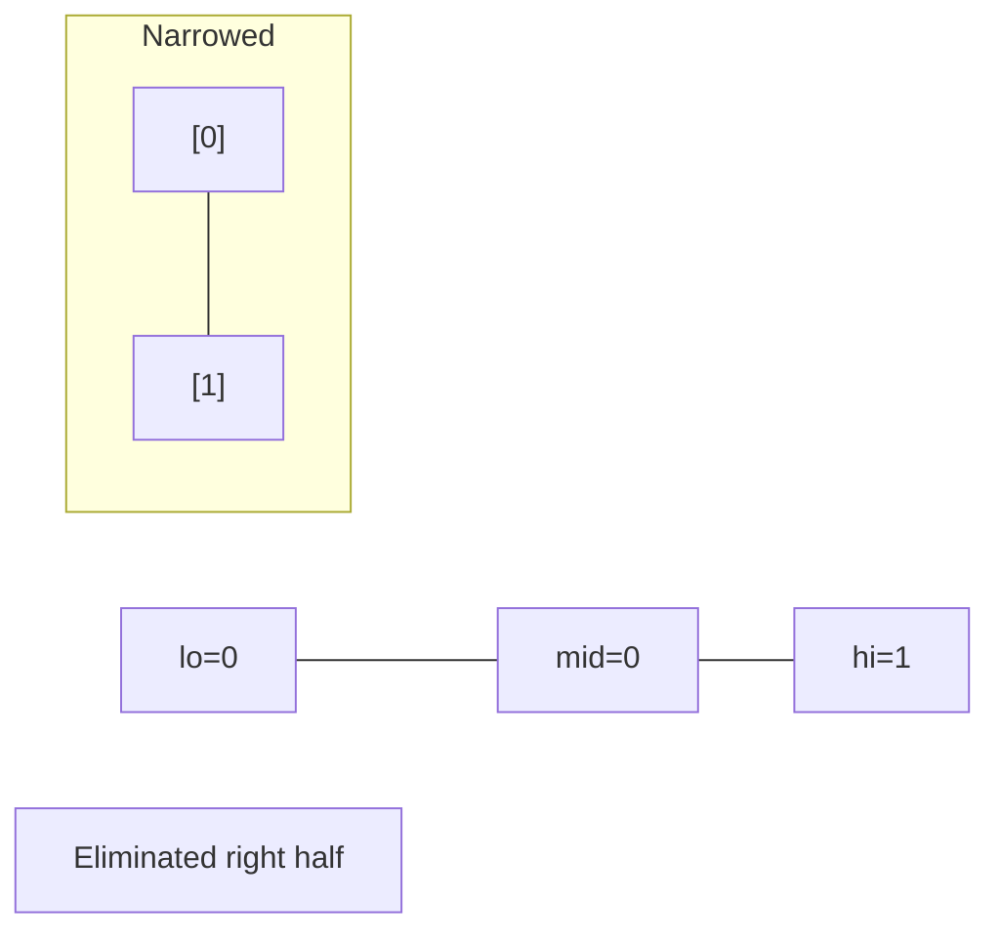
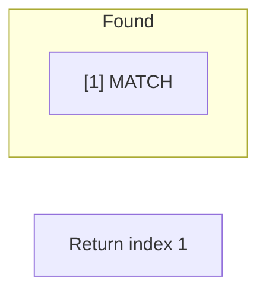

# Problem 1170: Compare Strings by Frequency of the Smallest Character

**Difficulty:** Medium  
**Tags:** Array, Hash Table, String, Binary Search, Sorting  
**Pattern:** Binary Search  
**Link:** [leetcode.com/problems/compare-strings-by-frequency-of-the-smallest-character](https://leetcode.com/problems/compare-strings-by-frequency-of-the-smallest-character/)

## Description

Let the function `f(s)` be the **frequency of the lexicographically smallest character** in a non-empty string `s`. For example, if `s = "dcce"` then `f(s) = 2` because the lexicographically smallest character is `'c'`, which has a frequency of 2.

You are given an array of strings `words` and another array of query strings `queries`. For each query `queries[i]`, count the **number of words** in `words` such that `f(queries[i])` < `f(W)` for each `W` in `words`.

Return *an integer array *`answer`*, where each *`answer[i]`* is the answer to the *`i^th`* query*.

 

Example 1:

```

**Input:** queries = ["cbd"], words = ["zaaaz"]
**Output:** [1]
**Explanation:** On the first query we have f("cbd") = 1, f("zaaaz") = 3 so f("cbd") < f("zaaaz").

```

Example 2:

```

**Input:** queries = ["bbb","cc"], words = ["a","aa","aaa","aaaa"]
**Output:** [1,2]
**Explanation:** On the first query only f("bbb") < f("aaaa"). On the second query both f("aaa") and f("aaaa") are both > f("cc").

```

 

**Constraints:**

	- `1 <= queries.length <= 2000`
	- `1 <= words.length <= 2000`
	- `1 <= queries[i].length, words[i].length <= 10`
	- `queries[i][j]`, `words[i][j]` consist of lowercase English letters.

## Approach: Binary Search

Use binary search to halve the search space each iteration. Define the search range [lo, hi], compute mid, and decide which half to keep based on the problem's monotonic condition.

## Pseudocode

```
1. lo = lower_bound, hi = upper_bound
2. While lo <= hi (or lo < hi):
   a. mid = (lo + hi) // 2
   b. If condition(mid) is satisfied: record answer, search left half
   c. Else: search right half
3. Return answer
```

## Algorithm Flow



## Visual State Transitions

**Binary Search Step-by-Step:**

**Frame 1: Initial search space**


**Frame 2: Compare mid, narrow search**


**Frame 3: Found target**



## Complexity Analysis

- **Time:** O(log n)
- **Space:** O(1)

## Solution (Python3)

```python
class Solution:
    def numSmallerByFrequency(self, queries: List[str], words: List[str]) -> List[int]:
        # Binary search - O(log n) time, O(1) space
        lo, hi = 0, len(queries) - 1
        while lo <= hi:
            mid = lo + (hi - lo) // 2
            if queries[mid] == words:
                return mid
            elif queries[mid] < words:
                lo = mid + 1
            else:
                hi = mid - 1
        return []
```

## Solution (C++)

```cpp
#include <string>
#include <vector>
using namespace std;

class Solution {
public:
    vector<int> numSmallerByFrequency(vector<string>& queries, vector<string>& words) {
        // Binary search - O(log n) time, O(1) space
        int lo = 0, hi = queries.size() - 1;
        while (lo <= hi) {
            int mid = lo + (hi - lo) / 2;
            if (queries[mid] == words) {
                return mid;
            } else if (queries[mid] < words) {
                lo = mid + 1;
            } else {
                hi = mid - 1;
            }
        }
        return {};
    }
};
```
