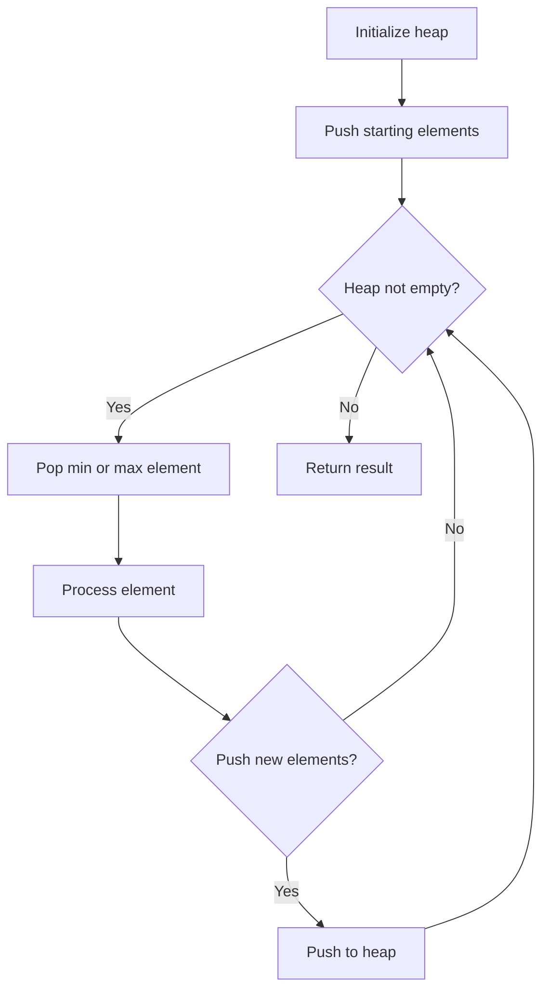
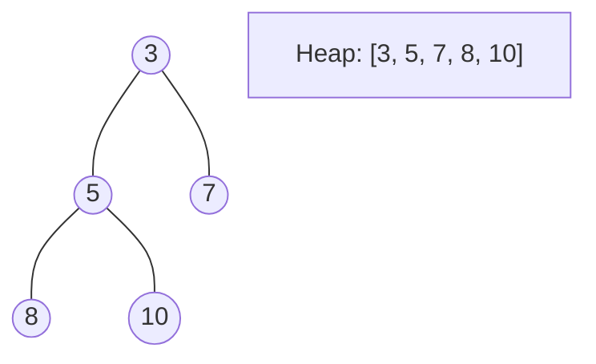
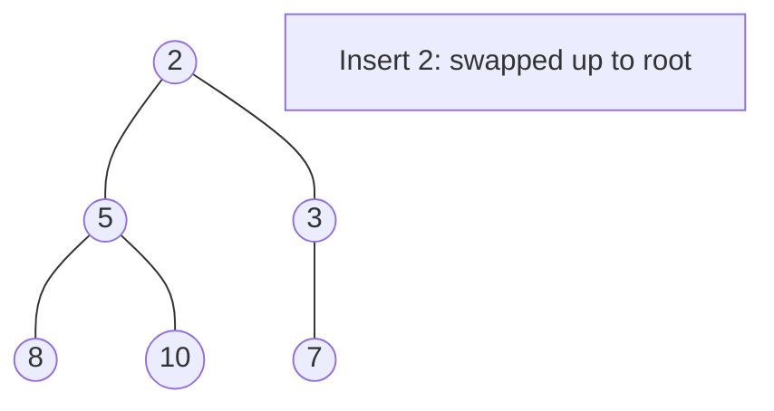
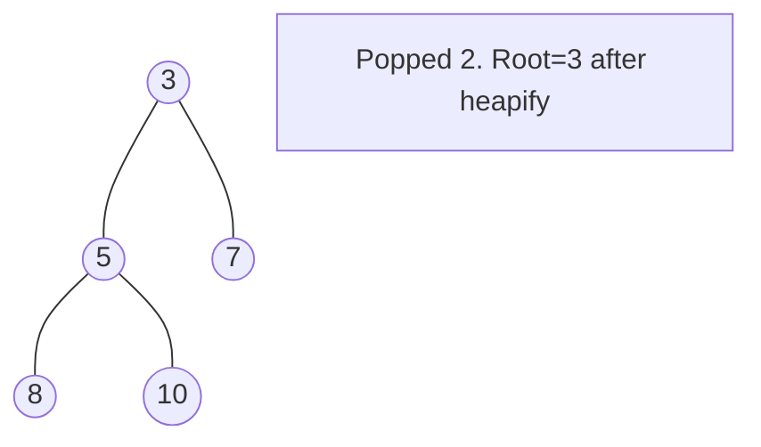

# Problem 1172: Dinner Plate Stacks

**Difficulty:** Hard  
**Tags:** Hash Table, Stack, Design, Heap (Priority Queue)  
**Pattern:** Heap / Priority Queue  
**Link:** [leetcode.com/problems/dinner-plate-stacks](https://leetcode.com/problems/dinner-plate-stacks/)

## Description

You have an infinite number of stacks arranged in a row and numbered (left to right) from `0`, each of the stacks has the same maximum capacity.

Implement the `DinnerPlates` class:

	- `DinnerPlates(int capacity)` Initializes the object with the maximum capacity of the stacks `capacity`.
	- `void push(int val)` Pushes the given integer `val` into the leftmost stack with a size less than `capacity`.
	- `int pop()` Returns the value at the top of the rightmost non-empty stack and removes it from that stack, and returns `-1` if all the stacks are empty.
	- `int popAtStack(int index)` Returns the value at the top of the stack with the given index `index` and removes it from that stack or returns `-1` if the stack with that given index is empty.

 

Example 1:

```

**Input**
["DinnerPlates", "push", "push", "push", "push", "push", "popAtStack", "push", "push", "popAtStack", "popAtStack", "pop", "pop", "pop", "pop", "pop"]
[[2], [1], [2], [3], [4], [5], [0], [20], [21], [0], [2], [], [], [], [], []]
**Output**
[null, null, null, null, null, null, 2, null, null, 20, 21, 5, 4, 3, 1, -1]

**Explanation:** 
DinnerPlates D = DinnerPlates(2);  // Initialize with capacity = 2
D.push(1);
D.push(2);
D.push(3);
D.push(4);
D.push(5);         // The stacks are now:  2  4
                                           1  3  5
                                           ﹈ ﹈ ﹈
D.popAtStack(0);   // Returns 2.  The stacks are now:     4
                                                       1  3  5
                                                       ﹈ ﹈ ﹈
D.push(20);        // The stacks are now: 20  4
                                           1  3  5
                                           ﹈ ﹈ ﹈
D.push(21);        // The stacks are now: 20  4 21
                                           1  3  5
                                           ﹈ ﹈ ﹈
D.popAtStack(0);   // Returns 20.  The stacks are now:     4 21
                                                        1  3  5
                                                        ﹈ ﹈ ﹈
D.popAtStack(2);   // Returns 21.  The stacks are now:     4
                                                        1  3  5
                                                        ﹈ ﹈ ﹈ 
D.pop()            // Returns 5.  The stacks are now:      4
                                                        1  3 
                                                        ﹈ ﹈  
D.pop()            // Returns 4.  The stacks are now:   1  3 
                                                        ﹈ ﹈   
D.pop()            // Returns 3.  The stacks are now:   1 
                                                        ﹈   
D.pop()            // Returns 1.  There are no stacks.
D.pop()            // Returns -1.  There are still no stacks.

```

 

**Constraints:**

	- `1 <= capacity <= 2 * 10^4`
	- `1 <= val <= 2 * 10^4`
	- `0 <= index <= 10^5`
	- At most `2 * 10^5` calls will be made to `push`, `pop`, and `popAtStack`.

## Approach: Heap / Priority Queue

Use a min-heap or max-heap to efficiently access the smallest/largest element. Push elements and pop the top to process in priority order.

## Pseudocode

```
1. Initialize heap (min or max)
2. Push initial elements onto heap
3. While heap not empty and condition:
   a. Pop top element (min or max)
   b. Process element
   c. Push new elements if needed
4. Return result
```

## Algorithm Flow



## Visual State Transitions

**Heap Operations (Min-Heap):**

**Frame 1: Initial heap**


**Frame 2: Insert 2 - bubble up**


**Frame 3: Pop minimum (2) - heapify down**



## Complexity Analysis

- **Time:** O(n log n)
- **Space:** O(n)

## Solution (Python3)

```python
class DinnerPlates:
    def __init__(self, capacity: int):
        # Initialize data structure
        self.capacity = capacity

    def push(self, val: int) -> None:
        return None

    def pop(self) -> int:
        return 0

    def popAtStack(self, index: int) -> int:
        return 0

```

## Solution (C++)

```cpp
#include <queue>
#include <string>
#include <vector>
using namespace std;

class DinnerPlates {
public:
    DinnerPlates(int capacity) {
        // Initialize
    }

    void push(int val) {
        return ;
    }

    int pop() {
        return 0;
    }

    int popAtStack(int index) {
        return 0;
    }

};
```
