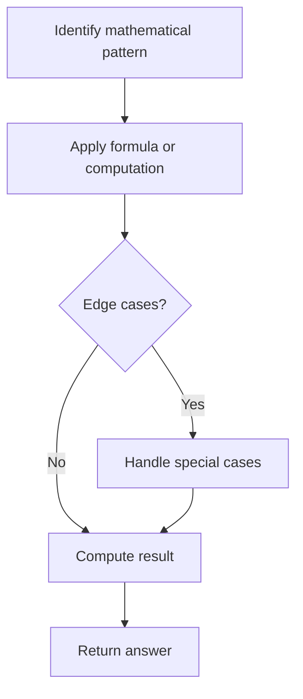

# Problem 1175: Prime Arrangements

**Difficulty:** Easy  
**Tags:** Math  
**Pattern:** Math  
**Link:** [leetcode.com/problems/prime-arrangements](https://leetcode.com/problems/prime-arrangements/)

## Description

Return the number of permutations of 1 to `n` so that prime numbers are at prime indices (1-indexed.)

*(Recall that an integer is prime if and only if it is greater than 1, and cannot be written as a product of two positive integers both smaller than it.)*

Since the answer may be large, return the answer **modulo `10^9 + 7`**.

 

Example 1:

```

**Input:** n = 5
**Output:** 12
**Explanation:** For example [1,2,5,4,3] is a valid permutation, but [5,2,3,4,1] is not because the prime number 5 is at index 1.

```

Example 2:

```

**Input:** n = 100
**Output:** 682289015

```

 

**Constraints:**

	- `1 <= n <= 100`

## Approach: Math

Apply mathematical properties, formulas, or number-theoretic concepts. Look for patterns, modular arithmetic, or closed-form solutions.

## Pseudocode

```
1. Identify the mathematical pattern or formula
2. Apply computation:
   - Modular arithmetic for large numbers
   - GCD/LCM for divisibility
   - Sieve for primes
3. Handle edge cases
4. Return result
```

## Algorithm Flow



## Complexity Analysis

- **Time:** O(n) or O(sqrt(n))
- **Space:** O(1)

## Solution (Python3)

```python
class Solution:
    def numPrimeArrangements(self, n: int) -> int:
        # Mathematical approach
        result = 0
        x = n
        while x != 0:
            result = result * 10 + x % 10
            x //= 10 if isinstance(x, int) else 1
        return result
```

## Solution (C++)

```cpp
#include <string>
#include <vector>
using namespace std;

class Solution {
public:
    int numPrimeArrangements(int n) {
        // Mathematical approach
        long long result = 0;
        int x = n;
        while (x != 0) {
            result = result * 10 + x % 10;
            x /= 10;
        }
        return (int)result;
    }
};
```
