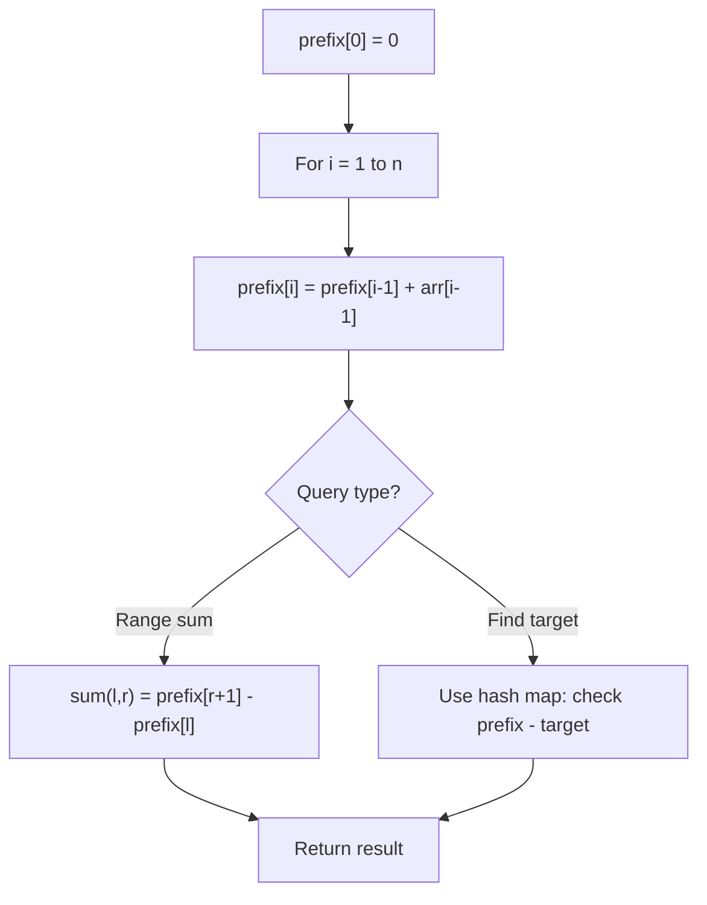

# Problem 1177: Can Make Palindrome from Substring

**Difficulty:** Medium  
**Tags:** Array, Hash Table, String, Bit Manipulation, Prefix Sum  
**Pattern:** Prefix Sum  
**Link:** [leetcode.com/problems/can-make-palindrome-from-substring](https://leetcode.com/problems/can-make-palindrome-from-substring/)

## Description

You are given a string `s` and array `queries` where `queries[i] = [lefti, righti, ki]`. We may rearrange the substring `s[lefti...righti]` for each query and then choose up to `ki` of them to replace with any lowercase English letter.

If the substring is possible to be a palindrome string after the operations above, the result of the query is `true`. Otherwise, the result is `false`.

Return a boolean array `answer` where `answer[i]` is the result of the `i^th` query `queries[i]`.

Note that each letter is counted individually for replacement, so if, for example `s[lefti...righti] = "aaa"`, and `ki = 2`, we can only replace two of the letters. Also, note that no query modifies the initial string `s`.

 

Example :

```

**Input:** s = "abcda", queries = [[3,3,0],[1,2,0],[0,3,1],[0,3,2],[0,4,1]]
**Output:** [true,false,false,true,true]
**Explanation:**
queries[0]: substring = "d", is palidrome.
queries[1]: substring = "bc", is not palidrome.
queries[2]: substring = "abcd", is not palidrome after replacing only 1 character.
queries[3]: substring = "abcd", could be changed to "abba" which is palidrome. Also this can be changed to "baab" first rearrange it "bacd" then replace "cd" with "ab".
queries[4]: substring = "abcda", could be changed to "abcba" which is palidrome.

```

Example 2:

```

**Input:** s = "lyb", queries = [[0,1,0],[2,2,1]]
**Output:** [false,true]

```

 

**Constraints:**

	- `1 <= s.length, queries.length <= 10^5`
	- `0 <= lefti <= righti < s.length`
	- `0 <= ki <= s.length`
	- `s` consists of lowercase English letters.

## Approach: Prefix Sum

Build a prefix sum array where prefix[i] = sum of elements 0..i-1. Any subarray sum [l..r] = prefix[r+1] - prefix[l]. Combine with hash map for O(n) subarray sum queries.

## Pseudocode

```
1. Build prefix sum array: prefix[0]=0, prefix[i]=prefix[i-1]+arr[i-1]
2. Use prefix sums to answer queries:
   - Subarray sum [l..r] = prefix[r+1] - prefix[l]
   - Or use hash map to find prefix[j]-prefix[i] == target
3. Return result
```

## Algorithm Flow



## Complexity Analysis

- **Time:** O(n)
- **Space:** O(n)

## Solution (Python3)

```python
class Solution:
    def canMakePaliQueries(self, s: str, queries: List[List[int]]) -> List[bool]:
        # Prefix sum approach - O(n) time, O(n) space
        prefix = {0: -1}
        curr_sum = 0
        result = 0
        target = queries if isinstance(queries, int) else 0
        for i, val in enumerate(s):
            curr_sum += val
            if curr_sum - target in prefix:
                result = max(result, i - prefix[curr_sum - target])
            if curr_sum not in prefix:
                prefix[curr_sum] = i
        return result
```

## Solution (C++)

```cpp
#include <algorithm>
#include <string>
#include <unordered_map>
#include <vector>
using namespace std;

class Solution {
public:
    vector<bool> canMakePaliQueries(string& s, vector<vector<int>>& queries) {
        // Prefix sum approach - O(n) time, O(n) space
        unordered_map<int, int> prefix;
        prefix[0] = -1;
        int curr_sum = 0, result = 0;
        int target = queries;
        for (int i = 0; i < (int)s.size(); i++) {
            curr_sum += s[i];
            if (prefix.count(curr_sum - target)) {
                result = max(result, i - prefix[curr_sum - target]);
            }
            if (!prefix.count(curr_sum)) {
                prefix[curr_sum] = i;
            }
        }
        return result;
    }
};
```
