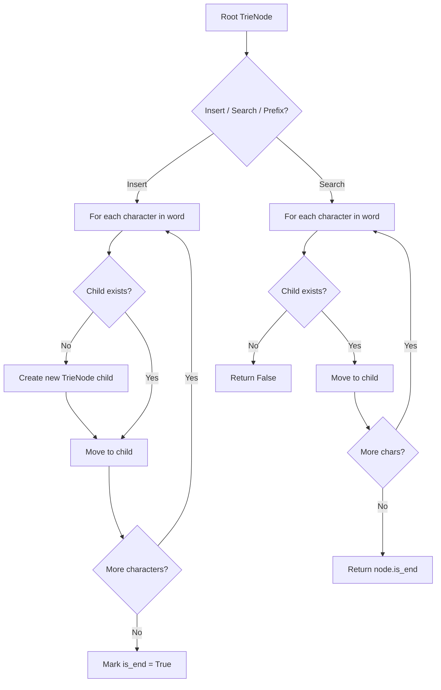
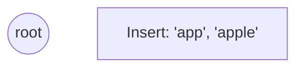
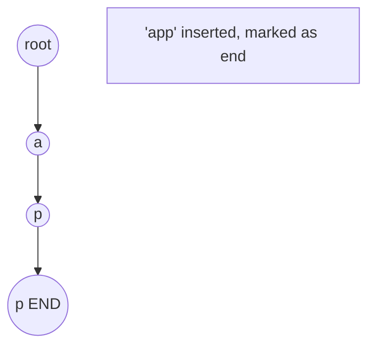
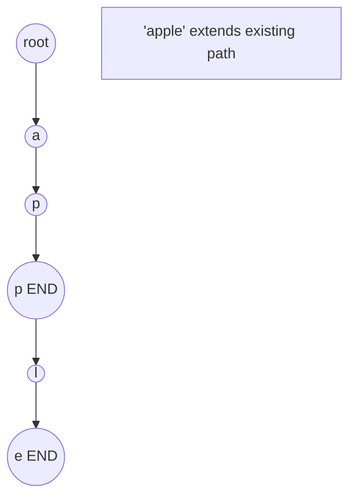
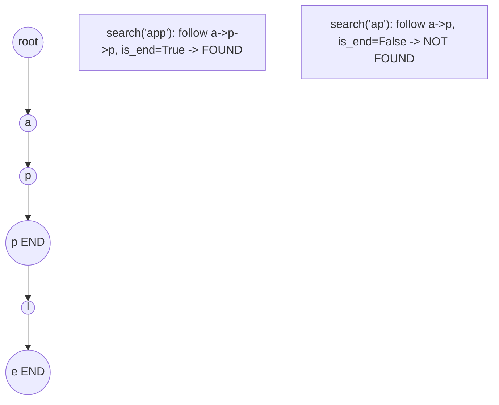

# Problem 1178: Number of Valid Words for Each Puzzle

**Difficulty:** Hard  
**Tags:** Array, Hash Table, String, Bit Manipulation, Trie  
**Pattern:** Trie / Prefix Tree  
**Link:** [leetcode.com/problems/number-of-valid-words-for-each-puzzle](https://leetcode.com/problems/number-of-valid-words-for-each-puzzle/)

## Description

With respect to a given `puzzle` string, a `word` is *valid* if both the following conditions are satisfied:

	- `word` contains the first letter of `puzzle`.
	- For each letter in `word`, that letter is in `puzzle`.
	
		For example, if the puzzle is `"abcdefg"`, then valid words are `"faced"`, `"cabbage"`, and `"baggage"`, while
		- invalid words are `"beefed"` (does not include `'a'`) and `"based"` (includes `'s'` which is not in the puzzle).
	
	

Return *an array *`answer`*, where *`answer[i]`* is the number of words in the given word list *`words`* that is valid with respect to the puzzle *`puzzles[i]`.
 

Example 1:

```

**Input:** words = ["aaaa","asas","able","ability","actt","actor","access"], puzzles = ["aboveyz","abrodyz","abslute","absoryz","actresz","gaswxyz"]
**Output:** [1,1,3,2,4,0]
**Explanation:** 
1 valid word for "aboveyz" : "aaaa" 
1 valid word for "abrodyz" : "aaaa"
3 valid words for "abslute" : "aaaa", "asas", "able"
2 valid words for "absoryz" : "aaaa", "asas"
4 valid words for "actresz" : "aaaa", "asas", "actt", "access"
There are no valid words for "gaswxyz" cause none of the words in the list contains letter 'g'.

```

Example 2:

```

**Input:** words = ["apple","pleas","please"], puzzles = ["aelwxyz","aelpxyz","aelpsxy","saelpxy","xaelpsy"]
**Output:** [0,1,3,2,0]

```

 

**Constraints:**

	- `1 <= words.length <= 10^5`
	- `4 <= words[i].length <= 50`
	- `1 <= puzzles.length <= 10^4`
	- `puzzles[i].length == 7`
	- `words[i]` and `puzzles[i]` consist of lowercase English letters.
	- Each `puzzles[i] `does not contain repeated characters.

## Approach: Trie / Prefix Tree

Build a trie (prefix tree) where each node represents a character. Insert words character by character, and search by following child pointers. Supports efficient prefix matching.

## Pseudocode

```
1. TrieNode: children = {}, is_end = False
2. Insert(word):
   - For each char: create child if absent, move to child
   - Mark last node as end
3. Search(word):
   - For each char: if child absent return False, move to child
   - Return node.is_end
4. StartsWith(prefix): same as search but return True at end
```

## Algorithm Flow



## Visual State Transitions

**Trie Insert and Search:**

**Frame 1: Empty trie**


**Frame 2: Insert 'app'**


**Frame 3: Insert 'apple'**


**Frame 4: Search 'app' = True, 'ap' = False**



## Complexity Analysis

- **Time:** O(L) per operation
- **Space:** O(N * L)

## Solution (Python3)

```python
class Solution:
    def findNumOfValidWords(self, words: List[str], puzzles: List[str]) -> List[int]:
        # Trie-based approach
        trie = {}
        # Build trie from word list
        words = words if isinstance(words, list) else [words]
        for word in words:
            node = trie
            for ch in word:
                if ch not in node:
                    node[ch] = {}
                node = node[ch]
            node['#'] = True
        
        # Search in trie
        def search(word):
            node = trie
            for ch in word:
                if ch not in node:
                    return False
                node = node[ch]
            return '#' in node
        
        return []
```

## Solution (C++)

```cpp
#include <string>
#include <vector>
using namespace std;

class Solution {
public:
    vector<int> findNumOfValidWords(vector<string>& words, vector<string>& puzzles) {
        // Trie-based approach
        struct TrieNode {
            TrieNode* children[26] = {};
            bool isEnd = false;
        };
        TrieNode* root = new TrieNode();
        // Build trie
        for (auto& word : words) {
            TrieNode* node = root;
            for (char ch : word) {
                int idx = ch - 'a';
                if (!node->children[idx])
                    node->children[idx] = new TrieNode();
                node = node->children[idx];
            }
            node->isEnd = true;
        }
        return {};
    }
};
```
