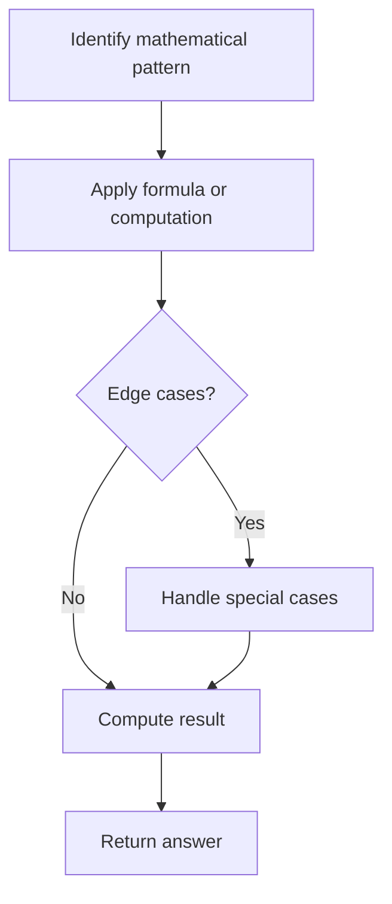

# Problem 1185: Day of the Week

**Difficulty:** Easy  
**Tags:** Math  
**Pattern:** Math  
**Link:** [leetcode.com/problems/day-of-the-week](https://leetcode.com/problems/day-of-the-week/)

## Description

Given a date, return the corresponding day of the week for that date.

The input is given as three integers representing the `day`, `month` and `year` respectively.

Return the answer as one of the following values `{"Sunday", "Monday", "Tuesday", "Wednesday", "Thursday", "Friday", "Saturday"}`.

**Note:** January 1, 1971 was a Friday.

 

Example 1:

```

**Input:** day = 31, month = 8, year = 2019
**Output:** "Saturday"

```

Example 2:

```

**Input:** day = 18, month = 7, year = 1999
**Output:** "Sunday"

```

Example 3:

```

**Input:** day = 15, month = 8, year = 1993
**Output:** "Sunday"

```

 

**Constraints:**

	- The given dates are valid dates between the years `1971` and `2100`.

## Approach: Math

Apply mathematical properties, formulas, or number-theoretic concepts. Look for patterns, modular arithmetic, or closed-form solutions.

## Pseudocode

```
1. Identify the mathematical pattern or formula
2. Apply computation:
   - Modular arithmetic for large numbers
   - GCD/LCM for divisibility
   - Sieve for primes
3. Handle edge cases
4. Return result
```

## Algorithm Flow



## Complexity Analysis

- **Time:** O(n) or O(sqrt(n))
- **Space:** O(1)

## Solution (Python3)

```python
class Solution:
    def dayOfTheWeek(self, day: int, month: int, year: int) -> str:
        # Mathematical approach
        result = 0
        x = day
        while x != 0:
            result = result * 10 + x % 10
            x //= 10 if isinstance(x, int) else 1
        return result
```

## Solution (C++)

```cpp
#include <string>
#include <vector>
using namespace std;

class Solution {
public:
    string dayOfTheWeek(int day, int month, int year) {
        // Mathematical approach
        long long result = 0;
        int x = day;
        while (x != 0) {
            result = result * 10 + x % 10;
            x /= 10;
        }
        return (int)result;
    }
};
```
