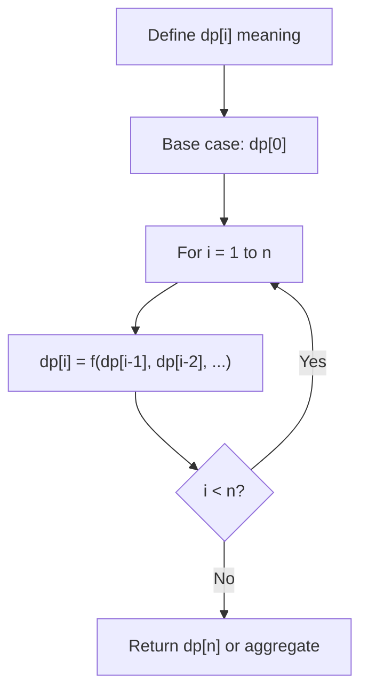
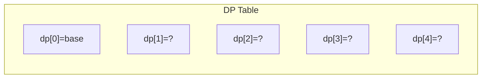
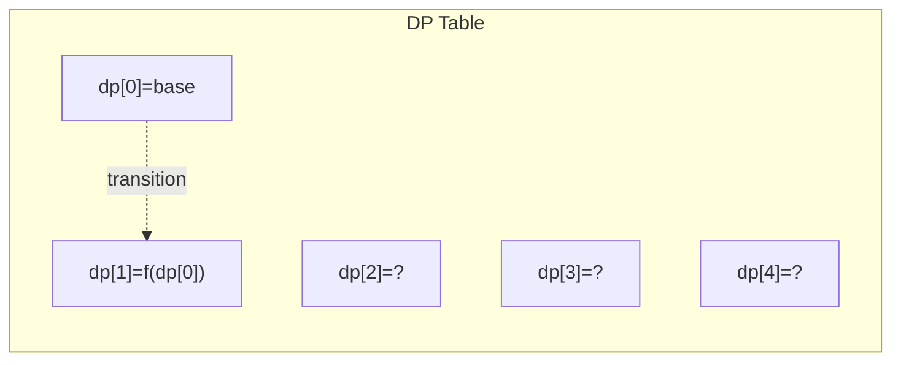
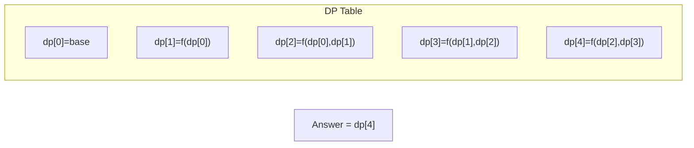

# Problem 1186: Maximum Subarray Sum with One Deletion

**Difficulty:** Medium  
**Tags:** Array, Dynamic Programming  
**Pattern:** Dynamic Programming (1D)  
**Link:** [leetcode.com/problems/maximum-subarray-sum-with-one-deletion](https://leetcode.com/problems/maximum-subarray-sum-with-one-deletion/)

## Description

Given an array of integers, return the maximum sum for a **non-empty** subarray (contiguous elements) with at most one element deletion. In other words, you want to choose a subarray and optionally delete one element from it so that there is still at least one element left and the sum of the remaining elements is maximum possible.

Note that the subarray needs to be **non-empty** after deleting one element.

 

Example 1:

```

**Input:** arr = [1,-2,0,3]
**Output:** 4
**Explanation: **Because we can choose [1, -2, 0, 3] and drop -2, thus the subarray [1, 0, 3] becomes the maximum value.
```

Example 2:

```

**Input:** arr = [1,-2,-2,3]
**Output:** 3
**Explanation: **We just choose [3] and it's the maximum sum.

```

Example 3:

```

**Input:** arr = [-1,-1,-1,-1]
**Output:** -1
**Explanation:** The final subarray needs to be non-empty. You can't choose [-1] and delete -1 from it, then get an empty subarray to make the sum equals to 0.

```

 

**Constraints:**

	- `1 <= arr.length <= 10^5`
	- `-10^4 <= arr[i] <= 10^4`

## Approach: Dynamic Programming (1D)

Break the problem into overlapping subproblems. Define dp[i] as the optimal value for the subproblem ending at or considering index i. Build the solution bottom-up, using previously computed dp values.

## Pseudocode

```
1. Define dp[i] = optimal value for subproblem i
2. Base case: dp[0] = initial value
3. For i from 1 to n:
   a. dp[i] = recurrence(dp[i-1], dp[i-2], ...)
4. Return dp[n] or max/min of dp
```

## Algorithm Flow



## Visual State Transitions

**1D Dynamic Programming Table Build:**

**Frame 1: Initialize base cases**


**Frame 2: Fill dp[1] from dp[0]**


**Frame 3: Fill remaining cells**



## Complexity Analysis

- **Time:** O(n)
- **Space:** O(n)

## Solution (Python3)

```python
class Solution:
    def maximumSum(self, arr: List[int]) -> int:
        # Dynamic programming (1D) - O(n) time, O(n) space
        if not arr:
            return 0
        n = len(arr) if isinstance(arr, list) else arr
        dp = [0] * (n + 1)
        dp[0] = 1  # base case
        for i in range(1, n + 1):
            dp[i] = dp[i-1]  # transition (customize per problem)
            if i >= 2:
                dp[i] += dp[i-2]
        return dp[n]
```

## Solution (C++)

```cpp
#include <string>
#include <vector>
using namespace std;

class Solution {
public:
    int maximumSum(vector<int>& arr) {
        // Dynamic programming (1D) - O(n) time, O(n) space
        int n = arr;
        if (n <= 0) return 0;
        vector<int> dp(n + 1, 0);
        dp[0] = 1;
        for (int i = 1; i <= n; i++) {
            dp[i] = dp[i-1];
            if (i >= 2) dp[i] += dp[i-2];
        }
        return dp[n];
    }
};
```
