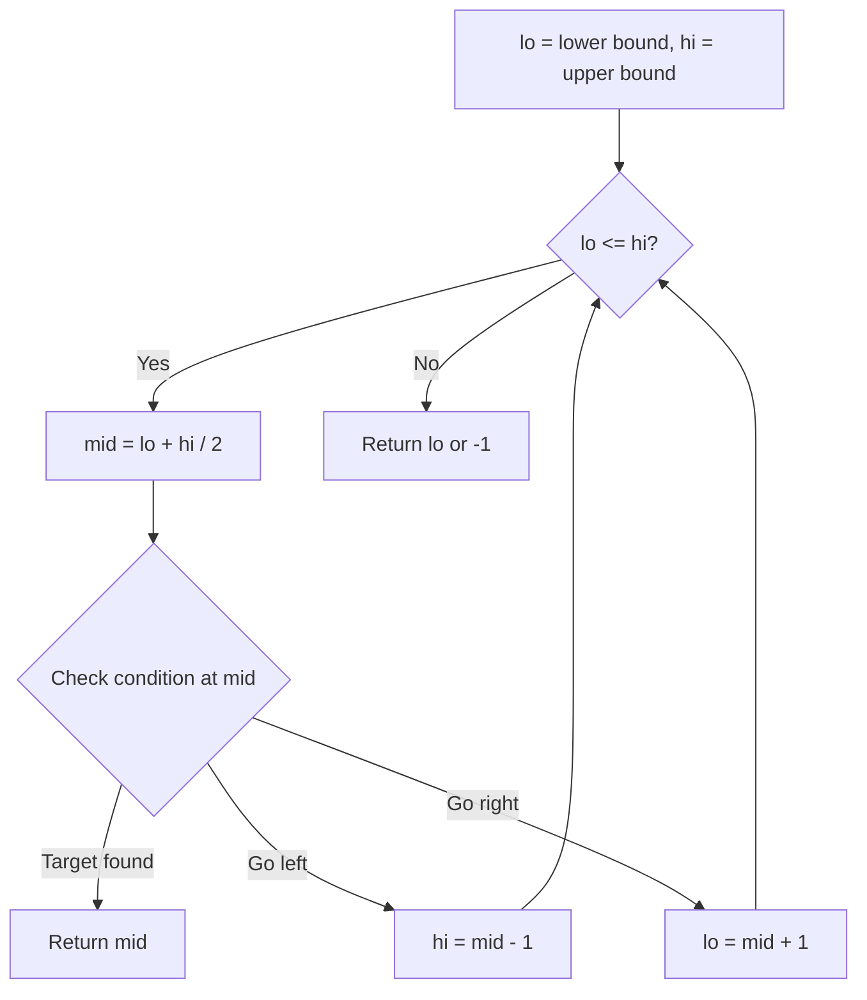
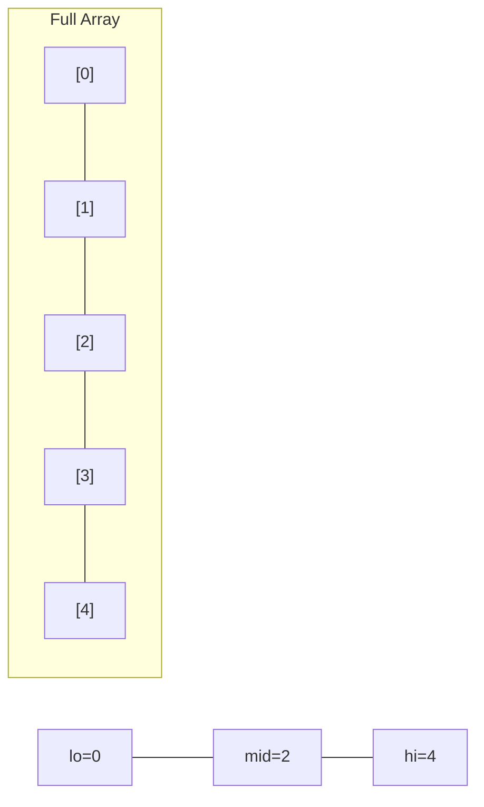
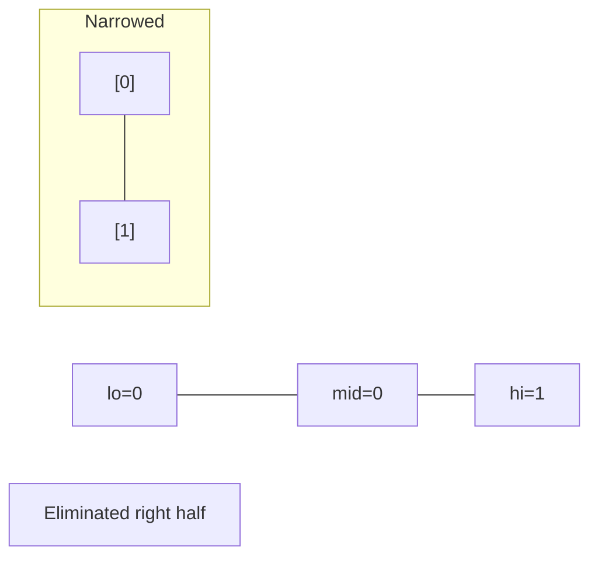
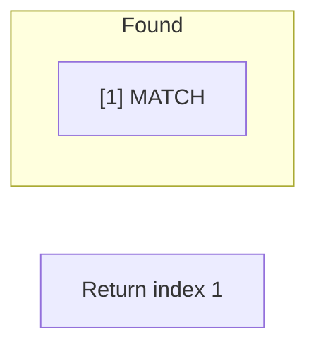

# Problem 1187: Make Array Strictly Increasing

**Difficulty:** Hard  
**Tags:** Array, Binary Search, Dynamic Programming, Sorting  
**Pattern:** Binary Search  
**Link:** [leetcode.com/problems/make-array-strictly-increasing](https://leetcode.com/problems/make-array-strictly-increasing/)

## Description

Given two integer arrays `arr1` and `arr2`, return the minimum number of operations (possibly zero) needed to make `arr1` strictly increasing.

In one operation, you can choose two indices `0 <= i < arr1.length` and `0 <= j < arr2.length` and do the assignment `arr1[i] = arr2[j]`.

If there is no way to make `arr1` strictly increasing, return `-1`.

 

Example 1:

```

**Input:** arr1 = [1,5,3,6,7], arr2 = [1,3,2,4]
**Output:** 1
**Explanation:** Replace `5` with `2`, then `arr1 = [1, 2, 3, 6, 7]`.

```

Example 2:

```

**Input:** arr1 = [1,5,3,6,7], arr2 = [4,3,1]
**Output:** 2
**Explanation:** Replace `5` with `3` and then replace `3` with `4`. `arr1 = [1, 3, 4, 6, 7]`.

```

Example 3:

```

**Input:** arr1 = [1,5,3,6,7], arr2 = [1,6,3,3]
**Output:** -1
**Explanation:** You can't make `arr1` strictly increasing.
```

 

**Constraints:**

	- `1 <= arr1.length, arr2.length <= 2000`
	- `0 <= arr1[i], arr2[i] <= 10^9`

## Approach: Binary Search

Use binary search to halve the search space each iteration. Define the search range [lo, hi], compute mid, and decide which half to keep based on the problem's monotonic condition.

## Pseudocode

```
1. lo = lower_bound, hi = upper_bound
2. While lo <= hi (or lo < hi):
   a. mid = (lo + hi) // 2
   b. If condition(mid) is satisfied: record answer, search left half
   c. Else: search right half
3. Return answer
```

## Algorithm Flow



## Visual State Transitions

**Binary Search Step-by-Step:**

**Frame 1: Initial search space**


**Frame 2: Compare mid, narrow search**


**Frame 3: Found target**



## Complexity Analysis

- **Time:** O(log n)
- **Space:** O(1)

## Solution (Python3)

```python
class Solution:
    def makeArrayIncreasing(self, arr1: List[int], arr2: List[int]) -> int:
        # Binary search - O(log n) time, O(1) space
        lo, hi = 0, len(arr1) - 1
        while lo <= hi:
            mid = lo + (hi - lo) // 2
            if arr1[mid] == arr2:
                return mid
            elif arr1[mid] < arr2:
                lo = mid + 1
            else:
                hi = mid - 1
        return 0
```

## Solution (C++)

```cpp
#include <string>
#include <vector>
using namespace std;

class Solution {
public:
    int makeArrayIncreasing(vector<int>& arr1, vector<int>& arr2) {
        // Binary search - O(log n) time, O(1) space
        int lo = 0, hi = arr1.size() - 1;
        while (lo <= hi) {
            int mid = lo + (hi - lo) / 2;
            if (arr1[mid] == arr2) {
                return mid;
            } else if (arr1[mid] < arr2) {
                lo = mid + 1;
            } else {
                hi = mid - 1;
            }
        }
        return 0;
    }
};
```
