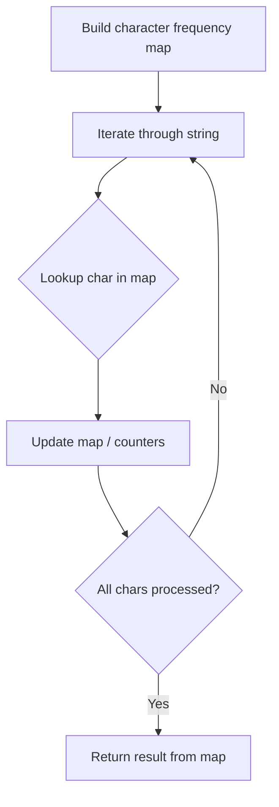

# Problem 1189: Maximum Number of Balloons

**Difficulty:** Easy  
**Tags:** Hash Table, String, Counting  
**Pattern:** Hash Map String Processing  
**Link:** [leetcode.com/problems/maximum-number-of-balloons](https://leetcode.com/problems/maximum-number-of-balloons/)

## Description

Given a string `text`, you want to use the characters of `text` to form as many instances of the word **"balloon"** as possible.

You can use each character in `text` **at most once**. Return the maximum number of instances that can be formed.

 

Example 1:

****

```

**Input:** text = "nlaebolko"
**Output:** 1

```

Example 2:

****

```

**Input:** text = "loonbalxballpoon"
**Output:** 2

```

Example 3:

```

**Input:** text = "leetcode"
**Output:** 0

```

 

**Constraints:**

	- `1 <= text.length <= 10^4`
	- `text` consists of lower case English letters only.

 

**Note:** This question is the same as  2287: Rearrange Characters to Make Target String.

## Approach: Hash Map String Processing

Use a hash map to count character frequencies or map characters/strings for O(1) lookups. Process the string in one or two passes.

## Pseudocode

```
1. Build frequency map / char-to-index map
2. Iterate through string:
   a. Look up character in map
   b. Update counts or mappings
3. Return result based on map state
```

## Algorithm Flow



## Complexity Analysis

- **Time:** O(n)
- **Space:** O(n)

## Solution (Python3)

```python
class Solution:
    def maxNumberOfBalloons(self, text: str) -> int:
        # Hash map for string/character frequency - O(n) time
        freq = {}
        for ch in text:
            freq[ch] = freq.get(ch, 0) + 1
        # Process frequency map
        for ch, cnt in freq.items():
            if cnt == 1:
                return text.index(ch)
        return 0
```

## Solution (C++)

```cpp
#include <string>
#include <unordered_map>
#include <vector>
using namespace std;

class Solution {
public:
    int maxNumberOfBalloons(string& text) {
        // Hash map for string/character frequency - O(n) time
        unordered_map<char, int> freq;
        for (char ch : text) {
            freq[ch]++;
        }
        // Process frequency map
        for (int i = 0; i < text.size(); i++) {
            if (freq[text[i]] == 1) return i;
        }
        return 0;
    }
};
```
