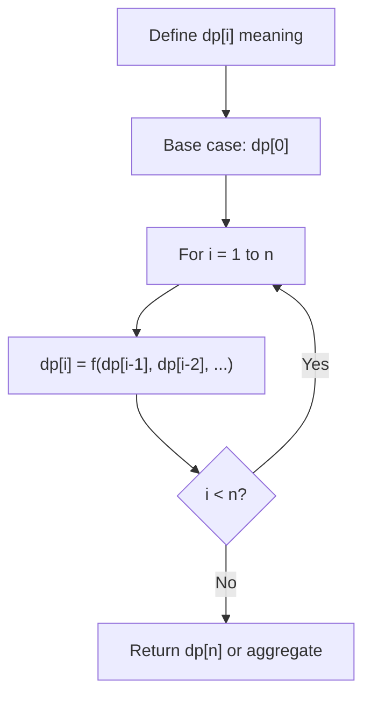
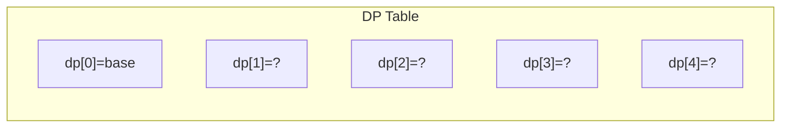
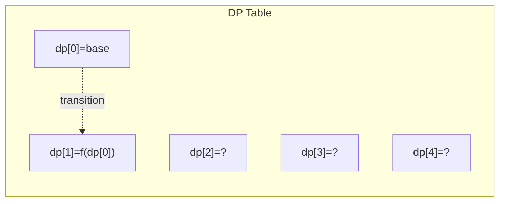
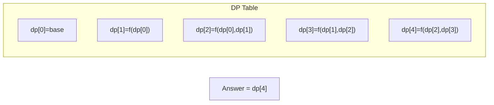

# Problem 1191: K-Concatenation Maximum Sum

**Difficulty:** Medium  
**Tags:** Array, Dynamic Programming  
**Pattern:** Dynamic Programming (1D)  
**Link:** [leetcode.com/problems/k-concatenation-maximum-sum](https://leetcode.com/problems/k-concatenation-maximum-sum/)

## Description

Given an integer array `arr` and an integer `k`, modify the array by repeating it `k` times.

For example, if `arr = [1, 2]` and `k = 3 `then the modified array will be `[1, 2, 1, 2, 1, 2]`.

Return the maximum sub-array sum in the modified array. Note that the length of the sub-array can be `0` and its sum in that case is `0`.

As the answer can be very large, return the answer **modulo** `10^9 + 7`.

 

Example 1:

```

**Input:** arr = [1,2], k = 3
**Output:** 9

```

Example 2:

```

**Input:** arr = [1,-2,1], k = 5
**Output:** 2

```

Example 3:

```

**Input:** arr = [-1,-2], k = 7
**Output:** 0

```

 

**Constraints:**

	- `1 <= arr.length <= 10^5`
	- `1 <= k <= 10^5`
	- `-10^4 <= arr[i] <= 10^4`

## Approach: Dynamic Programming (1D)

Break the problem into overlapping subproblems. Define dp[i] as the optimal value for the subproblem ending at or considering index i. Build the solution bottom-up, using previously computed dp values.

## Pseudocode

```
1. Define dp[i] = optimal value for subproblem i
2. Base case: dp[0] = initial value
3. For i from 1 to n:
   a. dp[i] = recurrence(dp[i-1], dp[i-2], ...)
4. Return dp[n] or max/min of dp
```

## Algorithm Flow



## Visual State Transitions

**1D Dynamic Programming Table Build:**

**Frame 1: Initialize base cases**


**Frame 2: Fill dp[1] from dp[0]**


**Frame 3: Fill remaining cells**



## Complexity Analysis

- **Time:** O(n)
- **Space:** O(n)

## Solution (Python3)

```python
class Solution:
    def kConcatenationMaxSum(self, arr: List[int], k: int) -> int:
        # Dynamic programming (1D) - O(n) time, O(n) space
        if not arr:
            return 0
        n = len(arr) if isinstance(arr, list) else arr
        dp = [0] * (n + 1)
        dp[0] = 1  # base case
        for i in range(1, n + 1):
            dp[i] = dp[i-1]  # transition (customize per problem)
            if i >= 2:
                dp[i] += dp[i-2]
        return dp[n]
```

## Solution (C++)

```cpp
#include <string>
#include <vector>
using namespace std;

class Solution {
public:
    int kConcatenationMaxSum(vector<int>& arr, int k) {
        // Dynamic programming (1D) - O(n) time, O(n) space
        int n = arr;
        if (n <= 0) return 0;
        vector<int> dp(n + 1, 0);
        dp[0] = 1;
        for (int i = 1; i <= n; i++) {
            dp[i] = dp[i-1];
            if (i >= 2) dp[i] += dp[i-2];
        }
        return dp[n];
    }
};
```
