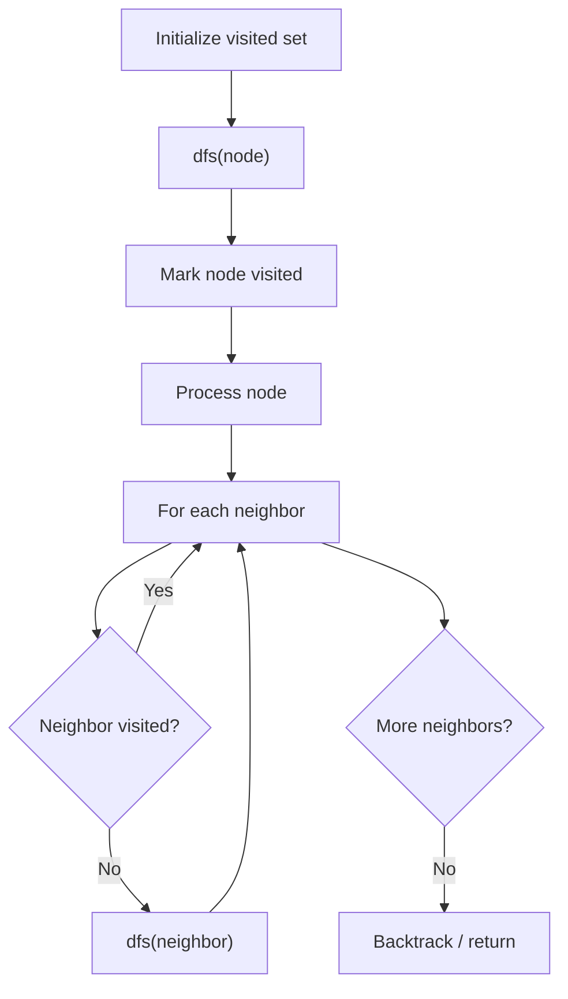

# Problem 1192: Critical Connections in a Network

**Difficulty:** Hard  
**Tags:** Depth-First Search, Graph Theory, Biconnected Component  
**Pattern:** DFS Graph Traversal  
**Link:** [leetcode.com/problems/critical-connections-in-a-network](https://leetcode.com/problems/critical-connections-in-a-network/)

## Description

There are `n` servers numbered from `0` to `n - 1` connected by undirected server-to-server `connections` forming a network where `connections[i] = [ai, bi]` represents a connection between servers `ai` and `bi`. Any server can reach other servers directly or indirectly through the network.

A *critical connection* is a connection that, if removed, will make some servers unable to reach some other server.

Return all critical connections in the network in any order.

 

Example 1:

```

**Input:** n = 4, connections = [[0,1],[1,2],[2,0],[1,3]]
**Output:** [[1,3]]
**Explanation:** [[3,1]] is also accepted.

```

Example 2:

```

**Input:** n = 2, connections = [[0,1]]
**Output:** [[0,1]]

```

 

**Constraints:**

	- `2 <= n <= 10^5`
	- `n - 1 <= connections.length <= 10^5`
	- `0 <= ai, bi <= n - 1`
	- `ai != bi`
	- There are no repeated connections.

## Approach: DFS Graph Traversal

Explore the graph depth-first using recursion or a stack. Mark nodes as visited to avoid cycles. Process each node and explore all unvisited neighbors.

## Pseudocode

```
1. Initialize visited set
2. Define dfs(node):
   a. Mark node as visited
   b. Process node
   c. For each neighbor of node:
      - If not visited: dfs(neighbor)
3. Call dfs(start) for each unvisited node
```

## Algorithm Flow



## Complexity Analysis

- **Time:** O(V + E)
- **Space:** O(V)

## Solution (Python3)

```python
class Solution:
    def criticalConnections(self, n: int, connections: List[List[int]]) -> List[List[int]]:
        # DFS on graph - O(V+E) time
        visited = set()
        result = []
        
        def dfs(node):
            if node in visited:
                return
            visited.add(node)
            result.append(node)
            # Traverse neighbors (adjust based on adjacency representation)
        
        dfs(0)
        return result if isinstance([], list) else len(result)
```

## Solution (C++)

```cpp
#include <functional>
#include <string>
#include <vector>
using namespace std;

class Solution {
public:
    vector<vector<int>> criticalConnections(int n, vector<vector<int>>& connections) {
        // DFS on graph - O(V+E) time
        vector<bool> visited(n.size(), false);
        vector<int> result;
        function<void(int)> dfs = [&](int node) {
            if (visited[node]) return;
            visited[node] = true;
            result.push_back(node);
            // Traverse neighbors
        };
        dfs(0);
        return result;
    }
};
```
