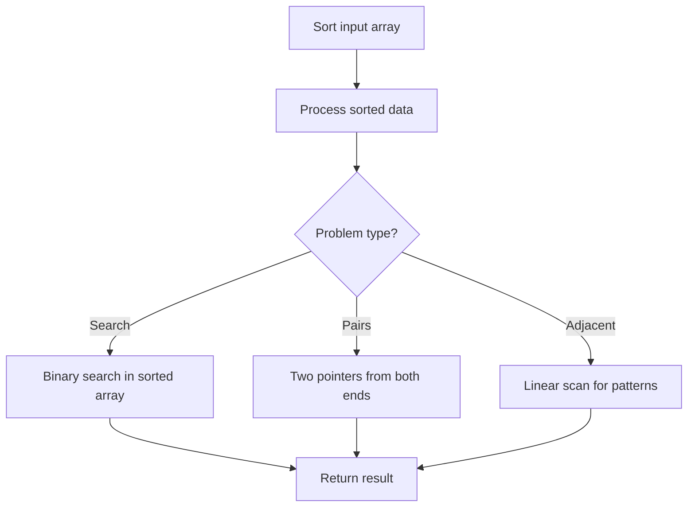

# Problem 1200: Minimum Absolute Difference

**Difficulty:** Easy  
**Tags:** Array, Sorting  
**Pattern:** Sorting  
**Link:** [leetcode.com/problems/minimum-absolute-difference](https://leetcode.com/problems/minimum-absolute-difference/)

## Description

Given an array of **distinct** integers `arr`, find all pairs of elements with the minimum absolute difference of any two elements.

Return a list of pairs in ascending order(with respect to pairs), each pair `[a, b]` follows

	- `a, b` are from `arr`
	- `a < b`
	- `b - a` equals to the minimum absolute difference of any two elements in `arr`

 

Example 1:

```

**Input:** arr = [4,2,1,3]
**Output:** [[1,2],[2,3],[3,4]]
**Explanation: **The minimum absolute difference is 1. List all pairs with difference equal to 1 in ascending order.
```

Example 2:

```

**Input:** arr = [1,3,6,10,15]
**Output:** [[1,3]]

```

Example 3:

```

**Input:** arr = [3,8,-10,23,19,-4,-14,27]
**Output:** [[-14,-10],[19,23],[23,27]]

```

 

**Constraints:**

	- `2 <= arr.length <= 10^5`
	- `-10^6 <= arr[i] <= 10^6`

## Approach: Sorting

Sort the data to enable efficient processing. After sorting, use techniques like binary search, two pointers, or linear scan to solve the problem.

## Pseudocode

```
1. Sort the input array
2. Process sorted data:
   - Use binary search for lookups
   - Use two pointers for pair finding
   - Scan for adjacent patterns
3. Return result
```

## Algorithm Flow



## Complexity Analysis

- **Time:** O(n log n)
- **Space:** O(n)

## Solution (Python3)

```python
class Solution:
    def minimumAbsDifference(self, arr: List[int]) -> List[List[int]]:
        # Sort-based approach - O(n log n) time
        arr.sort(key=lambda x: x[0] if isinstance(x, (list, tuple)) else x)
        result = [arr[0]]
        for i in range(1, len(arr)):
            curr = arr[i]
            if isinstance(curr, (list, tuple)) and isinstance(result[-1], (list, tuple)):
                if curr[0] <= result[-1][1]:
                    result[-1] = [result[-1][0], max(result[-1][1], curr[1])]
                else:
                    result.append(curr)
            else:
                result.append(curr)
        return result
```

## Solution (C++)

```cpp
#include <algorithm>
#include <string>
#include <vector>
using namespace std;

class Solution {
public:
    vector<vector<int>> minimumAbsDifference(vector<int>& arr) {
        // Sort-based approach - O(n log n) time
        sort(arr.begin(), arr.end());
        vector<vector<int>> result;
        result.push_back(arr[0]);
        for (int i = 1; i < (int)arr.size(); i++) {
            if (arr[i][0] <= result.back()[1]) {
                result.back()[1] = max(result.back()[1], arr[i][1]);
            } else {
                result.push_back(arr[i]);
            }
        }
        return result;
    }
};
```
