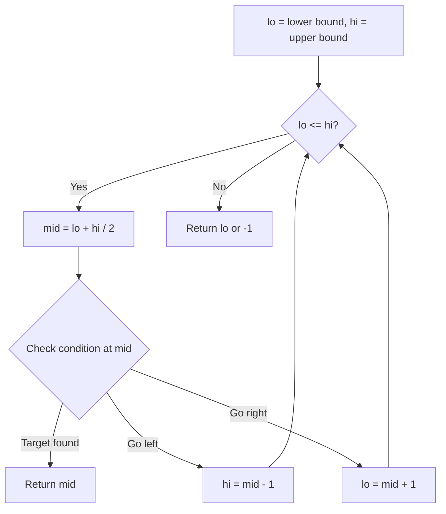
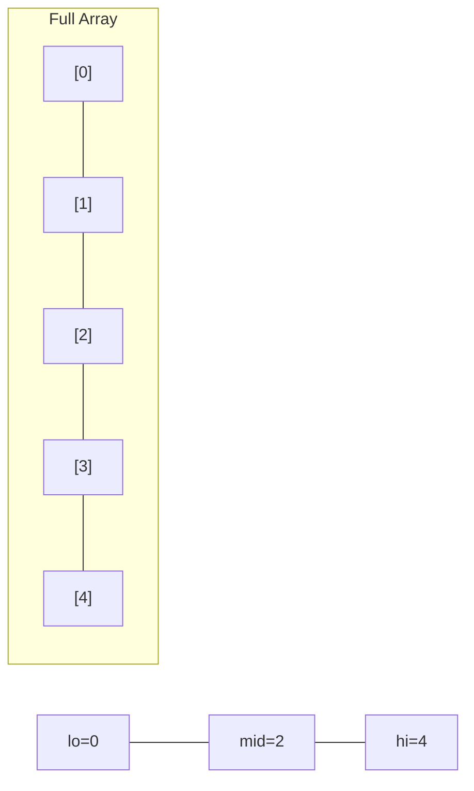
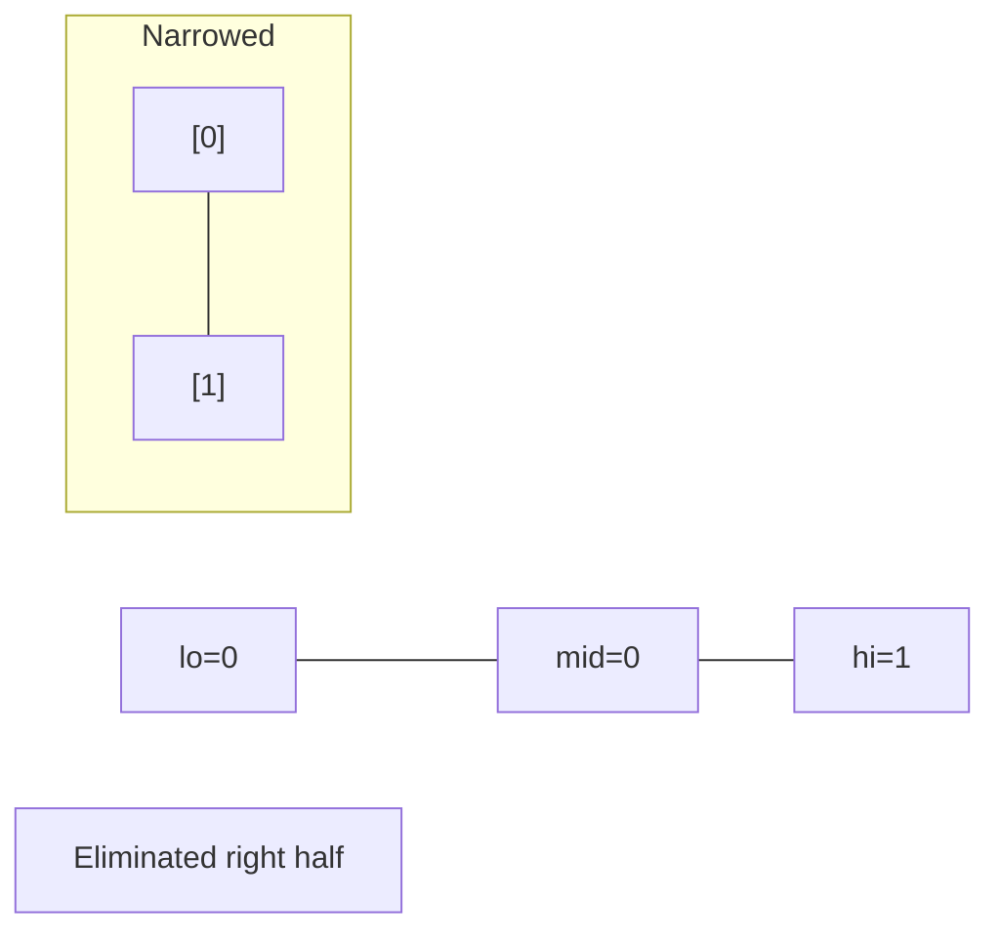
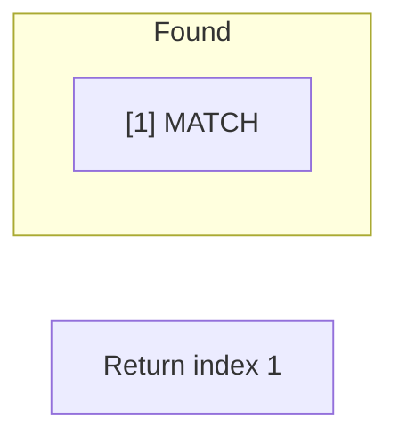

# Problem 1201: Ugly Number III

**Difficulty:** Medium  
**Tags:** Math, Binary Search, Combinatorics, Number Theory  
**Pattern:** Binary Search  
**Link:** [leetcode.com/problems/ugly-number-iii](https://leetcode.com/problems/ugly-number-iii/)

## Description

An **ugly number** is a positive integer that is divisible by `a`, `b`, or `c`.

Given four integers `n`, `a`, `b`, and `c`, return the `n^th` **ugly number**.

 

Example 1:

```

**Input:** n = 3, a = 2, b = 3, c = 5
**Output:** 4
**Explanation:** The ugly numbers are 2, 3, 4, 5, 6, 8, 9, 10... The 3rd is 4.

```

Example 2:

```

**Input:** n = 4, a = 2, b = 3, c = 4
**Output:** 6
**Explanation:** The ugly numbers are 2, 3, 4, 6, 8, 9, 10, 12... The 4th is 6.

```

Example 3:

```

**Input:** n = 5, a = 2, b = 11, c = 13
**Output:** 10
**Explanation:** The ugly numbers are 2, 4, 6, 8, 10, 11, 12, 13... The 5th is 10.

```

 

**Constraints:**

	- `1 <= n, a, b, c <= 10^9`
	- `1 <= a * b * c <= 10^18`
	- It is guaranteed that the result will be in range `[1, 2 * 10^9]`.

## Approach: Binary Search

Use binary search to halve the search space each iteration. Define the search range [lo, hi], compute mid, and decide which half to keep based on the problem's monotonic condition.

## Pseudocode

```
1. lo = lower_bound, hi = upper_bound
2. While lo <= hi (or lo < hi):
   a. mid = (lo + hi) // 2
   b. If condition(mid) is satisfied: record answer, search left half
   c. Else: search right half
3. Return answer
```

## Algorithm Flow



## Visual State Transitions

**Binary Search Step-by-Step:**

**Frame 1: Initial search space**


**Frame 2: Compare mid, narrow search**


**Frame 3: Found target**



## Complexity Analysis

- **Time:** O(log n)
- **Space:** O(1)

## Solution (Python3)

```python
class Solution:
    def nthUglyNumber(self, n: int, a: int, b: int, c: int) -> int:
        # Binary search - O(log n) time, O(1) space
        lo, hi = 0, len(n) - 1
        while lo <= hi:
            mid = lo + (hi - lo) // 2
            if n[mid] == a:
                return mid
            elif n[mid] < a:
                lo = mid + 1
            else:
                hi = mid - 1
        return 0
```

## Solution (C++)

```cpp
#include <string>
#include <vector>
using namespace std;

class Solution {
public:
    int nthUglyNumber(int n, int a, int b, int c) {
        // Binary search - O(log n) time, O(1) space
        int lo = 0, hi = n.size() - 1;
        while (lo <= hi) {
            int mid = lo + (hi - lo) / 2;
            if (n[mid] == a) {
                return mid;
            } else if (n[mid] < a) {
                lo = mid + 1;
            } else {
                hi = mid - 1;
            }
        }
        return 0;
    }
};
```
