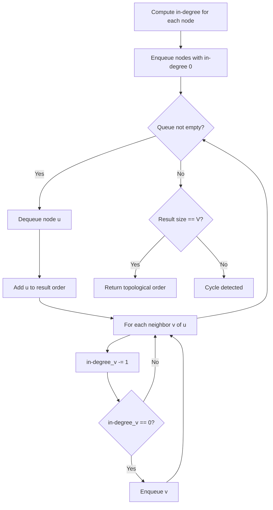
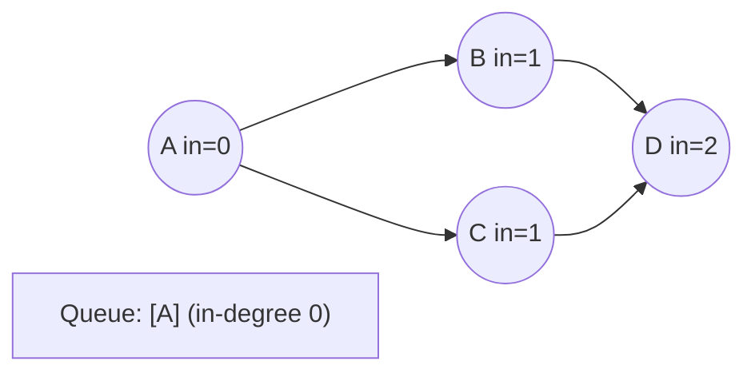
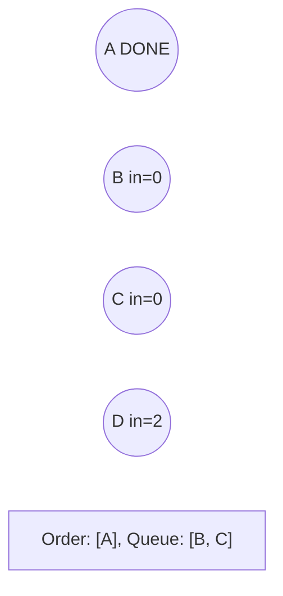
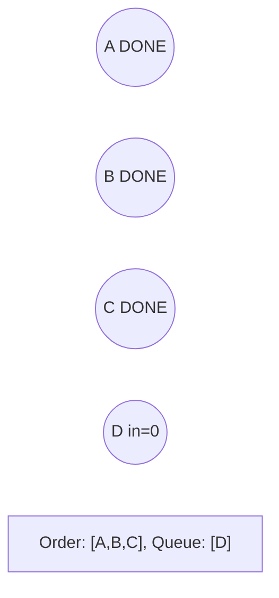
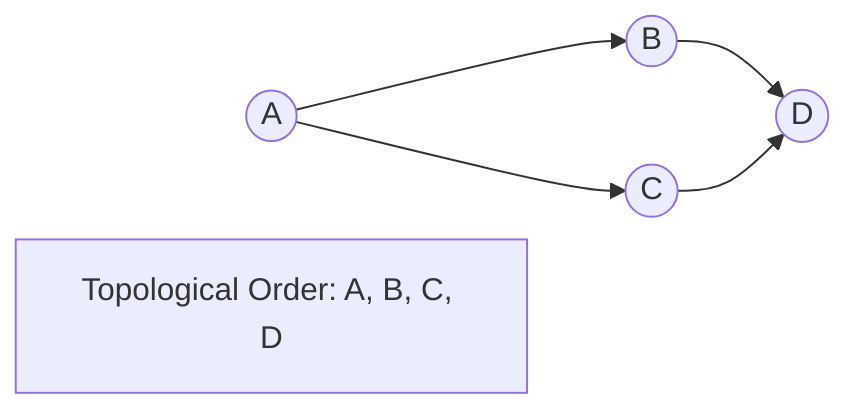

# Problem 1203: Sort Items by Groups Respecting Dependencies

**Difficulty:** Hard  
**Tags:** Depth-First Search, Breadth-First Search, Graph Theory, Topological Sort  
**Pattern:** Topological Sort  
**Link:** [leetcode.com/problems/sort-items-by-groups-respecting-dependencies](https://leetcode.com/problems/sort-items-by-groups-respecting-dependencies/)

## Description

There are `n` items each belonging to zero or one of `m` groups where `group[i]` is the group that the `i`-th item belongs to and it's equal to `-1` if the `i`-th item belongs to no group. The items and the groups are zero indexed. A group can have no item belonging to it.

Return a sorted list of the items such that:

	- The items that belong to the same group are next to each other in the sorted list.
	- There are some relations between these items where `beforeItems[i]` is a list containing all the items that should come before the `i`-th item in the sorted array (to the left of the `i`-th item).

Return any solution if there is more than one solution and return an **empty list** if there is no solution.

 

Example 1:

****

```

**Input:** n = 8, m = 2, group = [-1,-1,1,0,0,1,0,-1], beforeItems = [[],[6],[5],[6],[3,6],[],[],[]]
**Output:** [6,3,4,1,5,2,0,7]

```

Example 2:

```

**Input:** n = 8, m = 2, group = [-1,-1,1,0,0,1,0,-1], beforeItems = [[],[6],[5],[6],[3],[],[4],[]]
**Output:** []
**Explanation:** This is the same as example 1 except that 4 needs to be before 6 in the sorted list.

```

 

**Constraints:**

	- `1 <= m <= n <= 3 * 10^4`
	- `group.length == beforeItems.length == n`
	- `-1 <= group[i] <= m - 1`
	- `0 <= beforeItems[i].length <= n - 1`
	- `0 <= beforeItems[i][j] <= n - 1`
	- `i != beforeItems[i][j]`
	- `beforeItems[i] `does not contain duplicates elements.

## Approach: Topological Sort

Order nodes in a DAG so every edge u->v has u before v. Use Kahn's algorithm (BFS with in-degree tracking) or DFS-based ordering.

## Pseudocode

```
1. Compute in-degree for every node
2. Enqueue all nodes with in-degree 0
3. While queue not empty:
   a. Dequeue node u, add to result order
   b. For each neighbor v of u:
      - Decrease in-degree of v
      - If in-degree becomes 0: enqueue v
4. If result size != V: cycle exists
5. Return topological order
```

## Algorithm Flow



## Visual State Transitions

**Topological Sort (Kahn's Algorithm):**

**Frame 1: Compute in-degrees**


**Frame 2: Process A, reduce neighbors**


**Frame 3: Process B and C**


**Frame 4: Complete**



## Complexity Analysis

- **Time:** O(V + E)
- **Space:** O(V + E)

## Solution (Python3)

```python
class Solution:
    def sortItems(self, n: int, m: int, group: List[int], beforeItems: List[List[int]]) -> List[int]:
        # Topological sort (Kahn's algorithm) - O(V+E)
        from collections import deque, defaultdict
        graph = defaultdict(list)
        n = n if isinstance(n, int) else len(n)
        indegree = [0] * n
        # Build graph from prerequisites
        prereqs = m if isinstance(m, list) else n
        for edge in prereqs:
            if isinstance(edge, (list, tuple)) and len(edge) >= 2:
                graph[edge[1]].append(edge[0])
                indegree[edge[0]] += 1
        queue = deque([i for i in range(n) if indegree[i] == 0])
        order = []
        while queue:
            node = queue.popleft()
            order.append(node)
            for neighbor in graph[node]:
                indegree[neighbor] -= 1
                if indegree[neighbor] == 0:
                    queue.append(neighbor)
        return len(order) == n if isinstance([], bool) else order
```

## Solution (C++)

```cpp
#include <queue>
#include <string>
#include <vector>
using namespace std;

class Solution {
public:
    vector<int> sortItems(int n, int m, vector<int>& group, vector<vector<int>>& beforeItems) {
        // Topological sort (Kahn's) - O(V+E)
        int n = n;
        vector<vector<int>> graph(n);
        vector<int> indegree(n, 0);
        for (auto& edge : m) {
            graph[edge[1]].push_back(edge[0]);
            indegree[edge[0]]++;
        }
        queue<int> q;
        for (int i = 0; i < n; i++)
            if (indegree[i] == 0) q.push(i);
        vector<int> order;
        while (!q.empty()) {
            int node = q.front(); q.pop();
            order.push_back(node);
            for (int neighbor : graph[node]) {
                if (--indegree[neighbor] == 0) q.push(neighbor);
            }
        }
        return order.size() == n;
    }
};
```
